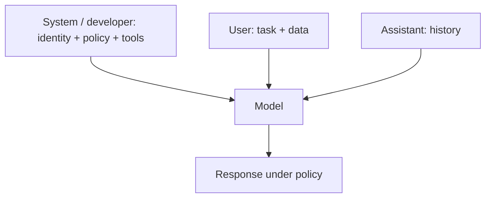

In chat APIs, not every message is equal. The **system** (or developer) message is the constitution: long-lived rules for identity, tools, safety, and output style. **User** messages are the day's requests. **Role design** is how you turn a generic model into a product-specific agent without fine-tuning.

## Intuition

If the user prompt is a ticket, the system prompt is the employee handbook. You do not reprint the handbook on every sticky note; you assume the employee already read it.

A good role is not a costume ("you are a pirate"). It is a **job description**: mission, audience, tools allowed, refusal rules, and escalation paths. Personality is a thin layer on top of that contract.



### Meta prompting (plan before you answer)

**Meta prompting** asks the model to think about the best strategy or structure for solving the task *before* answering it.

| Idea | Plain-English explanation |
| --- | --- |
| **What it is for** | Some tasks are easier when the model plans its approach first |
| **One plain sentence** | The model first designs how it should answer |
| **Example cue** | "First choose a solving strategy, then answer in a clean numbered format." |

Think of it like making a game plan before playing the game — not jumping straight into the final answer.

:::key
Put stable policy in the system role. Put task-specific data in the user role. Mixing them makes updates painful and invites users (or retrieved docs) to contradict your rules.
:::

## How it works

### What belongs in the system prompt

- Product identity and audience ("BackbenchLearner tutor for backend interviews").
- Hard constraints ("never invent library APIs; say when unsure").
- Tool use policy ("call `search_docs` before answering product questions").
- Safety and privacy ("do not request passwords; refuse illegal assistance").
- Default output style (markdown sections, citation format).

### What belongs in the user message

The current question, uploaded text, and ephemeral context. Prefer injecting retrieval-augmented generation (RAG) snippets into a clearly labeled user or tool section, not into the system prompt, so documents cannot quietly rewrite the constitution.

### Role vs persona

| Concept | Plain-English idea |
| --- | --- |
| **Role** | Mission, tools, refusals, grounding rules |
| **Persona** | Surface tone ("friendly mentor") layered on top |

Prefer role plus thin persona over theatrical characters that fight your safety rules.

### Directional stimulus prompting (light steering)

**Directional stimulus prompting** adds hints or keywords that steer the model toward important parts of the answer — especially useful for summarization.

Example: for a news article, include keywords such as names, events, and outcomes to cover in the summary. It is like highlighting key lines in a textbook before asking for a summary.

### Multi-agent roles

In agent systems, each specialist gets a narrow system prompt (researcher, critic, writer). Narrow roles reduce cross-talk and make failures easier to trace.

## In code

Assemble system text from versioned fragments; keep user content separate.

```python
FRAGMENTS = {
    "identity": "You are BackbenchTutor, a concise mentor for backend and GenAI interviews.",
    "grounding": "Answer only from CONTEXT when provided. If missing, say what is missing.",
    "safety": "Refuse requests for credentials, malware, or illegal activity. Offer safe alternatives.",
    "style": "Use short sections and plain language. Prefer bullets over essays.",
    "meta": "Before answering hard questions, briefly state your plan, then respond.",
}

def build_system(keys: list[str]) -> str:
    return "\n\n".join(FRAGMENTS[k] for k in keys)

def build_messages(question: str, context: str = "") -> list[dict]:
    user = question if not context else (
        f"CONTEXT:\n\"\"\"\n{context}\n\"\"\"\n\nQUESTION:\n{question}"
    )
    return [
        {"role": "system", "content": build_system(
            ["identity", "grounding", "safety", "style", "meta"]
        )},
        {"role": "user", "content": user},
    ]

msgs = build_messages(
    "What is idempotency?",
    context="Idempotency means retrying a request does not change the result beyond the first success.",
)
sys_text = msgs[0]["content"]
assert "Answer only from CONTEXT" in sys_text
print(msgs[0]["role"], "chars=", len(sys_text))
```

Version the fragment map in git. Changing tone should not require hunting through every template.

## What goes wrong

- **Constitution in the user channel.** Users can overwrite or contradict it.
- **Bloated system prompts.** Thousands of tokens of edge-case lore compete with the actual question.
- **Role conflict.** "Be maximally helpful" plus "never discuss competitors" creates silent trade-offs. Order rules by priority.
- **Persona overpowering policy.** A jokey character will ignore your citation format. Keep persona short.
- **Trusting wording alone.** Delimiters, privilege separation, and output validation still matter.

## One-line summary

System prompts are the product's constitution — put durable identity, tools, and safety there; use meta prompting to plan hard answers; keep ephemeral tasks and data in the user channel.

## Key terms

- **System / developer message:** high-privilege instructions that shape overall behavior.
- **User / assistant roles:** task input and conversational history.
- **Role design:** job description for the model (mission, tools, refusals), not just a costume.
- **Meta prompting:** asking the model to plan how to answer before solving the task.
- **Directional stimulus prompting:** hints or keywords that steer the answer toward key points.
- **Persona:** surface tone layered on top of the role.
- **Privilege separation:** keeping policy out of untrusted user or document text.
