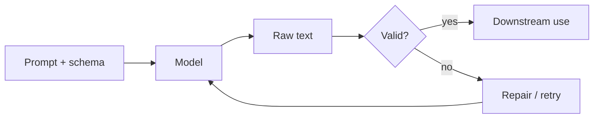

Chatty prose is fine for tutoring. Software needs **contracts**: JSON with known keys, enums with closed sets, tables with fixed columns. This lesson also covers **ReAct**, **prompt chaining**, and **Tree of Thoughts** — patterns for tasks that need tools, multiple steps, or exploring several reasoning paths.

## Intuition

An **output contract** is like a function signature. `def classify(text) -> Literal["bug","billing","feature"]` fails loudly if someone returns a novel label. LLMs do not fail loudly unless you wrap them. You specify the shape in the prompt, parse the response, and **reject or repair** on mismatch.

For complex tasks, one giant prompt often fails. Instead:

| Pattern | Plain-English idea |
| --- | --- |
| **Prompt chaining** | Break one big task into smaller LLM calls; each output feeds the next |
| **ReAct** | The model thinks, takes an action (search, tool call), observes, then thinks again |
| **Tree of Thoughts (ToT)** | Try several reasoning branches, evaluate them, keep the best path |



:::key
Do one small step at a time and pass the result forward. Complex tasks are easier to control when split into verified steps.
:::

## How it works

### Structured outputs (output contracts)

**Specify the contract in three places:**

1. **Prompt:** show the exact JSON shape and a tiny valid example.
2. **Schema:** JSON Schema or Pydantic model for programmatic checks.
3. **Decoder controls:** when available, use JSON mode or constrained decoding.

**Enums beat free text.** Prefer `"severity": "low|medium|high"` over open strings.

**Repair loops:** on validation failure, send the error back: "Your JSON failed: missing key `severity`. Resend valid JSON only." Cap retries (usually 1–2).

**Tool / function calling** is structured prompting with a vendor schema: the model fills arguments that your code executes.

### Prompt chaining

Break one big task into a sequence of smaller calls.

Example pipeline:

```
Step 1: summarize this article
Step 2: extract key facts from the summary
Step 3: turn facts into study notes
```

Each step is easier to verify than one mega-prompt.

### ReAct (Reason + Act)

ReAct combines **reasoning** and **acting** in a loop:

```
Thought -> Action (search / tool) -> Observation -> Thought -> ...
```

**Why it exists:** some tasks need outside information, not only internal memory.

**Example:** the model searches for a fact, reads the result, then refines its answer — like checking references as you go instead of guessing from memory alone.

### Tree of Thoughts

For problems with several possible routes, the model:

1. Explores multiple branches of reasoning.
2. Evaluates each branch.
3. Keeps the best path.

Useful for planning problems, tricky word puzzles, or anything with multiple valid moves — like drawing a decision tree while solving a puzzle.

## In code

A contract with validation and a simple two-step chain sketch.

```python
import json

ALLOWED = {"billing", "bug", "feature"}

SCHEMA_HINT = """
Return ONLY JSON:
{"label": "billing"|"bug"|"feature", "confidence": 0.0-1.0, "reason": "<=20 words"}
"""

def validate(payload: dict) -> list[str]:
    errors = []
    label = payload.get("label")
    if not isinstance(label, str) or label.lower() not in ALLOWED:
        errors.append("label must be billing|bug|feature")
    conf = payload.get("confidence")
    if not isinstance(conf, (int, float)) or not (0.0 <= float(conf) <= 1.0):
        errors.append("confidence must be in [0, 1]")
    return errors

def chain_summarize_then_extract(article: str) -> dict:
    # Step 1 — summarize (stub)
    summary = "Three-day outage; root cause DNS misconfig."
    # Step 2 — extract structured facts (stub)
    facts = {"duration_days": 3, "cause": "DNS misconfig"}
    return {"summary": summary, "facts": facts}

raw = '{"label": "bug", "confidence": 0.81, "reason": "crash on login"}'
data = json.loads(raw)
assert not validate(data), "expected valid payload"
print(chain_summarize_then_extract("long article text..."))
```

Treat `validate` as the source of truth. Prompts describe the contract; code enforces it.

## What goes wrong

- **Schema only in prose.** The model drifts; without parsers you never notice until a dashboard blanks out.
- **Over-nested JSON.** Deep trees raise error rates. Flatten when you can.
- **Trailing commentary.** "Here is your JSON: {...}" breaks `json.loads`. Instruct "JSON only" and strip fences in code.
- **Chaining without checks.** Passing bad output to the next step amplifies errors. Validate each hop.
- **ReAct without tool gates.** The model can propose dangerous tool calls; your runtime must allowlist and validate.
- **Retry storms.** Infinite repair loops amplify cost. Cap attempts and fall back to a human.

## One-line summary

Structured prompting pairs schemas with validation and repair; prompt chaining, ReAct, and Tree of Thoughts split complex work into controllable, verifiable steps.

## Key terms

- **Output contract:** agreed shape and constraints for model responses.
- **Repair loop:** feeding validation errors back for a corrected attempt.
- **Prompt chaining:** multiple LLM calls where each output feeds the next input.
- **ReAct:** reasoning plus acting in a loop (thought, action, observation).
- **Tree of Thoughts (ToT):** exploring multiple reasoning branches before choosing one.
- **Function / tool calling:** vendor-supported structured argument filling for tools.
- **Enum / closed set:** fixed allowed values instead of free text.
