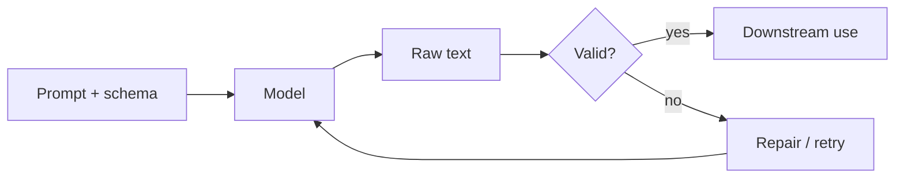

Chatty prose is fine for tutoring. Software needs **contracts**: JSON with known keys, enums with closed sets, tables with fixed columns. Structured prompting is how you make the model a function — inputs in, typed outputs out — instead of a conversationalist you have to re-parse by hand every time.

## Intuition

An output contract is like a function signature. `def classify(text) -> Literal["bug","billing","feature"]` fails loudly if someone returns a novel. LLMs do not fail loudly unless you wrap them. You specify the shape in the prompt (or via API schema modes), parse the response, and **reject or repair** on mismatch. Without that loop, one creative field name breaks your pipeline at 2 a.m.



## How it works

**Specify the contract in three places.**

1. **Prompt:** show the exact JSON shape and a tiny valid example.
2. **Schema:** JSON Schema or Pydantic model for programmatic checks.
3. **Decoder controls:** when available, use JSON mode or constrained decoding so invalid tokens are less likely.

**Enums beat free text.** Prefer `"severity": "low|medium|high"` over open strings. Prefer ISO dates over “next Tuesday.”

**Repair loops.** On validation failure, send the error back: “Your JSON failed: missing key `severity`. Resend valid JSON only.” Cap retries (usually 1–2). Log failure rates; rising repairs mean the prompt or schema drifted.

**Separation of concerns.** Ask the model for structured data first; render pretty UI yourself. Do not ask for “JSON and a friendly paragraph” in one blob if you can avoid it — mixed modes are fragile.

**Tool / function calling** is structured prompting with a vendor schema: the model fills arguments that your code executes. Same idea — contract first, prose second.

## In code

A Pydantic-style contract with a pure-Python validator and a single repair hint. Swap in your LLM client where the stub sits.

```python
import json
from typing import Literal

ALLOWED = {"billing", "bug", "feature"}

SCHEMA_HINT = """
Return ONLY JSON:
{"label": "billing"|"bug"|"feature", "confidence": 0.0-1.0, "reason": "<=20 words"}
"""

def stub_model(prompt: str) -> str:
    # Pretend the model returned almost-valid JSON
    return '{"label": "Bug", "confidence": 0.81, "reason": "crash on login"}'

def validate(payload: dict) -> list[str]:
    errors = []
    label = payload.get("label")
    if not isinstance(label, str) or label.lower() not in ALLOWED:
        errors.append("label must be billing|bug|feature")
    conf = payload.get("confidence")
    if not isinstance(conf, (int, float)) or not (0.0 <= float(conf) <= 1.0):
        errors.append("confidence must be in [0, 1]")
    reason = payload.get("reason")
    if not isinstance(reason, str) or len(reason.split()) > 20:
        errors.append("reason must be a short string")
    return errors

def run_with_contract(ticket: str, max_repairs: int = 2) -> dict:
    prompt = SCHEMA_HINT + f"\nTicket: {ticket}\n"
    for attempt in range(max_repairs + 1):
        raw = stub_model(prompt)
        try:
            data = json.loads(raw)
        except json.JSONDecodeError as e:
            prompt += f"\nPrevious output was invalid JSON ({e}). Resend JSON only."
            continue
        # normalize enum casing
        if isinstance(data.get("label"), str):
            data["label"] = data["label"].lower()
        errs = validate(data)
        if not errs:
            return data
        prompt += "\nValidation errors: " + "; ".join(errs) + ". Resend JSON only."
    raise ValueError("contract failed after repairs")

print(run_with_contract("App crashes on login"))
```

Treat `validate` as the source of truth. Prompts describe the contract; code enforces it.

## What goes wrong

- **Schema only in prose.** The model drifts; without parsers you never notice until a dashboard blanks out.
- **Over-nested JSON.** Deep trees raise error rates. Flatten when you can.
- **Trailing commentary.** “Here is your JSON: {...} hope that helps!” breaks `json.loads`. Instruct “JSON only” and strip fences in code.
- **Open enums.** New labels appear weekly (`bugs`, `defect`). Close the set and map synonyms in code if needed.
- **Retry storms.** Infinite repair loops amplify cost. Cap attempts and fall back to a human or a safer default.
- **Trusting JSON mode alone.** Schema mode reduces syntax errors; it does not guarantee business rules (confidence in range, mutually exclusive fields).

## Contracts in larger systems

Once outputs are validated, treat them like any other DTO: map into domain objects, never pass raw model text deep into business logic. A `TicketLabel` enum in your language should be the only type downstream services see. That isolation lets you swap models without rewriting billing workflows.

**Partial success.** Sometimes JSON is valid but `confidence` is 0.2. That is not a parse failure; it is a **business signal**. Route low-confidence labels to humans or to a second-stage prompt with more context. Your contract can include optional fields (`needs_human: bool`) the model sets under explicit rules.

**Streaming and structure.** Token streaming is friendly for chat and hostile for JSON. Prefer non-streaming for contracted calls, or buffer until a complete object parses. If you must stream, stream a user-visible summary from a second call after the structured call succeeds.

**Schema evolution.** Adding a field is easy; renaming one is a migration. Version schemas (`schema_version: 2`) and accept older shapes during rollout. Prompt text, validator, and publisher must move together — another reason prompts belong in the same PR as code.

## One-line summary

Structured prompting pairs a clear output schema with validation and bounded repair so LLM responses become typed inputs for software.

## Key terms

- **Output contract:** agreed shape and constraints for model responses.
- **JSON Schema / Pydantic:** declarative validation of structure and types.
- **Constrained decoding / JSON mode:** decoder-level bias toward valid structure.
- **Repair loop:** feeding validation errors back for a corrected attempt.
- **Enum / closed set:** fixed allowed values instead of free text.
- **Function / tool calling:** vendor-supported structured argument filling.
