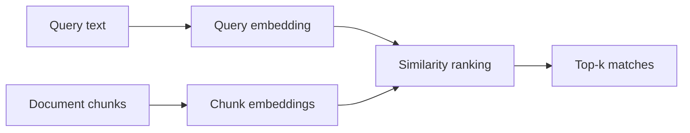

**Embeddings** turn text into dense number vectors. **Semantic search** finds documents whose vectors sit close to your question's vector—even when the exact words differ. Together they power most retrieval in **RAG** (retrieval-augmented generation) systems.

## Intuition

Think of every sentence as a point in a high-dimensional space. Similar meaning means nearby points. A question becomes a point too; the closest document points are your search results.

| Search type | Plain-English idea | Good at |
| --- | --- | --- |
| **Keyword search** | "Did these exact words appear?" | Names, error codes, part numbers |
| **Semantic search** | "Is the meaning close?" | Paraphrases, synonyms, related ideas |

You will often combine both later (hybrid search). For now, focus on the geometry: good embeddings plus a similarity score equals meaning-aware retrieval.



## How it works

### From one-hot to dense vectors

A **one-hot vector** gives each word its own dimension with a single 1. Different words are always unrelated in that space—"cat" and "kitten" look as far apart as "cat" and "refrigerator."

**Dense embeddings** spread meaning across a few hundred dimensions. Similar sentences land near each other.

```
one_hot(cat)    = [1, 0, 0, 0]
one_hot(kitten) = [0, 1, 0, 0]
dot product     = 0   (no similarity detected)

dense(cat)    ~= [0.2, 0.8, ...]
dense(kitten) ~= [0.3, 0.7, ...]
cosine score  ~= high (similar meaning)
```

### Cosine similarity

For vectors **A** and **B**:

```
cos(A, B) = (A · B) / (||A|| × ||B||)
```

**Plain English:** cosine measures the angle between two vectors. Closer to 1 means more similar meaning. If vectors are normalized, cosine equals a simple dot product—many indexes use that shortcut.

### Top-k retrieval

1. Embed the query.
2. Score every stored chunk (or use an **ANN**—approximate nearest neighbor—index at scale).
3. Return the **k** highest scores.

### Chunking matters

Each chunk becomes one point in vector space. A chunk that mixes three topics blurs that point. A chunk that is too tiny loses context. Aim for one coherent idea per chunk, with modest **overlap** so facts near boundaries are not lost.

## In code

A numpy toy: fake embeddings, cosine ranking, and a reminder that real models replace `embed()`.

```python
import numpy as np

rng = np.random.default_rng(0)

docs = [
    "cloud spend optimization tips",
    "reduce infrastructure cost this quarter",
    "chocolate cake recipe with frosting",
    "kubernetes horizontal pod autoscaling",
]
vocab = {}

def tokenize(text: str) -> list[str]:
    return text.lower().split()

def embed(text: str, dim: int = 8) -> np.ndarray:
    v = np.zeros(dim)
    for tok in tokenize(text):
        if tok not in vocab:
            vocab[tok] = rng.normal(size=dim)
        v += vocab[tok]
    n = np.linalg.norm(v)
    return v / n if n > 0 else v

doc_vecs = np.stack([embed(d) for d in docs])

def search(query: str, k: int = 2) -> list[tuple[str, float]]:
    q = embed(query)
    scores = [float(np.dot(q, dv)) for dv in doc_vecs]
    order = np.argsort(scores)[::-1][:k]
    return [(docs[i], scores[i]) for i in order]

for text, score in search("how do I cut infra costs?"):
    print(f"{score:.3f}  {text}")
```

The cost-related lines should outrank the cake recipe. Swap `embed` for a real sentence-transformer in production.

## What goes wrong

- **Wrong metric** — Mixing unnormalized distance with cosine-trained embeddings scrambles ranking.
- **Model mismatch** — Corpus embedded with model A, queries with model B, puts points in incompatible spaces.
- **Mega-chunks** — Huge blobs embed as mush; tiny fragments lose context.
- **Domain jargon** — Internal codenames may sit far from related terms unless your corpus or fine-tuning teaches that.
- **Semantic-only on IDs** — Part numbers and error codes often need keyword match, not "nearby meaning."

:::key
Measure recall@10 on your own queries whenever you change models or chunk sizes. Numbers beat vibes.
:::

## One-line summary

Embeddings place text in a vector space so semantic search can rank meaning-neighbors with cosine similarity instead of exact keywords alone.

## Key terms

- **Embedding:** a dense number vector that represents text meaning.
- **Semantic search:** retrieval by meaning similarity in embedding space.
- **Cosine similarity:** angle-based likeness between two vectors.
- **Top-k:** returning the k highest-scoring items.
- **Chunk:** a text unit you embed and index for retrieval.
- **ANN (approximate nearest neighbor):** fast search that trades a little exactness for speed at large scale.
