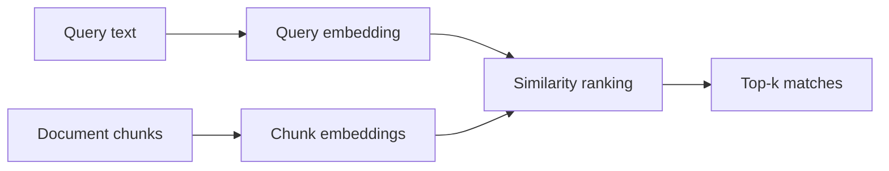

**Embeddings** map text to dense vectors so “reduce infra cost” can match “cloud spend optimization” even when the words differ. Semantic search ranks documents by vector similarity instead of exact keywords. Together they are the retrieval engine underneath most RAG systems.

## Intuition

Imagine every sentence as a point in a high-dimensional space where nearby points share meaning. The embedding model learned that geometry from huge text corpora: synonyms cluster, unrelated jargon sits far apart. A query becomes a point too; the nearest document points are your search results.

Keyword search asks “were these tokens present?” Semantic search asks “is the meaning close?” You often want both (hybrid search appears in the advanced chapter). For now, focus on the geometry: good embeddings + a similarity metric ≈ meaning-aware retrieval.



## How it works

**From one-hot to dense vectors.** Classic one-hot encoding gives each vocabulary word a sparse vector of length `|V|` with a single 1. Distinct words are always orthogonal — “cat” is as far from “dog” as from “refrigerator.” Distributed embeddings (Word2Vec-era and today’s sentence transformers) use dense vectors of a few hundred dimensions where similarity reflects usage in context.

**Document vs query embeddings.** Modern systems embed whole chunks (sentences or paragraphs), not only single words. Use the same model family for queries and documents unless the vendor documents an asymmetric pair (e.g. separate query/document towers).

**Cosine similarity.** For vectors `A` and `B`:

```
cos(A, B) = (A · B) / (‖A‖ ‖B‖)
```

Cosine cares about angle, not magnitude, which helps when some texts produce longer vectors. If all vectors are L2-normalized, cosine equals the dot product — a handy optimization in indexes.

**Euclidean distance** `‖A - B‖` is related but sensitive to length. Many vector DBs support both; cosine / inner product dominate text search.

**Top-k retrieval.** Embed the query, score all (or approximately all) stored vectors, return the `k` highest. Approximate nearest neighbor (ANN) indexes trade a little recall for huge speed — covered with vector databases next.

**Chunking matters.** Embeddings summarize a chunk into one point. A chunk that mixes three unrelated topics blurs that point. Prefer coherent chunks with modest overlap so boundary sentences are not lost.

## In code

A numpy toy: random but fixed “embeddings,” cosine ranking, and a reminder that real models replace `embed()`.

```python
import numpy as np

rng = np.random.default_rng(0)

# Fake embedding table for a tiny corpus (dim=8)
docs = [
    "cloud spend optimization tips",
    "reduce infrastructure cost this quarter",
    "chocolate cake recipe with frosting",
    "kubernetes horizontal pod autoscaling",
]
# Pretend an embedder: bag-of-words hash into R^8
vocab = {}

def tokenize(text: str) -> list[str]:
    return text.lower().split()

def embed(text: str, dim: int = 8) -> np.ndarray:
    v = np.zeros(dim)
    for tok in tokenize(text):
        if tok not in vocab:
            vocab[tok] = rng.normal(size=dim)
        v += vocab[tok]
    n = np.linalg.norm(v)
    return v / n if n > 0 else v

doc_vecs = np.stack([embed(d) for d in docs])

def cosine(a: np.ndarray, b: np.ndarray) -> float:
    return float(np.dot(a, b))  # already normalized

def search(query: str, k: int = 2) -> list[tuple[str, float]]:
    q = embed(query)
    scores = [cosine(q, dv) for dv in doc_vecs]
    order = np.argsort(scores)[::-1][:k]
    return [(docs[i], scores[i]) for i in order]

for text, score in search("how do I cut infra costs?"):
    print(f"{score:.3f}  {text}")
```

You should see the two cost-related lines outrank the cake recipe. Replace `embed` with a real sentence-transformer API for production quality.

## What goes wrong

- **Wrong metric.** Mixing unnormalized Euclidean search with cosine-trained embeddings scrambles ranking.
- **Model mismatch.** Embedding the corpus with model A and queries with model B puts points in incompatible spaces.
- **Mega-chunks.** 4,000-token blobs embed as mush; tiny fragments lose context. Tune chunk size to the task.
- **Vocabulary shift.** Domain jargon (internal codenames) may sit in a weak region of a general embedder — fine-tune or hybridize with keywords.
- **Assuming semantic always wins.** Part numbers, error codes, and exact IDs often need lexical match, not “nearby meaning.”

## Practical embedding choices

**Dimensionality and storage.** 384-d embeddings are lighter and often enough for FAQ search; 768–3072-d models may capture finer nuance at higher cost. Pick based on measured recall@k and budget, not brochure peak scores on unrelated benchmarks.

**Domain shift.** Internal codenames (“Project Falcon”) will not sit near “latency budget workstream” unless your corpus or fine-tuning teaches that. Hybrid search and synonym glossaries patch many gaps without a custom embedder. When gaps remain, consider fine-tuning a sentence model on query–doc pairs from search logs.

**Batch vs real-time embedding.** Ingest is bulk and retryable; query embedding is on the latency path. Cache query embeddings for identical strings in short TTLs if traffic repeats. Monitor embedder errors separately from vector DB errors so on-calls know which pager to wake.

**Evaluation tip.** Build a mini set of query → expected doc titles and compute recall@10 whenever you change models or chunking. Embedding upgrades that look nicer in a notebook sometimes hurt your actual corpus — numbers beat vibes.

## One-line summary

Embeddings place text in a vector space so semantic search can rank meaning-neighbors with cosine similarity instead of exact keywords alone.

## Key terms

- **Embedding:** dense vector representation of text (or other modalities).
- **Semantic search:** retrieval by meaning similarity in embedding space.
- **Cosine similarity:** angle-based likeness ` (A·B) / (‖A‖‖B‖) `.
- **Top-k:** returning the k highest-scoring items.
- **Chunk:** contiguous text unit embedded and indexed for retrieval.
- **ANN:** approximate nearest neighbor search for large vector collections.
