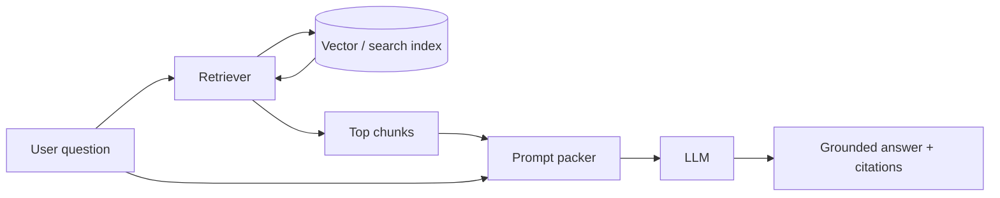

**Retrieval-Augmented Generation (RAG)** connects a language model to an external knowledge base at inference time. Instead of hoping the model memorized your HR policy or product docs during training, you retrieve relevant snippets and ask the model to answer *using* them. That is how teams get fresher facts, private data access, and traceable answers without a full fine-tune for every edit.

## Intuition

An LLM’s weights are a lossy, frozen encyclopedia. Your company wiki is a living filing cabinet. RAG is the pattern of **look it up, then write**. The retriever is the librarian; the generator is the writer who must stay faithful to the books on the desk. If the librarian brings the wrong books, the writer either hallucinates or honestly says “not in the sources” — your prompts and evaluations decide which.



## How it works

**Offline (ingest).**

1. Collect documents (PDFs, HTML, tickets, markdown).
2. Clean and split into chunks with overlap and metadata (source URL, updated_at, ACL).
3. Embed chunks and upsert into a vector index (and often a keyword index).

**Online (query).**

1. Optionally rewrite the user question for search.
2. Retrieve top-k chunks (dense, sparse, or hybrid).
3. Optionally re-rank to a smaller set that fits the context window.
4. Pack question + chunks into a prompt with clear delimiters and citation IDs.
5. Generate an answer; require the model to cite chunk IDs or refuse when evidence is missing.

**Why not only fine-tune?** Fine-tuning shapes style and specialized behavior; it is a poor CMS. Policies change weekly; re-indexing beats re-training. Many production systems combine light fine-tuning or adapters with RAG for facts.

**Context packing.** Order chunks by relevance, cap tokens, and label each block:

```
[doc_3] ...text...
[doc_7] ...text...
```

Instruct: “Use only these sources. Cite `[doc_id]`. If absent, say you lack evidence.”

## In code

A bare-metal RAG loop with toy retrieval (cosine over bag embeddings) and a prompt packer. Swap stubs for a real embedder and LLM.

```python
import numpy as np

rng = np.random.default_rng(1)
chunks = [
    {"id": "hr_1", "text": "Employees receive 12 casual leaves per calendar year."},
    {"id": "hr_2", "text": "Parental leave is 26 weeks for primary caregivers."},
    {"id": "eng_1", "text": "Services must expose /healthz for readiness probes."},
]

def embed(text: str, dim: int = 16) -> np.ndarray:
    v = np.zeros(dim)
    for tok in text.lower().split():
        rng_tok = np.random.default_rng(abs(hash(tok)) % (2**32))
        v += rng_tok.normal(size=dim)
    n = np.linalg.norm(v)
    return v / n if n else v

matrix = np.stack([embed(c["text"]) for c in chunks])

def retrieve(query: str, k: int = 2) -> list[dict]:
    q = embed(query)
    scores = matrix @ q
    idx = np.argsort(scores)[::-1][:k]
    return [chunks[i] | {"score": float(scores[i])} for i in idx]

def pack_prompt(question: str, hits: list[dict]) -> str:
    blocks = "\n\n".join(f"[{h['id']}] {h['text']}" for h in hits)
    return f"""Answer ONLY from the sources. Cite ids like [hr_1].
If the answer is not present, say "Not in sources."

SOURCES:
{blocks}

QUESTION: {question}
"""

hits = retrieve("How many casual leaves do I get?")
prompt = pack_prompt("How many casual leaves do I get?", hits)
print(prompt)
# answer = llm.complete(prompt)
```

Even with a fake embedder, the packer shape is what production RAG looks like: retrieve -> label -> constrain -> generate.

## What goes wrong

- **Retrieval miss.** Right answer exists but never enters the prompt; the model invents or hedges wrongly. Fix chunking, hybrid search, and query rewriting before blaming the LLM.
- **Context stuffing.** Dumping 40 mediocre chunks dilutes attention; the model quotes noise. Re-rank and keep fewer, better snippets.
- **Unfaithful generation.** Evidence is present but ignored. Tighten prompts, lower temperature, add citation checks, or use a faithfulness grader.
- **Stale indexes.** Docs updated in Confluence but not re-embedded. Treat ingest as a pipeline with freshness SLAs.
- **ACL leaks.** Retriever returns a doc the user cannot see. Filter by permissions *before* packing the prompt.
- **Conflicting sources.** Two policies disagree; without guidance the model averages them. Prefer newest metadata or explicit conflict handling.

## Designing the prompt pack carefully

The packer is a product surface. Put **instructions first or last** (test both; models differ), keep sources clearly bounded, and include a machine-readable citation scheme from day one. If you postpone citations, users will ask “where did you get that?” and you will retrofit IDs under pressure.

**Token budgeting.** Count tokens for system rules + question + sources. When over budget, drop lowest-ranked chunks, do not silently truncate mid-sentence inside the best chunk. Log `dropped_chunk_ids` for debugging “it was in the index but not in the answer.”

**Caching.** Identical questions under stable indexes can reuse retrieval results (and sometimes full answers) with a TTL. Invalidate on re-ingest of cited docs. Cache keys should include embedder version and index generation, not only the question string.

**Human escalation.** For workflows that change money, access, or medical/legal advice, RAG should propose — not finalize. Grounded drafts with citations are ideal copilots for a human who clicks approve.

## One-line summary

RAG retrieves relevant private or fresh documents at query time and conditions the LLM on those chunks so answers stay grounded and updatable without retraining.

## Key terms

- **RAG:** retrieval-augmented generation — retrieve then generate.
- **Retriever:** component that selects candidate chunks for a query.
- **Generator:** LLM that produces the final answer from question + context.
- **Context packing:** formatting chunks and instructions into the prompt.
- **Grounding:** tying claims to retrieved evidence.
- **Ingest pipeline:** offline clean -> chunk -> embed -> index process.
