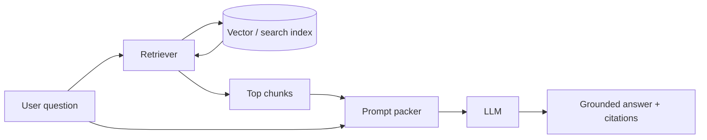

**RAG** stands for **retrieval-augmented generation**. Instead of asking a language model to answer from memory alone, you **find relevant text first**, **add it to the prompt**, then **let the model write an answer tied to that evidence**.

## Intuition

An LLM's weights are a frozen, lossy encyclopedia. Your company wiki is a living filing cabinet. RAG is the pattern: **look it up, then write**.

| Problem with plain LLMs | Plain-English idea | How RAG helps |
| --- | --- | --- |
| **Hallucination** | Confident answers with no real source | Answers must lean on retrieved text |
| **Verifiability** | Hard to check where a claim came from | Citations point to source chunks |
| **Knowledge cutoff** | Model only knows training data up to a date | Fresh docs can be indexed and fetched live |

:::key
RAG is useful when the answer must come from current, private, or auditable information—not from the model's memory alone.
:::



## How it works

### Core workflow

1. **Index** documents so they can be searched.
2. **Receive** the user question.
3. **Retrieve** the most relevant chunks.
4. **Optionally** rewrite or rerank the retrieved text.
5. **Build** a prompt with the question and the evidence.
6. **Generate** an answer using only that prompt.
7. **Evaluate** whether the answer is supported by the evidence.

### Offline (ingest)

1. Collect documents (PDFs, HTML, tickets, markdown).
2. Clean and split into **chunks** with overlap and metadata (source URL, updated date, access tags).
3. Embed chunks and store them in a vector index (often plus a keyword index).

### Online (query)

1. Optionally rewrite the user question for search.
2. Retrieve top-k chunks (dense, sparse, or hybrid).
3. Optionally rerank to a smaller set that fits the context window.
4. Pack question + chunks into a prompt with clear labels and citation IDs.
5. Generate; require citations or refusal when evidence is missing.

### Naive RAG vs advanced RAG

| Mode | What happens | When it helps |
| --- | --- | --- |
| **Naive RAG** | Raw query → retrieve top chunks → answer | Simple factual questions |
| **Advanced RAG** | Rewrite query, rerank, compress context, then answer | Vague, multi-hop, or domain-specific questions |

### Retriever vs generator

| Role | Job |
| --- | --- |
| **Retriever** | Finds the best supporting chunks |
| **Generator (LLM)** | Writes the final answer from those chunks |

The retriever decides what the model **sees**. The generator decides how that evidence is **explained**. If retrieval is weak, the answer will be weak too.

### Grounding

**Grounding** means tying the response to retrieved evidence instead of letting the model freewheel.

Example: if the retrieved policy says "leave requests must be filed 3 days in advance," the answer should repeat that rule—not invent a different one.

### Why not only fine-tune?

Fine-tuning shapes style and behavior; it is a poor content management system. Policies change weekly; re-indexing beats re-training. Many production systems combine light fine-tuning with RAG for facts.

## In code

A bare-metal RAG loop with toy retrieval and a prompt packer.

```python
import numpy as np

rng = np.random.default_rng(1)
chunks = [
    {"id": "hr_1", "text": "Employees receive 12 casual leaves per calendar year."},
    {"id": "hr_2", "text": "Parental leave is 26 weeks for primary caregivers."},
    {"id": "eng_1", "text": "Services must expose /healthz for readiness probes."},
]

def embed(text: str, dim: int = 16) -> np.ndarray:
    v = np.zeros(dim)
    for tok in text.lower().split():
        rng_tok = np.random.default_rng(abs(hash(tok)) % (2**32))
        v += rng_tok.normal(size=dim)
    n = np.linalg.norm(v)
    return v / n if n else v

matrix = np.stack([embed(c["text"]) for c in chunks])

def retrieve(query: str, k: int = 2) -> list[dict]:
    q = embed(query)
    scores = matrix @ q
    idx = np.argsort(scores)[::-1][:k]
    return [chunks[i] | {"score": float(scores[i])} for i in idx]

def pack_prompt(question: str, hits: list[dict]) -> str:
    blocks = "\n\n".join(f"[{h['id']}] {h['text']}" for h in hits)
    return f"""Answer ONLY from the sources. Cite ids like [hr_1].
If the answer is not present, say "Not in sources."

SOURCES:
{blocks}

QUESTION: {question}
"""

hits = retrieve("How many casual leaves do I get?")
print(pack_prompt("How many casual leaves do I get?", hits))
```

## What goes wrong

### Retrieval failures

- **Wrong chunk** — Search matches related but incorrect text.
- **Incomplete retrieval** — The answer needs facts from multiple docs, but only one comes back.
- **Stale knowledge base** — Documents were not updated; outdated text is retrieved.

### Context failures

- **Lost in the middle** — LLMs may pay less attention to useful info in the middle of a long context.
- **Context overload** — Too many chunks make it hard to focus on what matters.
- **Irrelevant context** — Noisy chunks distract even when a good chunk is present.

### Generation failures

- **Hallucination despite retrieval** — The model still invents facts not in the retrieved text.
- **Knowledge conflict** — Retrieved text says one thing; model memory pushes another.
- **Attribution errors** — Wrong source cited, or context ignored.

Fix retrieval (chunking, hybrid search, query rewriting) before blaming the LLM.

## Types of RAG

| Variant | Plain-English idea | Best for | Uses memory? |
| --- | --- | --- | --- |
| **Standard RAG** | One query, one retrieval, one answer | Straightforward lookup | No |
| **RAG with memory** | Past turns plus retrieval | Follow-up questions ("What about its population?") | Yes |
| **Agentic RAG** | Model plans tools and searches again | Multi-step tasks | Often |
| **CoRAG (chain-of-RAG)** | Chain of sub-questions and sub-answers | Deep research, complex reasoning | Can use chains |

## Evaluation snapshot (RAGAS)

**RAGAS** (Retrieval-Augmented Generation Assessment Suite) is an open-source framework for scoring RAG quality.

| Metric | Plain-English question |
| --- | --- |
| **Context precision** | Was the retrieved context actually relevant? |
| **Context recall** | Did we fetch enough of the needed evidence? |
| **Answer relevancy** | Does the answer address the question? |
| **Faithfulness** | Is every claim supported by the retrieved context? |

Example: retrieved text says Shakespeare wrote *Romeo and Juliet*. An answer adding "in 1597" fails faithfulness if that date is not in the context.

## One-line summary

RAG retrieves relevant documents at query time and conditions the LLM on those chunks so answers stay grounded and updatable without retraining.

## Key terms

- **RAG (retrieval-augmented generation):** retrieve evidence, then generate an answer from it.
- **Retriever:** component that selects candidate chunks for a query.
- **Generator:** the LLM that produces the final answer.
- **Grounding:** tying claims to retrieved evidence.
- **Ingest pipeline:** offline clean → chunk → embed → index.
- **Faithfulness:** whether the answer stays inside the retrieved text.
