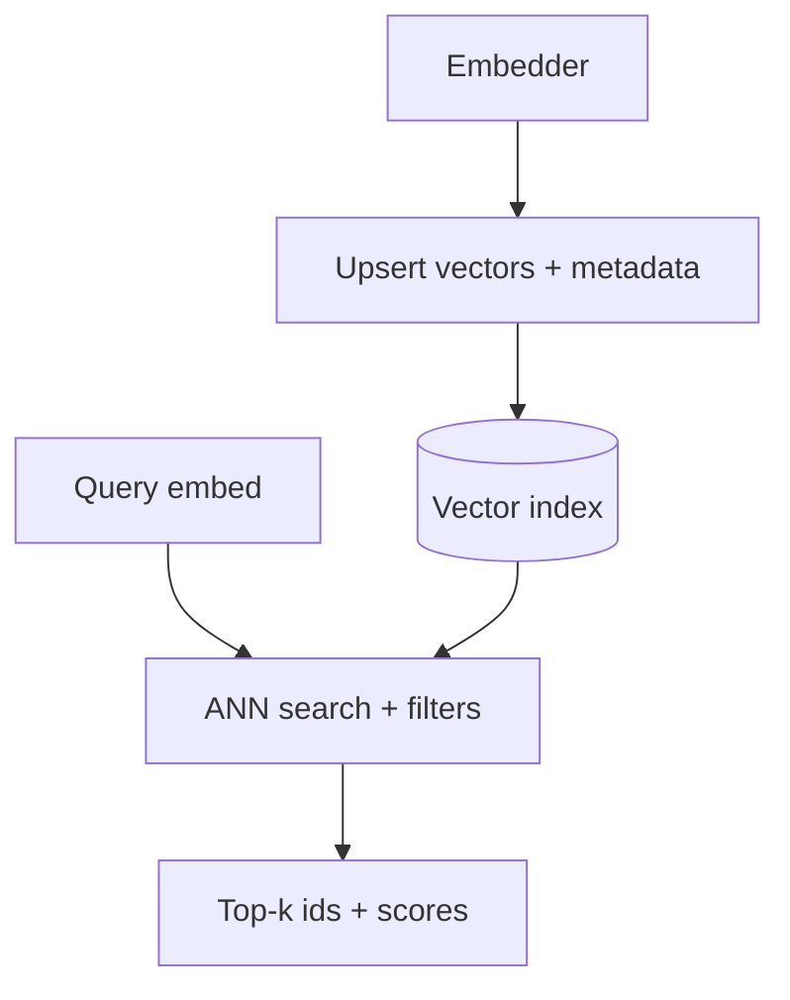

A **vector database** (or vector index inside a general store) saves embeddings and answers "which stored vectors are closest to my query?" fast enough for interactive RAG. At ten documents, a simple loop in numpy is fine. At ten million chunks, you need indexing, filtering, and operational discipline.

## Intuition

Think of a library shelved by "topic coordinates." When a question arrives, the librarian walks to the right region instead of reading every spine.

| Approach | Plain-English idea | Trade-off |
| --- | --- | --- |
| **Brute-force KNN (k-nearest neighbors)** | Compare query to every vector | Exact but slow at scale |
| **ANN (approximate nearest neighbor)** | Skip most vectors using smart indexes | Much faster; may miss a true neighbor |

Common **ANN** methods include **HNSW** (hierarchical navigable small world graph), **IVF** (inverted file index), and **PQ** (product quantization). You trade a little recall for huge speed and memory savings.



## How it works

### Core API

- **Upsert** — Store `id → vector` plus metadata (`source`, `tenant`, `updated_at`).
- **Query** — Vector + `top_k` + optional metadata filter (`tenant = acme AND lang = en`).
- **Delete** — Remove outdated chunks when documents change.

### Index types (conceptual)

| Index | Plain-English idea | Good when |
| --- | --- | --- |
| **Flat / brute force** | Compare to every vector | Small corpora, recall baselines |
| **HNSW** | Layered graph of near neighbors | Strong recall/latency on CPU; RAM-heavy |
| **IVF** | Cluster vectors; search only nearby buckets | Millions of vectors with tuning |
| **PQ** | Compress vectors into short codes | Tight memory budgets |

### Metadata filtering

Essential for multi-tenant apps and access control. Always enforce authorization in your app layer too—the index filter is necessary but not sufficient if misconfigured.

### Common systems

Pinecone, Weaviate, Milvus, Qdrant, Chroma (dev/light), pgvector. Choose based on ops model, filter strength, hybrid search, and cost at your scale.

### Operations

A model change requires **full re-embed**. Track index build time, recall@k vs a flat baseline, p95 query latency, and how stale upserts are. Store canonical text elsewhere; the vector store is an index, not your CMS.

## In code

A tiny in-memory vector store with cosine search and metadata filters.

```python
import numpy as np
from dataclasses import dataclass

@dataclass
class Row:
    id: str
    vector: np.ndarray
    meta: dict

class TinyVectorDB:
    def __init__(self):
        self.rows: list[Row] = []

    def upsert(self, id: str, vector: np.ndarray, meta: dict):
        v = vector / (np.linalg.norm(vector) + 1e-9)
        self.rows = [r for r in self.rows if r.id != id]
        self.rows.append(Row(id, v, meta))

    def query(self, vector: np.ndarray, k: int = 3, where: dict | None = None):
        q = vector / (np.linalg.norm(vector) + 1e-9)
        scored = []
        for r in self.rows:
            if where and any(r.meta.get(key) != val for key, val in where.items()):
                continue
            scored.append((float(np.dot(q, r.vector)), r))
        scored.sort(key=lambda x: x[0], reverse=True)
        return scored[:k]

db = TinyVectorDB()
rng = np.random.default_rng(2)
db.upsert("a", rng.normal(size=4), {"tenant": "acme", "topic": "hr"})
db.upsert("b", rng.normal(size=4), {"tenant": "acme", "topic": "eng"})
db.upsert("c", rng.normal(size=4), {"tenant": "other", "topic": "hr"})

hits = db.query(rng.normal(size=4), k=2, where={"tenant": "acme"})
print([(score, r.id, r.meta["topic"]) for score, r in hits])
```

Production APIs mirror `upsert` / `query`; the difference is ANN structures, durability, and distributed filters.

## What goes wrong

- **Silent model skew** — Half the corpus embedded with one model, new docs with another; scores become meaningless.
- **Filter bugs** — Forgetting `tenant` in the query leaks another customer's chunks into the prompt.
- **Unbounded k** — Huge `top_k` blows token cost; the DB is happy, your bill is not.
- **DB as source of truth** — Store canonical documents elsewhere; vectors can be regenerated from text.
- **Ignoring deletes** — Updated PDFs leave ghost chunks that contradict new policy.

:::key
When switching embedding models, build a parallel collection, backfill, flip traffic, then delete the old one. Half-migrated corpora are a classic outage.
:::

## One-line summary

Vector databases index embeddings for fast approximate similarity search with metadata filters so RAG can retrieve the right chunks at interactive latency.

## Key terms

- **Vector database:** store optimized for nearest-neighbor lookup over embeddings.
- **KNN (k-nearest neighbors):** brute-force search comparing the query to every vector.
- **ANN:** approximate nearest neighbor search—fast with possible missed neighbors.
- **Upsert:** insert or update a vector and its metadata.
- **Metadata filter:** constrain search by tenant, date, language, etc.
- **Recall@k:** fraction of true neighbors found in the top k under approximation.
- **Re-embedding:** recomputing vectors after an embedding-model change.
