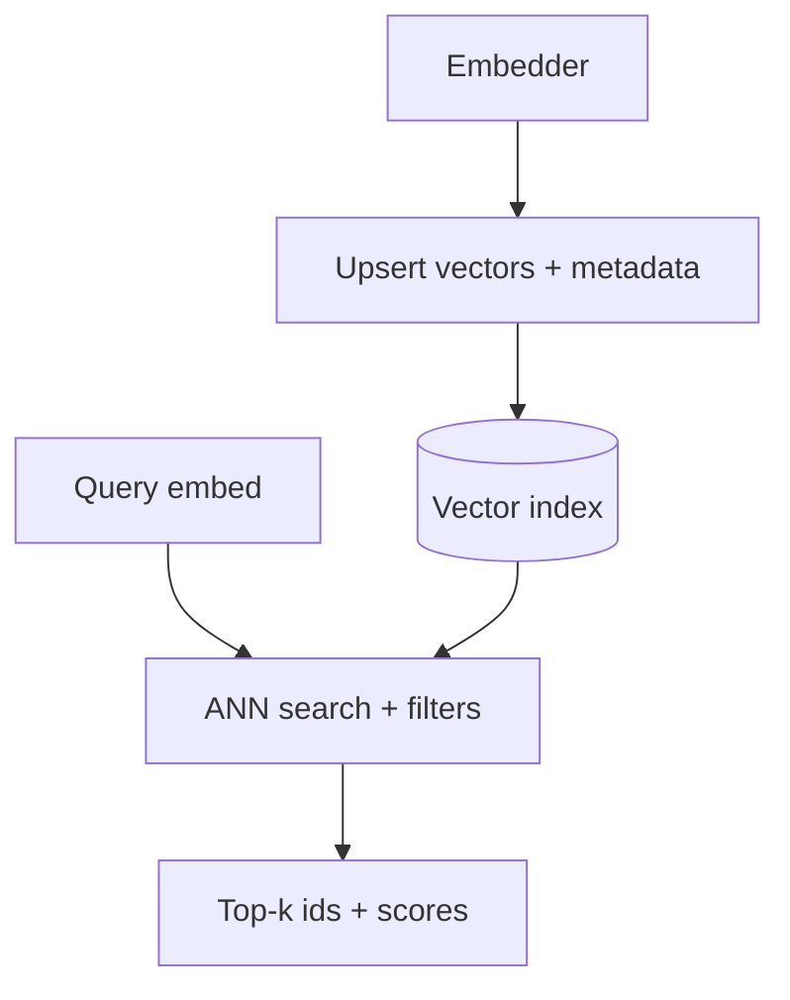

A **vector database** (or vector index inside a general store) persists embeddings and serves nearest-neighbor queries fast enough for interactive RAG. At ten documents, a numpy scan is fine. At ten million chunks, you need indexing, filtering, replication, and operational discipline — that is the product category vector DBs occupy.

## Intuition

Think of a library that shelves books not by title alone but by “topic coordinates.” When a question arrives, the librarian walks to the right region of the shelves instead of reading every spine. Exact search would compare the query to every vector (`O(n)`). Approximate indexes (HNSW, IVF, product quantization) jump through a graph or coarse clusters to find *mostly* the best neighbors in sublinear time. You trade a little recall for orders-of-magnitude speed.



## How it works

**Core API.**

- **Upsert:** store `id -> vector`, plus metadata (`source`, `tenant`, `updated_at`).
- **Query:** vector + `top_k` + optional metadata filter (`tenant = acme AND lang = en`).
- **Delete / tombstone:** remove outdated chunks when docs change.

**Indexes (conceptual).**

- **Flat / brute force:** exact, great for small corpora and recall baselines.
- **HNSW:** graph of near neighbors; strong recall/latency trade-off; memory hungry.
- **IVF / clustering:** probe a few clusters; good at scale with tuning.
- **PQ / compression:** store coarse codes to shrink RAM at some quality cost.

**Metadata filtering.** Essential for multi-tenant SaaS and ACL. Filter-then-search vs search-then-filter changes performance; engines differ. Always enforce authorization in your app layer too — the index filter is necessary but not sufficient if misconfigured.

**Hybrid storage.** Many teams keep keywords in Elasticsearch/OpenSearch and vectors in a specialist (or use one engine that does both). Postgres + `pgvector` is a popular starting point when operational simplicity beats peak ANN performance.

**Common systems.** Pinecone, Weaviate, Milvus, Qdrant, Chroma (dev/light), pgvector. Choose based on ops model (managed vs self-host), filter strength, hybrid search, and cost at your dimension x cardinality.

**Operations.** Version embedding models: a model change requires **full re-embed**. Track index build time, recall@k vs a flat baseline, p95 query latency, and staleness of upserts. Back up ids and metadata; vectors can be regenerated if you keep source text.

## In code

Simulate a tiny in-memory vector store with cosine search and metadata filters — the mental model behind every hosted API.

```python
import numpy as np
from dataclasses import dataclass

@dataclass
class Row:
    id: str
    vector: np.ndarray
    meta: dict

class TinyVectorDB:
    def __init__(self):
        self.rows: list[Row] = []

    def upsert(self, id: str, vector: np.ndarray, meta: dict):
        v = vector / (np.linalg.norm(vector) + 1e-9)
        self.rows = [r for r in self.rows if r.id != id]
        self.rows.append(Row(id, v, meta))

    def query(self, vector: np.ndarray, k: int = 3, where: dict | None = None):
        q = vector / (np.linalg.norm(vector) + 1e-9)
        scored = []
        for r in self.rows:
            if where and any(r.meta.get(key) != val for key, val in where.items()):
                continue
            scored.append((float(np.dot(q, r.vector)), r))
        scored.sort(key=lambda x: x[0], reverse=True)
        return scored[:k]

db = TinyVectorDB()
rng = np.random.default_rng(2)
db.upsert("a", rng.normal(size=4), {"tenant": "acme", "topic": "hr"})
db.upsert("b", rng.normal(size=4), {"tenant": "acme", "topic": "eng"})
db.upsert("c", rng.normal(size=4), {"tenant": "other", "topic": "hr"})

hits = db.query(rng.normal(size=4), k=2, where={"tenant": "acme"})
print([(score, r.id, r.meta["topic"]) for score, r in hits])
```

Production APIs mirror `upsert` / `query`; the difference is ANN structures, durability, and distributed filters.

## What goes wrong

- **Silent model skew.** Half the corpus embedded with `text-emb-3`, new docs with another model — scores become meaningless. Pin and migrate atomically.
- **Filter bugs.** Forgetting `tenant` in the query leaks another customer’s chunks into the prompt.
- **Over-sharding early.** Premature multi-index complexity; start simple, measure recall and latency, then specialize.
- **Unbounded k.** Huge `top_k` into the LLM blows tokens; the DB is happy, your bill is not. Re-rank down.
- **Treating the DB as source of truth for text.** Store canonical documents elsewhere; the vector store is an index, not your CMS.
- **Ignoring delete/re-index.** Updated PDFs leave ghost chunks that contradict new policy.

## Operating indexes without drama

**Capacity planning.** Memory roughly scales with `num_vectors * dimensions * bytes_per_dim` plus graph overhead for HNSW. Quantization reduces RAM at a recall cost — measure before celebrating the savings. Disk-based indexes help huge corpora but add latency variance.

**Blue/green re-embeds.** When switching embedding models, build a parallel collection, backfill, flip traffic on recall/latency gates, then delete the old collection. Half-migrated corpora are a classic outage class: queries and docs in different geometries.

**SLOs worth having.** p95 query latency, upsert lag (time from doc publish to searchable), and recall@k versus a flat sample. Alert on upsert lag; stale policy is a correctness bug, not a cosmetic delay.

**Local vs managed.** `pgvector` or a lightweight engine is perfect for learning and early products. Managed specialist stores buy ops time when you need multi-region, strong hybrid, or billion-scale ANN. Migrate when metrics — not Twitter threads — say you must.

## One-line summary

Vector databases index embeddings for fast approximate similarity search with metadata filters so RAG can retrieve the right chunks at interactive latency.

## Key terms

- **Vector database / index:** store optimized for nearest-neighbor lookup over embeddings.
- **ANN (HNSW, IVF, PQ):** approximate indexes trading recall for speed/memory.
- **Upsert:** insert or update a vector and its metadata.
- **Metadata filter:** constraining search by fields like tenant, date, or language.
- **Recall@k:** fraction of true neighbors found in the top k under approximation.
- **Re-embedding:** recomputing vectors after an embedding-model change.
