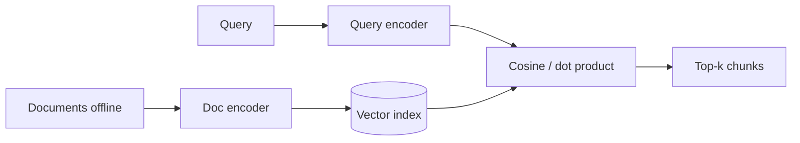

**Dense retrieval** turns queries and documents into embeddings and compares their meaning—not just their exact words. A **bi-encoder** embeds the query and each document separately so document vectors can be precomputed and indexed. That is the standard setup for fast semantic search in RAG.

## Intuition

Keyword search is a checklist: "Did these words appear?" Dense search is a meaning map: "Are these ideas close?"

Example: the query "How much vacation do I get?" may fail to find "Employees accrue 18 days of paid leave annually" with keyword search—the words do not match. Dense retrieval can still connect them.

| Aspect | Sparse (keyword) retrieval | Dense retrieval |
| --- | --- | --- |
| **Core idea** | Match exact words | Match semantic meaning |
| **Good for** | Names, codes, IDs, rare terms | Synonyms, paraphrases, related ideas |
| **Weakness** | Misses meaning when wording changes | Needs a good embedding model |



## How it works

### Why one-hot vectors fail

In a **one-hot vector**, every word is its own dimension. "Cat" and "kitten" are unrelated dimensions, so their dot product is zero even though the meaning is close.

**Dense vectors** spread meaning across dimensions. Similar sentences land near each other in vector space.

### Sentence embeddings

Modern systems embed whole sentences or paragraphs—not just single words.

**BERT-style idea:** the **[CLS]** token (a special token at the start) often acts as a summary of the whole input.

**Cosine similarity** compares the angle between two vectors:

```
cosine(a, b) = (a · b) / (||a|| × ||b||)
```

Closer to 1 means more similar meaning. Near 0 means unrelated.

### Why plain BERT is not enough for retrieval

BERT is trained to understand text—not to rank documents for search. Better approach: train the encoder so **relevant query–document pairs are close** and **irrelevant pairs are far apart**.

| Training pair | Plain-English idea |
| --- | --- |
| **Positive pair** | A query and a document that should match |
| **Negative pair** | A query and a document that should not match |
| **In-batch negatives** | Other docs in the same training batch act as easy negatives |
| **Hard negatives** | Docs that look relevant but are wrong—teach a stronger lesson |

### Bi-encoder vs cross-encoder

| Model type | How it works | Speed | Accuracy |
| --- | --- | --- | --- |
| **Bi-encoder** | Encode query and document separately; compare embeddings | Fast | Good for first-stage retrieval |
| **Cross-encoder** | Encode query and document together; score relevance directly | Slow | Usually more accurate |

Use bi-encoders for wide first-stage search. Use cross-encoders later to rerank a small candidate set (covered in lesson 2.7 on reranking).

### Choosing an embedding model

**Key lesson:** measure candidates on **your own data**, not only a public leaderboard.

| Model (examples) | Plain-English note |
| --- | --- |
| `all-MiniLM-L6-v2` | Small, fast baseline for prototypes |
| `bge-base-en-v1.5` | Strong open English retrieval |
| `e5-base-v2` | Good asymmetric setup (different query vs passage format) |
| `text-embedding-3-small` | Hosted API; easy start, no GPU |

**Matryoshka representation learning (MRL):** some models train embeddings so the **first part of the vector** already carries useful meaning. You can truncate dimensions to save storage—**only** when the model was trained for this.

| Situation | Lean toward |
| --- | --- |
| General English, zero infrastructure | Hosted APIs |
| Sensitive or on-prem data | Open-weight models (BGE, multilingual-e5) |
| Multilingual text | Multilingual embedders |
| Code, logs, exact IDs | Code embedders or hybrid search with BM25 |
| Tiny corpus that fits in context | Maybe skip RAG entirely |

:::key
Some asymmetric models expect different prefixes for queries and passages (e.g. `query: ...` and `passage: ...`). Forgetting the prefix can silently kill recall—always read the model card.
:::

## In code

Cosine similarity and the bi-encoder mental model.

```python
import numpy as np

def cosine_sim(a, b):
    a = np.array(a, dtype=float)
    b = np.array(b, dtype=float)
    return float(np.dot(a, b) / (np.linalg.norm(a) * np.linalg.norm(b) + 1e-9))

# Toy: query and two doc vectors (pretend from a bi-encoder)
query_vec = np.array([0.9, 0.1, 0.0])
doc_a = np.array([0.85, 0.15, 0.0])   # relevant
doc_b = np.array([0.0, 0.1, 0.95])    # unrelated

print("doc_a", cosine_sim(query_vec, doc_a))
print("doc_b", cosine_sim(query_vec, doc_b))
```

In production, document vectors are computed offline and stored in the index; only the query is embedded at search time.

## What goes wrong

- **Missing query/passage prefixes** — Recall drops; looks like a bad model when it is misconfiguration.
- **Wrong model for the domain** — Internal jargon sits in weak regions of a general embedder.
- **Using cross-encoder for full corpus search** — Too slow; encode every doc per query.
- **Benchmark chasing** — Leaderboard winner hurts your actual corpus; measure recall@k on your data.
- **Truncating vectors without MRL training** — Damages embedding quality.

## One-line summary

Bi-encoders embed queries and documents separately so meaning-based search can run fast at scale, after training (or choosing a model) so relevant pairs land close in vector space.

## Key terms

- **Dense embedding:** a compact vector that encodes meaning.
- **Sentence embedding:** one vector representing a whole sentence or passage.
- **Bi-encoder:** encodes query and document separately for fast retrieval.
- **Cross-encoder:** scores query and document together—accurate but slow.
- **Cosine similarity:** angle-based score between two vectors.
- **Positive / negative pair:** correct vs incorrect query–document matches for training.
- **Hard negative:** a wrong doc that looks relevant—used to sharpen training.
