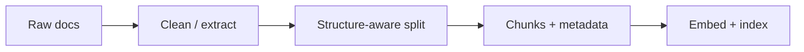

Retrieval quality is decided **before** the first query. **Preprocessing** turns messy PDFs and HTML into clean text. **Chunking** cuts that text into units you embed and fetch. Bad chunks—too huge, too tiny, or split mid-table—make even a perfect vector database look broken.

## Intuition

An embedding is one point summarizing a chunk. A 40-page handbook in one chunk becomes oatmeal: every topic blended. Three words alone lack context. You want chunks that are **one coherent idea**, large enough to answer something, small enough to stay focused.

**Overlap** exists because answers often straddle boundaries. A sentence at the end of chunk 4 may need the first lines of chunk 5.

:::key
Garbage in, garbage out. Many RAG failures are actually parsing failures—the retriever never gets a fair chance.
:::



## How it works

### Preprocessing checklist

- Extract text carefully (PDF layout, headers/footers, two-column junk).
- Strip navigation chrome from HTML; keep headings.
- Normalize Unicode and whitespace; preserve code fences when relevant.
- Attach metadata: `source_id`, `title`, `url`, `updated_at`, `section_path`, access tags.
- Drop boilerplate repeated on every page (confidentiality banners).

### Document types and tools

| Document type | Suggested approach | Why |
| --- | --- | --- |
| **PDF plain prose** | pypdf | Fast when the file is mostly text |
| **PDF with tables** | pdfplumber or Camelot | Preserves row/column structure |
| **Scanned / image PDF** | OCR (optical character recognition) | No text layer to extract otherwise |
| **Complex layout** | layout-aware parser (unstructured, docling) | Reading order matters |
| **HTML pages** | BeautifulSoup, trafilatura | Strip boilerplate; keep useful content |

**OCR** turns scanned images of text into machine-readable text. If a PDF is just an image, a plain extractor may return empty strings—nothing to embed.

Quick probe before parsing:

```python
from pypdf import PdfReader

def pdf_has_text_layer(path, sample=3):
    reader = PdfReader(path)
    return any((p.extract_text() or "").strip() for p in reader.pages[:sample])
```

### Chunking strategies

| Strategy | How it works | Best when |
| --- | --- | --- |
| **Fixed-size** | Split by token count with overlap | Baseline or uniform prose |
| **Sliding window** | Move a window with 10–20% overlap | Answers cross boundaries |
| **Structure-aware** | Split on headings, clauses, sections | Markdown, legal text, code, API docs |
| **Semantic chunking** | Split when topic similarity drops | Topic-shifting docs; quality over cost |
| **Recursive splitting** | Try structure first, then smaller pieces | General-purpose practical choice |
| **Parent–child** | Index small child chunks; return larger parent for context | Balance precision and completeness |

**Common starting point:** about 512 tokens with 10–20% overlap. Match chunk size to the kind of answer you expect—small for FAQ facts, larger for narrative or code.

### When RAG may not be needed

If the knowledge base is tiny and already fits in the model's context window, you may get a simpler result by putting the text directly in the prompt instead of building a retrieval system.

## In code

Structure-aware splitting over Markdown headings with word-based overlap.

```python
import re
from dataclasses import dataclass

@dataclass
class Chunk:
    id: str
    text: str
    section: str
    source: str

def split_markdown(text: str, source: str, max_words: int = 80, overlap: int = 15) -> list[Chunk]:
    parts = re.split(r"(?m)^(#{1,3} .+)$", text)
    sections: list[tuple[str, str]] = []
    current_title = "intro"
    buf = []
    for part in parts:
        if re.match(r"^#{1,3} ", part or ""):
            if buf:
                sections.append((current_title, " ".join(buf).strip()))
                buf = []
            current_title = part.lstrip("#").strip()
        elif part and part.strip():
            buf.append(part.strip())
    if buf:
        sections.append((current_title, " ".join(buf).strip()))

    chunks: list[Chunk] = []
    n = 0
    for title, body in sections:
        words = body.split()
        if not words:
            continue
        start = 0
        while start < len(words):
            end = min(start + max_words, len(words))
            piece = " ".join(words[start:end])
            chunks.append(Chunk(f"{source}_{n}", piece, title, source))
            n += 1
            if end == len(words):
                break
            start = max(0, end - overlap)
    return chunks
```

Production code usually counts real tokenizer tokens, not words.

## What goes wrong

- **Header/footer pollution** — Page numbers and "Company Confidential" become top hits for every query.
- **Splitting tables** — A row severed from its header is unreadable; keep tables atomic or serialize with column names.
- **No overlap** — Boundary answers disappear from retrieval.
- **Metadata amnesia** — Chunks without `source` or access tags cannot be cited or filtered safely.
- **Too much overlap** — Near-duplicate chunks flood top-k and waste storage.

## One-line summary

Preprocess to clean, structured text, then chunk with coherent boundaries, sensible size, overlap, and metadata—because embeddings can only retrieve what you gave them.

## Key terms

- **Preprocessing:** cleaning and extracting text before indexing.
- **Chunk:** indexed unit of text for embedding and retrieval.
- **Overlap:** shared text between neighboring chunks to protect boundary content.
- **OCR (optical character recognition):** turns scanned images into text.
- **Structure-aware splitting:** uses headings/sections instead of only character counts.
- **Parent–child indexing:** retrieve small units, expand to larger context for the LLM.
