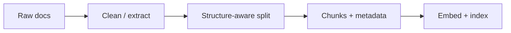

Retrieval quality is decided before the first query. **Preprocessing** turns messy PDFs and HTML into clean text. **Chunking** cuts that text into units you embed and fetch. Bad chunks — too huge, too tiny, or split mid-table — make even a perfect vector database look broken.

## Intuition

An embedding is a single point summarizing a chunk. If the chunk is a whole 40-page handbook, that point is oatmeal: every topic blended. If the chunk is three words, the point lacks context. You want chunks that are **semantically coherent**, large enough to answer something, small enough to stay focused, and labeled with metadata so filters and citations work.

Overlap exists because answers often straddle boundaries. A sentence at the end of chunk 4 may need the first lines of chunk 5; a little duplication is cheaper than a permanent miss.



## How it works

**Preprocessing checklist.**

- Extract text carefully (PDF layout, headers/footers, two-column junk).
- Strip navigation chrome from HTML; keep headings.
- Normalize Unicode, collapse whitespace, preserve code fences when relevant.
- Attach metadata: `source_id`, `title`, `url`, `updated_at`, `section_path`, ACL tags.
- Drop boilerplate repeated on every page (confidentiality banners) or it will retrieve everywhere.

**Chunking strategies.**

- **Fixed tokens:** e.g. 400–800 tokens with 10–20% overlap. Simple baseline.
- **Sentence / paragraph packing:** grow a chunk until a size budget; avoid mid-sentence cuts.
- **Structure-aware:** split on Markdown/HTML headings; keep a section together when small; recursively split when large.
- **Special structures:** tables as CSV-like rows with captions; Q&A pairs as atomic units; code by function/class.

**Parent–child / small-to-big.** Index small chunks for precise matching, but return a larger parent window to the LLM for context. That pattern often beats “one size embeds and prompts.”

**Sizing heuristics.** FAQ bots like smaller chunks; narrative policies like medium sections. Measure with retrieval eval (hit rate on gold questions), not aesthetics.

## In code

A structure-aware splitter over Markdown-ish headings with a token budget approximated by words, plus overlap.

```python
import re
from dataclasses import dataclass

@dataclass
class Chunk:
    id: str
    text: str
    section: str
    source: str

def split_markdown(text: str, source: str, max_words: int = 80, overlap: int = 15) -> list[Chunk]:
    parts = re.split(r"(?m)^(#{1,3} .+)$", text)
    sections: list[tuple[str, str]] = []
    current_title = "intro"
    buf = []
    for part in parts:
        if re.match(r"^#{1,3} ", part or ""):
            if buf:
                sections.append((current_title, " ".join(buf).strip()))
                buf = []
            current_title = part.lstrip("#").strip()
        else:
            if part and part.strip():
                buf.append(part.strip())
    if buf:
        sections.append((current_title, " ".join(buf).strip()))

    chunks: list[Chunk] = []
    n = 0
    for title, body in sections:
        words = body.split()
        if not words:
            continue
        start = 0
        while start < len(words):
            end = min(start + max_words, len(words))
            piece = " ".join(words[start:end])
            chunks.append(Chunk(f"{source}_{n}", piece, title, source))
            n += 1
            if end == len(words):
                break
            start = max(0, end - overlap)
    return chunks

doc = """# Leave policy
Employees receive 12 casual leaves per year.
## Carry over
Up to 5 unused casual leaves may carry to the next year.
"""
for c in split_markdown(doc, source="hr"):
    print(c.id, c.section, "→", c.text[:60])
```

Tune `max_words` against your embedder’s sweet spot; production code often counts real tokenizer tokens.

## What goes wrong

- **Header/footer pollution.** Page numbers and “Company Confidential” become top hits for every query.
- **Splitting tables.** A row severed from its header is unreadable; keep tables atomic or serialize with column names.
- **No overlap.** Boundary answers disappear permanently from retrieval.
- **Metadata amnesia.** Chunks without `source` or ACL cannot be cited or filtered safely.
- **One global size.** Legal contracts and Slack threads need different budgets; route by doc type.
- **Cleaning that deletes meaning.** Stripping all punctuation can break code and identifiers.

## Document-type playbooks

**PDFs.** Watch for ligatures, broken hyphenation across lines, and repeated headers. Table extraction may need a specialized parser; a bad extract that jumbles columns will embed garbage no reranker can fix. Store page numbers in metadata for citations that jump to the right page.

**HTML / Notion / Confluence.** Prefer export paths that preserve heading hierarchy. Strip “Related articles” sidebars or they retrieve as false friends. Keep anchors in metadata so the UI can deep-link.

**Code and config.** Chunk by symbol when possible; include the file path in every chunk’s text prefix (`path: src/auth/token.py`) so lexical search and citations stay meaningful. Do not mix license banners into every function chunk.

**Evaluation for chunking.** When you change splitters, re-run retrieval recall@k on the same gold questions *before* you look at generation quality. Chunking regressions show up as retrieval misses first.

## Overlap, IDs, and re-chunking

Choose overlap as a fraction of chunk size (often 10–15%), not a fixed magic number copied from a blog. Too much overlap wastes index space and can flood the top-k with near-duplicates — add near-duplicate suppression at retrieval if needed. Stable **chunk IDs** should survive harmless whitespace edits when possible (hash of source + section + ordinal) so citations and analytics do not thrash on every ingest.

When re-chunking after a strategy change, rebuild the collection rather than mixing old and new granularities in one index. Mixed chunk regimes make A/B comparisons dishonest and confuse rerankers trained or tuned on prior lengths.

## One-line summary

Preprocess to clean, structured text, then chunk with coherent boundaries, sensible size, overlap, and metadata — because embeddings can only retrieve what you gave them.

## Key terms

- **Preprocessing:** cleaning and extracting text before indexing.
- **Chunk:** indexed unit of text for embedding and retrieval.
- **Overlap:** repeated tokens across adjacent chunks to protect boundary content.
- **Structure-aware splitting:** using headings/sections instead of only character counts.
- **Parent–child indexing:** retrieve small units, expand to larger context for the LLM.
- **Metadata:** fields stored with chunks for filters, citations, and freshness.
