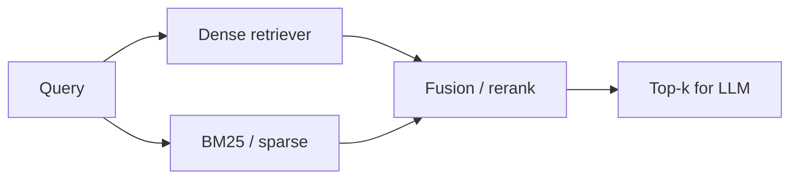

Dense retrieval shines when phrasing differs. **BM25** (and friends) shines when the query contains rare identifiers — SKUs, error codes, API names — that embeddings may blur. **Hybrid search** runs both, then merges scores so you get the strengths of each.

## Intuition

Semantic search is a bloodhound for paraphrase. Keyword search is a metal detector for exact tokens. Ask “how do we fix E_CONN_9182?” and you need the metal detector. Ask “ways to lower our cloud bill” and you need the bloodhound. Production RAG usually keeps both on the leash and fuses their top candidates.



## How it works

**BM25 intuition.** Documents that contain query terms more often score higher, but term frequency saturates (tenth “latency” helps less than the first). Rare terms across the corpus get higher weight (inverse document frequency). Long documents are penalized so they do not win by sheer bulk. The classic scoring flavor is:

```
score ≈ IDF(term) * (tf * (k1 + 1)) / (tf + k1 * (1 - b + b * doc_len / avg_len))
```

You do not memorize constants `k1` and `b`; you remember “TF with saturation + IDF + length norm.”

**Dense retrieval.** Embed query and chunks; rank by cosine / inner product. Captures synonyms and paraphrase; weak on out-of-vocabulary codes if the embedder never saw them as atomic.

**Fusion methods.**

- **Convex combination:** `final = α * norm(dense) + (1-α) * norm(bm25)` after score normalization.
- **Reciprocal Rank Fusion (RRF):** for each document, add `1 / (k + rank)` from each list; robust when score scales differ.
- **Cascade:** take union of top-n from each, then re-rank with a cross-encoder.

**When to bias α.** More BM25 for support desks with ticket IDs; more dense for conceptual wiki Q&A. Measure — do not guess forever.

## In code

A tiny BM25 and dense scorer with RRF merge — enough to internalize the wiring.

```python
import math
import numpy as np
from collections import Counter

docs = [
    "fix error E_CONN_9182 by restarting the sync worker",
    "reduce cloud spend with reserved instances and rightsizing",
    "sync worker configuration and retry policy",
]

def tokenize(s: str) -> list[str]:
    return s.lower().split()

# --- BM25 ---
N = len(docs)
tokenized = [tokenize(d) for d in docs]
df = Counter()
for toks in tokenized:
    for t in set(toks):
        df[t] += 1
avgdl = sum(len(t) for t in tokenized) / N
k1, b = 1.5, 0.75

def idf(term: str) -> float:
    n = df.get(term, 0)
    return math.log(1 + (N - n + 0.5) / (n + 0.5))

def bm25(query: str) -> list[float]:
    q = tokenize(query)
    scores = []
    for toks in tokenized:
        tf = Counter(toks)
        dl = len(toks)
        s = 0.0
        for term in q:
            f = tf.get(term, 0)
            if f == 0:
                continue
            denom = f + k1 * (1 - b + b * dl / avgdl)
            s += idf(term) * (f * (k1 + 1)) / denom
        scores.append(s)
    return scores

# --- Dense (toy hash embed) ---
def embed(text: str, dim: int = 32) -> np.ndarray:
    v = np.zeros(dim)
    for tok in tokenize(text):
        rng = np.random.default_rng(abs(hash(tok)) % (2**32))
        v += rng.normal(size=dim)
    n = np.linalg.norm(v)
    return v / n if n else v

doc_vecs = np.stack([embed(d) for d in docs])

def dense_scores(query: str) -> list[float]:
    q = embed(query)
    return list(doc_vecs @ q)

def rrf(rank_lists: list[list[int]], k: int = 60) -> list[tuple[int, float]]:
    scores = {i: 0.0 for i in range(len(docs))}
    for ranks in rank_lists:
        for rank, doc_i in enumerate(ranks):
            scores[doc_i] += 1.0 / (k + rank + 1)
    return sorted(scores.items(), key=lambda x: x[1], reverse=True)

q = "E_CONN_9182 sync"
bm = bm25(q)
ds = dense_scores(q)
bm_ranks = list(np.argsort(bm)[::-1])
ds_ranks = list(np.argsort(ds)[::-1])
merged = rrf([bm_ranks, ds_ranks])
print("top:", docs[merged[0][0]])
```

Expect the error-code document to surface even when dense paraphrase matching is noisy.

## What goes wrong

- **Score-scale naivety.** Adding raw BM25 to cosine without normalization lets one channel dominate randomly.
- **Dense-only on ID-heavy corpora.** Looks fine in demos with English questions; fails on production tickets.
- **BM25-only on paraphrases.** Users never type your wiki’s exact headings.
- **Double indexing drift.** Keyword and vector stores out of sync after partial upserts.
- **Ignoring analyzers.** Stemming and tokenization choices change BM25 radically across languages.

## Tuning hybrid systems

**Normalize before blending.** Min-max or z-score within the retrieved candidate set, not across the whole corpus, so scores are comparable for that query. RRF avoids much of this pain and is a strong default when you lack time to tune α.

**Analyzers and languages.** BM25 quality hinges on tokenization: lowercasing, stemming, stopwords, CJK segmentation. A dense model multilingual story does not automatically fix a keyword analyzer that splits Unicode poorly. Test with real queries from each locale you support.

**Sparse learned retrievers.** Beyond classic BM25, learned sparse models (e.g. SPLADE-style) produce weighted term vectors that still hit inverted indexes but capture some expansion. They sit conceptually between BM25 and dense — useful when you want lexical controllability with softer matching.

**Ops note.** Keep both indexes updated in one ingest transaction or outbox flow. A vector upsert without the keyword twin (or the reverse) creates “works in staging, flaky in prod” stories that are painful to debug.

## One-line summary

Hybrid search fuses BM25’s exact-term strength with dense embedding recall so rare IDs and paraphrased questions both retrieve well.

## Key terms

- **BM25:** ranking function using saturated term frequency, IDF, and length normalization.
- **Dense retrieval:** embedding-based nearest-neighbor search.
- **Hybrid search:** combining sparse and dense candidate lists.
- **RRF (reciprocal rank fusion):** rank-based merge robust to incompatible score scales.
- **IDF:** higher weight for terms that appear in fewer documents.
- **α-fusion:** weighted mix of normalized channel scores.
