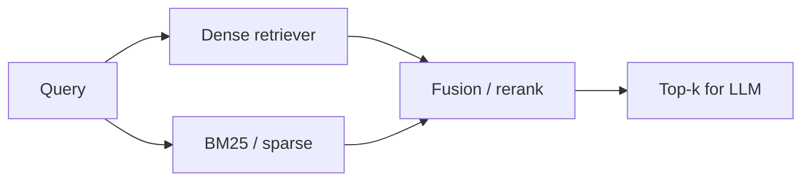

**Dense retrieval** finds relevant text even when words differ. **BM25** (Best Matching 25—a classic keyword ranking formula) shines when the query contains rare identifiers: SKUs, error codes, API names. **Hybrid search** runs both and merges results so you get the strengths of each.

## Intuition

| Search type | Plain-English analogy | Best for |
| --- | --- | --- |
| **Semantic (dense)** | Bloodhound for paraphrase | "Ways to lower our cloud bill" |
| **Keyword (BM25)** | Metal detector for exact tokens | "Fix error E_CONN_9182" |

Production RAG usually keeps both and fuses their top candidates.



## How it works

### Sparse retrieval (keyword)

**Plain English:** match the exact words or terms that appear in the query and the document. Fast and strong when wording matters—names, IDs, codes, rare terms.

### TF-IDF (term frequency–inverse document frequency)

Scores a term higher when it is **common in one document** but **rare across the whole collection**.

```
tf-idf(t, d) = tf(t, d) × log(N / df(t))
```

**Plain English:** a word matters if it appears often in one doc and not everywhere else.

### BM25

**BM25** improves on TF-IDF by considering term frequency **and** document length.

**Plain English:** a term gets more credit if it appears a reasonable number of times, but very long documents are not unfairly rewarded.

Example: two documents mention the query terms—BM25 prefers the one where those terms are concentrated and informative, not repeated endlessly in a huge article.

### Dense retrieval

Embed query and chunks; rank by cosine similarity or inner product. Captures synonyms and paraphrase; weaker on out-of-vocabulary codes the embedder never saw as atomic.

### Comparison table

| Aspect | Sparse (BM25) | Dense |
| --- | --- | --- |
| **Core idea** | Match exact words | Match semantic meaning |
| **Good for** | Names, codes, IDs | Synonyms, paraphrases |
| **Weakness** | Misses meaning when wording changes | May blur exact tokens |

### Fusion methods

| Method | Plain-English idea |
| --- | --- |
| **Alpha fusion** | Weighted mix of normalized dense + BM25 scores |
| **RRF (reciprocal rank fusion)** | Add `1 / (k + rank)` from each list—robust when score scales differ |
| **Cascade** | Union of top-n from each, then rerank with a cross-encoder |

**When to bias toward BM25:** support desks with ticket IDs. **Toward dense:** conceptual wiki Q&A. Measure—do not guess forever.

## In code

Tiny BM25 plus dense scores merged with RRF.

```python
import math
import numpy as np
from collections import Counter

docs = [
    "fix error E_CONN_9182 by restarting the sync worker",
    "reduce cloud spend with reserved instances and rightsizing",
    "sync worker configuration and retry policy",
]

def tokenize(s: str) -> list[str]:
    return s.lower().split()

N = len(docs)
tokenized = [tokenize(d) for d in docs]
df = Counter(t for toks in tokenized for t in set(toks))
avgdl = sum(len(t) for t in tokenized) / N
k1, b = 1.5, 0.75

def bm25(query: str) -> list[float]:
    q = tokenize(query)
    scores = []
    for toks in tokenized:
        tf = Counter(toks)
        dl = len(toks)
        s = 0.0
        for term in q:
            f = tf.get(term, 0)
            if f == 0:
                continue
            idf = math.log(1 + (N - df.get(term, 0) + 0.5) / (df.get(term, 0) + 0.5))
            denom = f + k1 * (1 - b + b * dl / avgdl)
            s += idf * (f * (k1 + 1)) / denom
        scores.append(s)
    return scores

def rrf(rank_lists: list[list[int]], k: int = 60) -> list[tuple[int, float]]:
    scores = {i: 0.0 for i in range(len(docs))}
    for ranks in rank_lists:
        for rank, doc_i in enumerate(ranks):
            scores[doc_i] += 1.0 / (k + rank + 1)
    return sorted(scores.items(), key=lambda x: x[1], reverse=True)

q = "E_CONN_9182 sync"
bm_ranks = list(np.argsort(bm25(q))[::-1])
# (toy dense ranks omitted for brevity—merge with bm_ranks via rrf)
merged = rrf([bm_ranks, bm_ranks])
print("top:", docs[merged[0][0]])
```

## What goes wrong

- **Score-scale naivety** — Adding raw BM25 to cosine without normalization lets one channel dominate.
- **Dense-only on ID-heavy corpora** — Fails on production tickets with error codes.
- **BM25-only on paraphrases** — Users never type your wiki's exact headings.
- **Double indexing drift** — Keyword and vector stores out of sync after partial upserts.
- **Bad tokenization** — Stemming and analyzer choices change BM25 across languages.

:::key
Keep both indexes updated in one ingest flow. A vector upsert without the keyword twin creates flaky "works in staging" bugs.
:::

## One-line summary

Hybrid search fuses BM25's exact-term strength with dense embedding recall so rare IDs and paraphrased questions both retrieve well.

## Key terms

- **BM25 (Best Matching 25):** keyword ranking with term frequency, IDF, and length normalization.
- **TF-IDF:** term frequency–inverse document frequency scoring.
- **Sparse retrieval:** search that matches exact terms or keyword overlap.
- **Dense retrieval:** embedding-based nearest-neighbor search.
- **Hybrid search:** combining sparse and dense candidate lists.
- **RRF (reciprocal rank fusion):** rank-based merge robust to incompatible score scales.
