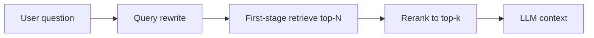

First-stage retrieval is built for **recall at speed**: grab fifty maybe-relevant chunks cheaply. **Reranking** is built for **precision**: score those candidates carefully and keep the best five for the LLM. **Query rewriting** fixes the input so the first stage has a fighting chance — expanding acronyms, turning chatty questions into search queries, or splitting multi-part asks.

## Intuition

A wide net (bi-encoder / BM25) throws fish on the deck. A careful sorter (cross-encoder reranker) picks the keepers. Separately, users ask like humans: “hey can u explain that leave thing from last email?” Search indexes prefer “casual leave policy carry over.” Rewriting is the translator between chat and search.



## How it works

**Query rewriting patterns.**

- **Normalize:** fix spelling, expand product codenames using a glossary.
- **HyDE:** ask an LLM to draft a hypothetical answer passage, embed that for dense search (risky if the draft invents facts — use for retrieval only).
- **Multi-query:** generate 3 paraphrases, retrieve for each, fuse with RRF.
- **Step-back / decomposition:** for complex questions, retrieve for a broader or split sub-question first.

Keep rewrites **instrumented**: log original vs rewritten and A/B hit rates.

**Rerankers.**

- **Cross-encoders:** jointly encode `(query, document)` for a relevance score; accurate, slower — perfect for N<=100.
- **LLM rerankers:** prompt a model to order passages; flexible, costlier.
- **Feature rerankers:** boost by recency, click priors, or metadata match.

**Typical cascade.** Hybrid retrieve N=50 -> cross-encode -> keep k=5 -> generate. Most quality gains per dollar sit in this cascade, not in doubling LLM size.

## In code

Toy rewrite (glossary + strip chitchat) and a cross-encoder stand-in that scores token overlap with a length penalty — swap for a real model later.

```python
import re
import numpy as np

GLOSSARY = {"pto": "paid time off", "hpa": "horizontal pod autoscaling"}

def rewrite(query: str) -> str:
    q = query.lower()
    q = re.sub(r"\b(hey|please|can you|explain)\b", " ", q)
    for src, dst in GLOSSARY.items():
        q = re.sub(rf"\b{src}\b", dst, q)
    return " ".join(q.split())

candidates = [
    "Employees receive 12 casual leaves; unused leaves may carry over up to 5.",
    "Horizontal pod autoscaling adds replicas when CPU is high.",
    "Chocolate cake recipe with three layers of frosting.",
]

def fake_cross_encoder(query: str, doc: str) -> float:
    q_toks = set(query.split())
    d_toks = doc.lower().split()
    overlap = len(q_toks & set(d_toks))
    return overlap / (1.0 + 0.01 * len(d_toks))

def rerank(query: str, docs: list[str], k: int = 2) -> list[tuple[str, float]]:
    scored = [(d, fake_cross_encoder(query, d)) for d in docs]
    scored.sort(key=lambda x: x[1], reverse=True)
    return scored[:k]

original = "hey can u explain PTO carry over?"
q = rewrite(original)
print("rewritten:", q)
for doc, score in rerank(q, candidates):
    print(f"{score:.3f} | {doc[:64]}...")
```

In production, measure recall@50 after rewrite and nDCG@5 after rerank on a labeled set.

## What goes wrong

- **Rewrite hallucination.** HyDE invents a wrong API name and retrieval locks onto fiction. Constrain glossaries; prefer multi-query over creative fiction when stakes are high.
- **Reranking too few.** If stage-one never retrieved the truth (N too small or bad hybrid), rerankers cannot resurrect it.
- **Reranking too many.** Cross-encoding 5,000 docs blows latency SLOs.
- **Chatty context pollution.** Feeding the whole conversation as the search query dilutes keywords; rewrite to a standalone search string.
- **Ignoring freshness.** Relevance-only rerankers promote obsolete policies; add a recency feature when policies churn.

## Putting rewrite and rerank in production

**Latency budgets.** If the user SLO is 2s for the full answer, retrieval + rerank might own only 300–600ms. That caps candidate count and model size. Distilled cross-encoders or vendor rerank APIs exist specifically for this slice. Measure p95 separately from generation time.

**Rewrite guardrails.** Limit rewrite output length; ban invention of part numbers not in a glossary; fall back to the original query if the rewrite model times out. Log both strings. Product and legal teams will eventually ask why a search ran against a transformed query — be ready.

**Learning from clicks.** If your UI shows sources, anonymized click and pin data can train or tune rerankers. Start with simple boosts (“title match +0.1”) before a full learning-to-rank project. Even crude features often beat a generic cross-encoder alone on enterprise jargon.

**A/B discipline.** Change one stage at a time: rewrite on/off, then rerank on/off, then hybrid weights. Simultaneous changes make wins impossible to attribute.

## Failure stories worth remembering

A rewrite that expands “RI” to “Rhode Island” in a cloud-cost corpus full of “reserved instances” will retrieve tourism pages of nonsense if such text exists — or simply miss. Domain glossaries beat unconstrained LLM expansion. Likewise, a reranker trained on open-web relevance may demote your internal runbooks because they look stylistically dull; calibrate on *your* labeled pairs.

Always keep a kill switch: serve first-stage hybrid top-k if the rerank service errors. Degraded relevance beats total outage. Track the fallback rate as a reliability metric beside latency.

## One-line summary

Rewrite user questions into searchable forms, retrieve broadly, then rerank with a stronger model so only the best evidence reaches the generator.

## Key terms

- **Query rewriting:** transforming user text into better search queries.
- **Multi-query retrieval:** paraphrases fused for higher recall.
- **HyDE:** hypothetical document embeddings for dense search.
- **Reranker / cross-encoder:** joint query–document scorer for precision.
- **Cascade retrieval:** cheap wide retrieval followed by expensive precise ranking.
- **nDCG / MRR:** ranking metrics for evaluating ordered results.
