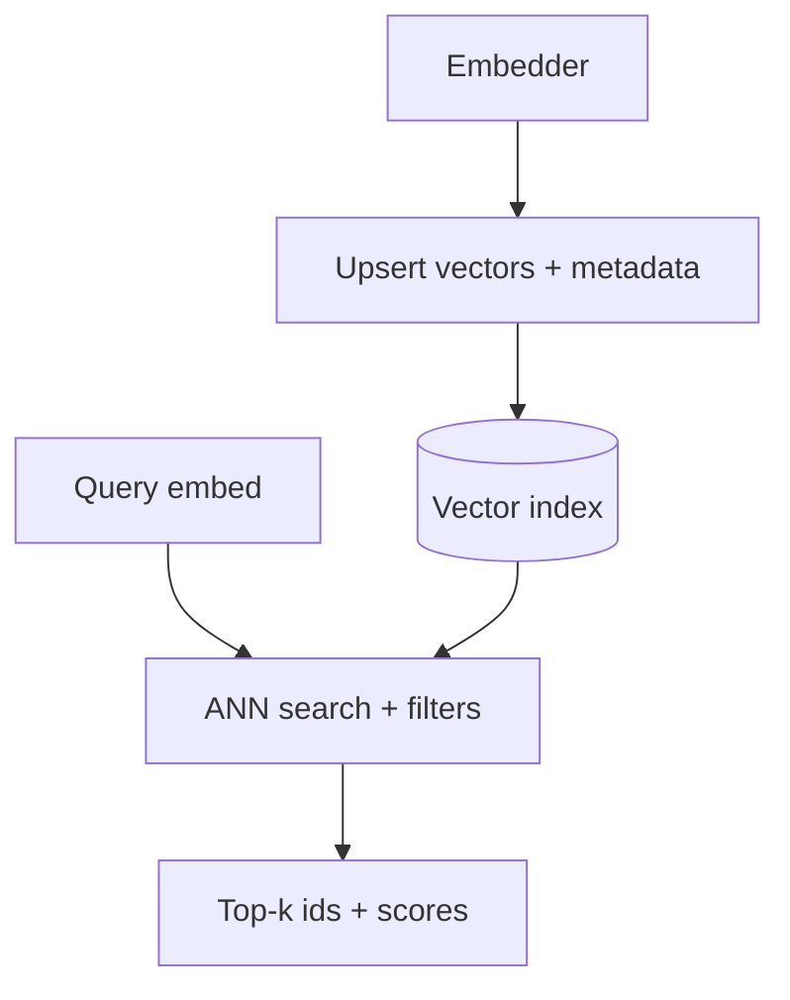

At production scale, you need more than a numpy loop. This lesson covers **FAISS** (Facebook AI Similarity Search—a fast vector search library) vs **ChromaDB** (a database that wraps vector search with text and metadata), how to pick an index, and the **bi-encoder / cross-encoder / ColBERT** scoring options that sit in front of the index.

## Intuition

| Tool | Plain-English idea | Good for |
| --- | --- | --- |
| **FAISS** | The engine that finds nearest vectors—you manage text and metadata yourself | Huge scale, full control |
| **ChromaDB** | Stores vectors, chunk text, and metadata together | Prototypes and quick RAG apps |

**Classic bug:** FAISS returns a vector ID, but if your ID-to-text map is lost, the LLM gets numbers instead of useful documents.



## How it works

### FAISS vs ChromaDB

| Tool | What it is | Good for |
| --- | --- | --- |
| **FAISS** | Fast similarity-search library | Millions+ vectors, custom indexes |
| **ChromaDB** | Database wrapping vector search | Persistence, metadata, prototypes |

### Which FAISS index to use?

| Index | Plain-English idea | When |
| --- | --- | --- |
| **IndexFlatIP / IndexFlatL2** | Exact brute-force search | Up to ~1M vectors or need full recall |
| **IVFFlat** | Clustered search; skip most vectors | Millions of vectors; small recall loss OK |
| **IVF + PQ** | IVF prunes; PQ compresses | Massive corpus; tight memory |
| **HNSW** | Graph-based ANN | Strong recall/speed on CPU |

**Decision rule:** if you can afford exact search, use it. If not, move to IVF, HNSW, or IVF+PQ based on RAM, recall needs, and tuning appetite.

### Bi-encoder, cross-encoder, and ColBERT

Different ways to score query–document relevance—balancing speed, accuracy, and storage.

| Model | How it scores | Speed | Accuracy |
| --- | --- | --- | --- |
| **Bi-encoder** | Encode query and doc separately; dot product | Fast | Good |
| **Cross-encoder** | Encode query and doc together | Slow | Best |
| **ColBERT** | Token-level late interaction with MaxSim | Middle | Near cross-encoder |

**Two-stage pattern (industry standard):**

```
1. Retrieve candidates cheaply with bi-encoder + ANN index
2. Rerank top candidates with cross-encoder
3. Pass best chunks to the generator
```

### Common silent failures

| Bug | Plain-English idea |
| --- | --- |
| **Empty chunks** | Scanned PDF has no text layer—nothing to embed without OCR |
| **Prefix bug** | Asymmetric models need `query:` and `passage:` prefixes |
| **Metric bug** | Wrong distance metric (L2 vs cosine) quietly hurts recall |

:::key
Many retrieval bugs are configuration bugs, not model bugs. Read the model card before blaming the architecture.
:::

## In code

Two-stage retrieve-then-rerank sketch.

```python
# Stage 1: fast bi-encoder retrieval (vectors precomputed)
scores = bi_encoder.dot(query_vec, doc_vecs)
topk_ids = retrieve_top_k(scores, k=200)

# Stage 2: precise cross-encoder rerank
reranked = cross_encoder.score(query, topk_ids)
final_context = select_top(reranked, n=10)
```

## What goes wrong

- **Wrong index for corpus size** — Exact search on 50M vectors times out; IVF with nprobe=1 misses neighbors.
- **Lost ID-to-text map** — ANN returns IDs; without metadata you cannot show sources.
- **Cross-encoder on full corpus** — Latency explodes; use only on top-N.
- **Half-migrated embedding model** — Old and new vectors in one index; scores meaningless.

## One-line summary

Pick FAISS or ChromaDB for your scale, match the index to recall and RAM needs, and use bi-encoder retrieval plus cross-encoder reranking in production.

## Key terms

- **FAISS:** library for fast similarity search over dense vectors.
- **ChromaDB:** vector database storing text, metadata, and vectors together.
- **Bi-encoder:** encodes query and document separately for fast search.
- **Cross-encoder:** scores query and document jointly—accurate but slow.
- **ColBERT:** late-interaction model with token-level embeddings and MaxSim scoring.
- **IndexFlat:** exact brute-force FAISS search.
