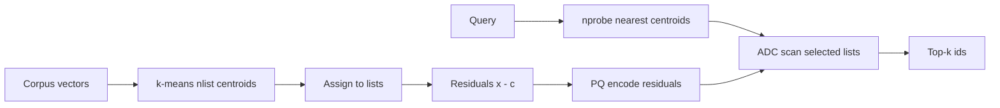

Exact nearest-neighbor search compares a query to every vector. At a million 768-dim embeddings that is a million distance computations and gigabytes of float32 RAM. **IVF** (inverted file) cuts the search space with coarse clusters. **Product quantization (PQ)** compresses each vector into a short code so more of the corpus fits in memory. Together they are the workhorse behind many production ANN engines at medium-to-large scale.

## Intuition

Picture a city of one million addresses. Instead of walking every street, you divide the city into about a thousand neighborhoods (clusters). For a new query you visit only the eight most promising neighborhoods. That is IVF: **probe a few lists, not all N points**.

Even inside those neighborhoods, storing every full float32 vector is expensive. Product quantization replaces each vector with a tiny codebook index — like filing a book as “shelf 12, slot 3, bin 7” instead of photocopying every page. Distance becomes a table lookup over those codes (**asymmetric distance computation**, ADC). You lose a little accuracy; you gain RAM headroom and cache-friendly scans.

:::key
IVF answers “where should I look?” PQ answers “how little can I store while still ranking neighbors?” Tune both against a flat recall baseline, not against blog defaults.
:::

## How it works

### IVF: coarse quantizer + inverted lists

1. Run **k-means** (or similar) on a training sample of vectors to learn `nlist` centroids. Typical starting point: `nlist` near `sqrt(N)` — for N = 1e6, that is about 1000 lists.
2. Assign every corpus vector to its nearest centroid. Each centroid owns an **inverted list** of member ids (and vectors or PQ codes).
3. At query time, find the `nprobe` nearest centroids to the query and scan only those lists.

**Scan cost (approximate).** If lists are balanced, each list holds about `N / nlist` vectors. Probing `nprobe` lists visits roughly:

```
scanned ≈ (nprobe / nlist) * N
```

**Numeric example.** N = 1,000,000, nlist ≈ 1000, nprobe = 8:

```
scanned ≈ (8 / 1000) * 1_000_000 = 8000
```

You compare against about **8,000** candidates instead of **1,000,000** — roughly a **125×** reduction in distance work, before PQ and before SIMD tricks. Raising `nprobe` improves recall and raises latency almost linearly in the scanned set. Raising `nlist` shrinks each list but makes centroid selection noisier if training data is thin.

### Memory: float32 vs PQ codes

A single 768-dimensional float32 vector:

```
768 * 4 bytes = 3072 bytes
```

A common PQ setup encodes the vector into an **8-byte** code (for example 8 subspaces × 1 byte each, or similar bit budgets). Compression ratio:

```
3072 / 8 = 384
```

So an 8-byte PQ code is about **384× smaller** than the float32 vector. One million float32 vectors need roughly 3 GB just for coordinates; the same corpus in 8-byte codes needs about 8 MB for codes (plus codebooks and inverted-list bookkeeping — still far cheaper than full floats).

### IVF+PQ pipeline (residuals)

Production stacks usually quantize **residuals**, not raw vectors:

1. **Train IVF centroids** with k-means on the embedding space.
2. **Assign** each vector `x` to nearest centroid `c`.
3. Form the **residual** `r = x - c` (what remains after the coarse code).
4. Train **PQ** on residuals: split `r` into `m` subvectors; for each subspace learn a small codebook (often 256 centroids → 1 byte per subspace).
5. Store for each point: list id + PQ code of the residual.
6. At query time: pick `nprobe` lists; for each candidate, estimate distance with **ADC** — compare the query (or query residual relative to that list’s centroid) against codebook tables without reconstructing full float vectors.



**Why residuals?** The coarse centroid already explains a large chunk of the vector. PQ only has to model the leftover, which usually yields better distance estimates at the same code length.

### Knobs that matter

| Knob | Effect if you increase it |
|------|---------------------------|
| `nlist` | Smaller lists, coarser training demand |
| `nprobe` | Higher recall, higher latency |
| PQ `m` / bits | Better fidelity, larger codes |
| Training sample size | Stabler centroids and codebooks |

Always measure **recall@k** against a flat exact index on a held-out query set. Latency without recall is vanity.

## In code

A teaching-scale demo: IVF assignment, scan-fraction math, and a toy PQ byte budget. Not a production index — the shapes are what matter.

```python
import numpy as np

rng = np.random.default_rng(7)
N, D, nlist, nprobe = 1_000_000, 768, 1000, 8
print("scanned ≈", (nprobe / nlist) * N)          # 8000
print("float32 bytes", D * 4, "PQ bytes", 8,
      "ratio", (D * 4) // 8)                       # 3072, 8, 384×

# Mini IVF on a toy sample (16-d): assign → residual → 4-byte PQ
sample = rng.normal(size=(2000, 16)).astype(np.float32)
centroids = sample[rng.choice(len(sample), size=32, replace=False)]
labels = ((sample[:, None, :] - centroids[None, :, :]) ** 2).sum(axis=2).argmin(axis=1)
x, c = sample[0], centroids[labels[0]]
residual = x - c
codebooks = [rng.normal(size=(256, 4)).astype(np.float32) for _ in range(4)]
codes = []
for i, cb in enumerate(codebooks):
    sub = residual[i * 4 : (i + 1) * 4]
    codes.append(int(((cb - sub) ** 2).sum(axis=1).argmin()))
print("PQ code", codes)
```

In Faiss / managed DBs this is `IndexIVFPQ`: train, add, set `nprobe` at search.

## What goes wrong

- **nprobe stuck at 1.** Fast demos, quietly missing true neighbors when the query sits near a cell boundary. Sweep nprobe on a recall curve.
- **Unbalanced lists.** Hot centroids swallow most traffic; p99 latency spikes. Re-train, split hot cells, or use better initialization.
- **PQ without residuals.** Encoding raw vectors when IVF already assigned a centroid wastes code capacity and hurts recall.
- **Training on the wrong distribution.** Centroids fit last month’s embeddings; a new embedder or domain shift invalidates lists. Re-train after model changes.
- **Celebrating compression only.** 384× smaller codes with 40% recall@10 is not a win for RAG. Gate on recall and answer faithfulness, not RAM alone.
- **Filter + IVF interaction.** Aggressive metadata filters can empty the probed lists. Engines differ on filter-then-probe vs probe-then-filter; measure under real ACL predicates.

Use IVF+PQ when HNSW RAM hurts and you can retrain after embedder changes; keep a flat sample index for recall baselines. Version model id with `nlist`/PQ params, and document shipped `nprobe` so on-call does not “fix latency” by silently killing recall.

## One-line summary

IVF probes a few coarse clusters so you scan about `(nprobe / nlist) * N` vectors, and PQ stores residuals as tiny codes (~384× smaller than 768-d float32 at 8 bytes) scored with ADC at query time.

## Key terms

- **IVF (inverted file):** partition vectors into lists by nearest coarse centroid; search probes `nprobe` lists.
- **nlist / nprobe:** number of clusters vs number of lists scanned per query.
- **Product quantization (PQ):** split a vector into subspaces and replace each with a codebook index.
- **Residual:** `x - centroid`; what PQ usually encodes after IVF assignment.
- **ADC:** asymmetric distance computation — estimate distances from PQ codes via lookup tables.
- **Recall@k:** fraction of true nearest neighbors recovered in the approximate top-k.
