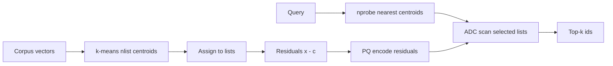

Exact nearest-neighbor search compares a query to **every** vector. At a million 768-dimensional embeddings that is a million distance computations and gigabytes of **float32** RAM. **IVF** (inverted file index) cuts the search space with coarse clusters. **PQ** (product quantization) compresses each vector into a short code. Together they make large-scale search practical.

## Intuition

| Technique | Plain-English question it answers |
| --- | --- |
| **IVF** | "Which few neighborhoods should I search?" |
| **PQ** | "How little can I store each vector while still ranking neighbors?" |

Picture a city of one million addresses. **IVF** divides it into about a thousand neighborhoods—you visit only the eight most promising ones, not every street.

**PQ** replaces each full vector with a tiny code—like filing a book as "shelf 12, slot 3" instead of photocopying every page. Distance becomes a table lookup (**ADC**—asymmetric distance computation).

:::key
IVF answers "where should I look?" PQ answers "how little can I store?" Tune both against a flat recall baseline, not blog defaults.
:::

## How it works

### IVF (inverted file index)

1. Run **k-means** on vectors to learn **nlist** centroids (cluster centers). Typical start: `nlist ~= sqrt(N)`—for N = 1,000,000, about 1000 lists.
2. Assign every vector to its nearest centroid. Each centroid owns an **inverted list**.
3. At query time, find the **nprobe** nearest centroids and scan only those lists.

**Scan cost (approximate):**

```
scanned ~= (nprobe / nlist) × N
```

**Example:** N = 1,000,000, nlist = 1000, nprobe = 8:

```
scanned ~= (8 / 1000) × 1,000,000 = 8,000
```

About **125×** fewer comparisons than scanning all one million vectors.

| Knob | Plain-English effect |
| --- | --- |
| **nlist** | Number of clusters/buckets |
| **nprobe** | Number of clusters searched at query time—higher recall, higher latency |

### PQ (product quantization)

Split each vector into sub-vectors; replace each piece with a **centroid ID** from a small codebook.

**Memory example:** a 768-dim float32 vector = 768 × 4 = **3072 bytes**. An **8-byte** PQ code is about **384× smaller** (3072 ÷ 8).

**ADC:** the query stays full precision; stored vectors are compressed. Expensive work is done once per query, not once per database vector.

### IVF + PQ together (residuals)

Production stacks usually quantize **residuals**, not raw vectors:

1. Train IVF centroids with k-means.
2. Assign each vector **x** to nearest centroid **c**.
3. Form **residual** `r = x - c`.
4. Train **PQ** on residuals; store list id + PQ code.
5. At query time: pick **nprobe** lists; score with ADC.

**Why residuals?** The coarse centroid already explains much of the vector. PQ only models what's left—better distance estimates at the same code length.



## In code

Scan math and a toy PQ intuition.

```python
N, nlist, nprobe = 1_000_000, 1000, 8
print("scanned ~=", (nprobe / nlist) * N)          # 8000
D = 768
print("float32 bytes", D * 4, "PQ bytes", 8,
      "ratio", (D * 4) // 8)                       # 3072, 8, 384x
```

In FAISS this is `IndexIVFPQ`: train, add, set `nprobe` at search time.

## What goes wrong

- **nprobe stuck at 1** — Fast demos, quietly missing true neighbors near cell boundaries.
- **Unbalanced lists** — Hot centroids swallow traffic; p99 latency spikes.
- **PQ without residuals** — Wastes code capacity; hurts recall.
- **Training on wrong distribution** — New embedder invalidates centroids; re-train after model changes.
- **Celebrating compression only** — 384× smaller with 40% recall@10 is not a win for RAG.

## One-line summary

IVF probes a few coarse clusters so you scan roughly `(nprobe / nlist) × N` vectors, and PQ stores residuals as tiny codes (~384× smaller than 768-d float32 at 8 bytes) scored with ADC.

## Key terms

- **IVF (inverted file index):** partition vectors into lists by nearest coarse centroid.
- **nlist / nprobe:** number of clusters vs number of lists scanned per query.
- **PQ (product quantization):** compress vectors into short codebook indices.
- **Residual:** `x - centroid`; what PQ usually encodes after IVF assignment.
- **ADC (asymmetric distance computation):** estimate distances from PQ codes via lookup tables.
- **Recall@k:** fraction of true nearest neighbors recovered in approximate top-k.
