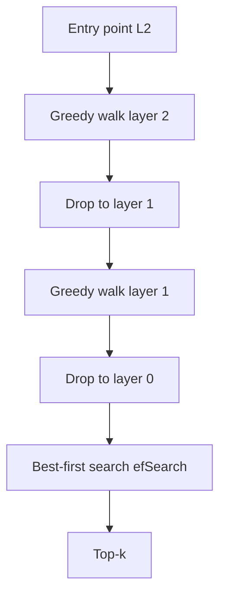

**HNSW** (Hierarchical Navigable Small World) is the graph-based approximate nearest-neighbor index most teams meet first in modern vector databases. Instead of clustering space into lists, it builds a multi-layer graph of “who is near whom” and walks that graph from a coarse entry point down to a dense base layer. Recall is often excellent at interactive latency — if you have the RAM to hold the graph.

## Intuition

Think of a road network with **highways and local streets**. The top layers of HNSW are sparse long-range links — highways that jump across the embedding space. Lower layers add denser local connections — neighborhood streets. A search starts on a highway, greedily hops toward the query region, then drops a layer and refines, until the base layer does careful local exploration.

That is why HNSW feels different from IVF. IVF asks “which few districts do I open?” HNSW asks “which path of neighbors do I follow, and how thoroughly do I explore at the end?” The main online knob, **efSearch**, is how wide that final exploration is — analogous in spirit to IVF’s **nprobe**, but operating on a graph walk rather than a set of inverted lists.

:::key
HNSW buys high recall with graph memory. If RAM is the constraint, look at quantization or IVF+PQ. If latency-at-high-recall is the constraint, HNSW is often the default.
:::

## How it works

### Build: layers and neighbors

Each vector is inserted with a random maximum layer (geometric distribution — few points appear on the top layers). At every layer up to that max, the new point connects to up to **M** nearest neighbors found under the current graph, with heuristics that keep edges useful (not only the absolute closest, which can create traffic jams).

- **M** — typical degree / max neighbors per node (per layer; some implementations use `2M` on the base layer). Higher M → denser graph → better recall, more RAM, slower builds.
- **efConstruction** — size of the candidate set explored while inserting. Higher → better graph quality, longer index build.

Build is write-heavy and often offline or batched. Online upserts are supported by many engines but can fragment quality if you never rebuild.

### Search: greedy then expand

1. Enter at a fixed top-layer entry point.
2. Greedily move to the neighbor closest to the query until a local minimum.
3. Drop one layer; repeat.
4. On the base layer, run a best-first search bounded by **efSearch**: keep a dynamic candidate list of size `efSearch`, expand neighbors, return the best `k`.

**efSearch** must be ≥ `k`. Raising it improves recall roughly monotonically and increases latency. It is the primary runtime trade-off — change it without rebuilding the index.

### Compare to nprobe

| | IVF `nprobe` | HNSW `efSearch` |
|--|----------------|-----------------|
| What it widens | Number of coarse lists scanned | Candidate beam during graph search |
| Rebuild needed to change? | No | No |
| Failure mode if too low | Miss whole clusters | Stop in a local basin |
| Failure mode if too high | Latency ~ linear in scanned | Latency grows with expansions |
| Memory driver | Vectors / PQ codes + lists | Vectors + graph edges (~M links/node) |

Both are “spend more compute at query time for recall.” Neither fixes a bad embedding space or a stale index after a model change.

### Memory sketch

Rough mental model: store vectors plus about `M` neighbor ids per node on the base layer (and fewer on upper layers). For millions of 768-d float32 vectors, the graph overhead is often hundreds of bytes to a couple KB per vector depending on M and id width — enough that HNSW can be RAM-bound before CPU is. Quantized HNSW variants exist; know whether your engine stores full floats or codes beside the graph.



## In code

A minimal layered greedy walk to make the highway idea concrete. Production HNSW adds neighbor heuristics, visited sets, and ef-bounded priority queues — the skeleton is the same.

```python
import numpy as np

rng = np.random.default_rng(3)
X = rng.normal(size=(200, 8))
X /= np.linalg.norm(X, axis=1, keepdims=True) + 1e-9
M = 8

def knn_graph(ids, M):
    g = {}
    for i in ids:
        d = ((X[ids] - X[i]) ** 2).sum(axis=1)
        g[i] = [ids[j] for j in np.argsort(d)[1 : M + 1]]
    return g

# Toy 2-layer graph: all on L0, subset on L1 (the "highway")
base_ids = list(range(len(X)))
high_ids = base_ids[::4]
g0, g1 = knn_graph(base_ids, M), knn_graph(high_ids, M)

def greedy(start, q, graph):
    cur = start
    while True:
        nxt = min([cur, *graph[cur]], key=lambda i: ((X[i] - q) ** 2).sum())
        if nxt == cur:
            return cur
        cur = nxt

q = rng.normal(size=(8,)); q /= np.linalg.norm(q) + 1e-9
cur = greedy(high_ids[0], q, g1)                 # highway
# base beam ~ efSearch
beam = {cur}; frontier = [cur]
while frontier and len(beam) < 20:
    n = frontier.pop()
    for nb in g0[n]:
        if nb not in beam:
            beam.add(nb); frontier.append(nb)
approx = sorted(beam, key=lambda i: ((X[i] - q) ** 2).sum())[:5]
exact = np.argsort(((X - q) ** 2).sum(axis=1))[:5]
print("approx", approx, "exact", exact.tolist())
```

Sweep `efSearch` offline: recall@k vs p95 latency, pick the knee, pin it in config.

## What goes wrong

- **efSearch = k forever.** Fine for demos; under-explores when neighborhoods are dense or queries are out-of-distribution. Raise ef until recall plateaus.
- **M too small.** Graph becomes a fragile chain of local minima. Builds look fast; production recall disappoints.
- **M / efConstruction huge “just in case.”** Index RAM and build time explode; returns diminish. Measure.
- **Treating HNSW as exact.** It is ANN. Keep a flat baseline for eval; never assume 100% recall.
- **Ignoring deletes.** Tombstones and fragmented graphs degrade walks. Plan compaction/rebuilds.
- **Metadata filters.** Filtered HNSW may need special strategies (filter during walk vs post-filter). Post-filter with tiny `k` is a classic empty-result bug under strict ACLs.

Prefer **HNSW** for strong default recall at moderate size; prefer **IVF (+PQ)** when graph RAM dominates. Bake off on your embeddings and filters. Index knobs never fix bad chunks — measure answer faithfulness, not only ANN recall.

## One-line summary

HNSW searches a layered neighbor graph — highways then local streets — where M shapes memory and connectivity and efSearch (like IVF’s nprobe) spends query-time compute for recall.

## Key terms

- **HNSW:** hierarchical navigable small-world graph index for ANN search.
- **M:** neighbor degree / max edges per node; drives recall and RAM.
- **efConstruction:** candidate list size during graph build.
- **efSearch:** candidate list size during query; primary latency/recall knob.
- **Layered graph:** sparse upper layers for long-range jumps; dense base for refinement.
- **ANN:** approximate nearest neighbor — fast search with possible missed neighbors.
