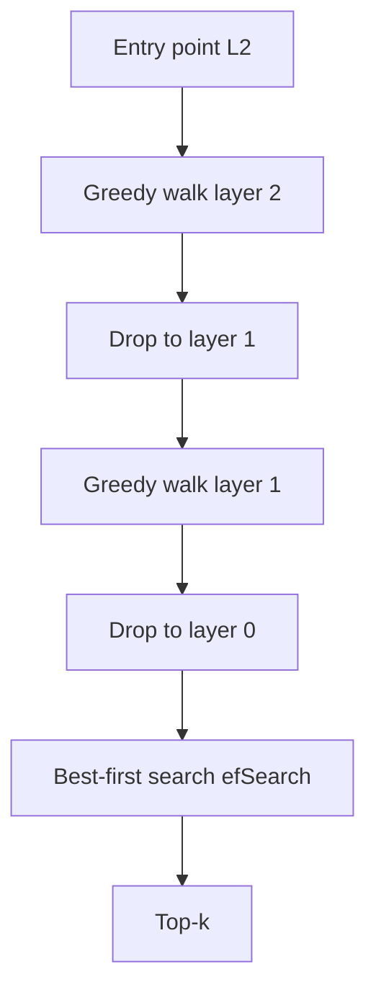

**HNSW** (Hierarchical Navigable Small World) is a graph-based **ANN** (approximate nearest neighbor) index common in modern vector databases. Instead of clustering space into lists, it builds a multi-layer graph of "who is near whom" and walks that graph from a coarse entry point down to a dense base layer.

## Intuition

Think of a road network with **highways and local streets**.

| Layer | Plain-English idea |
| --- | --- |
| **Top layers** | Sparse long-range links—highways across embedding space |
| **Base layer** | Dense local connections—neighborhood streets |

Search starts on a highway, hops toward the query region, drops a layer, and refines until the base layer finds the best neighbors.

**HNSW vs IVF:** IVF asks "which few districts do I open?" HNSW asks "which path of neighbors do I follow, and how thoroughly do I explore at the end?"

:::key
**efSearch** is the recall–speed dial for HNSW—similar in spirit to **nprobe** for IVF. Higher values improve recall and cost more latency.
:::

## How it works

### Build: layers and neighbors

Each vector gets a random maximum layer (few points on top layers). At every layer, the point connects to up to **M** nearest neighbors.

| Knob | Plain-English idea |
| --- | --- |
| **M** | Max neighbors per node at build time—higher M → denser graph, more RAM, better recall |
| **efConstruction** | Candidate list size while inserting—higher → better graph quality, slower build |

### Search: greedy then expand

1. Enter at a fixed top-layer entry point.
2. Greedily move to the neighbor closest to the query until no improvement.
3. Drop one layer; repeat.
4. On the base layer, run best-first search bounded by **efSearch** (must be ≥ k).

**efSearch** is the primary runtime trade-off—change it without rebuilding the index.

### Why HNSW feels like log(N)

Higher layers contain fewer nodes. Search jumps far at the top and pays local cost only near the bottom—logarithmic-style navigation instead of a linear scan.

### Compare to IVF nprobe

| | IVF **nprobe** | HNSW **efSearch** |
| --- | --- | --- |
| **What it widens** | Number of coarse lists scanned | Candidate beam during graph search |
| **Rebuild to change?** | No | No |
| **Too low** | Miss whole clusters | Stop in a local basin |
| **Too high** | Latency ~ linear in scanned | Latency grows with expansions |



## In code

Minimal layered greedy walk (teaching scale—not production HNSW).

```python
import numpy as np

rng = np.random.default_rng(3)
X = rng.normal(size=(200, 8))
X /= np.linalg.norm(X, axis=1, keepdims=True) + 1e-9
M = 8

def knn_graph(ids, M):
    g = {}
    for i in ids:
        d = ((X[ids] - X[i]) ** 2).sum(axis=1)
        g[i] = [ids[j] for j in np.argsort(d)[1 : M + 1]]
    return g

base_ids = list(range(len(X)))
high_ids = base_ids[::4]
g0, g1 = knn_graph(base_ids, M), knn_graph(high_ids, M)

def greedy(start, q, graph):
    cur = start
    while True:
        nxt = min([cur, *graph[cur]], key=lambda i: ((X[i] - q) ** 2).sum())
        if nxt == cur:
            return cur
        cur = nxt

q = rng.normal(size=(8,)); q /= np.linalg.norm(q) + 1e-9
cur = greedy(high_ids[0], q, g1)
print("landed near query at index", cur)
```

Sweep **efSearch** offline: recall@k vs p95 latency, pick the knee, pin it in config.

## What goes wrong

- **efSearch = k forever** — Under-explores in dense neighborhoods.
- **M too small** — Fragile graph; production recall disappoints.
- **M / efConstruction huge "just in case"** — RAM and build time explode.
- **Treating HNSW as exact** — It is ANN; keep a flat baseline for eval.
- **Metadata filters** — Post-filter with tiny k is a classic empty-result bug under strict access control.

## One-line summary

HNSW searches a layered neighbor graph—highways then local streets—where M shapes memory and efSearch spends query-time compute for recall.

## Key terms

- **HNSW (Hierarchical Navigable Small World):** layered graph index for ANN search.
- **M:** neighbor degree / max edges per node; drives recall and RAM.
- **efConstruction:** candidate list size during graph build.
- **efSearch:** candidate list size during query; primary latency/recall knob.
- **ANN:** approximate nearest neighbor—fast search with possible missed neighbors.
