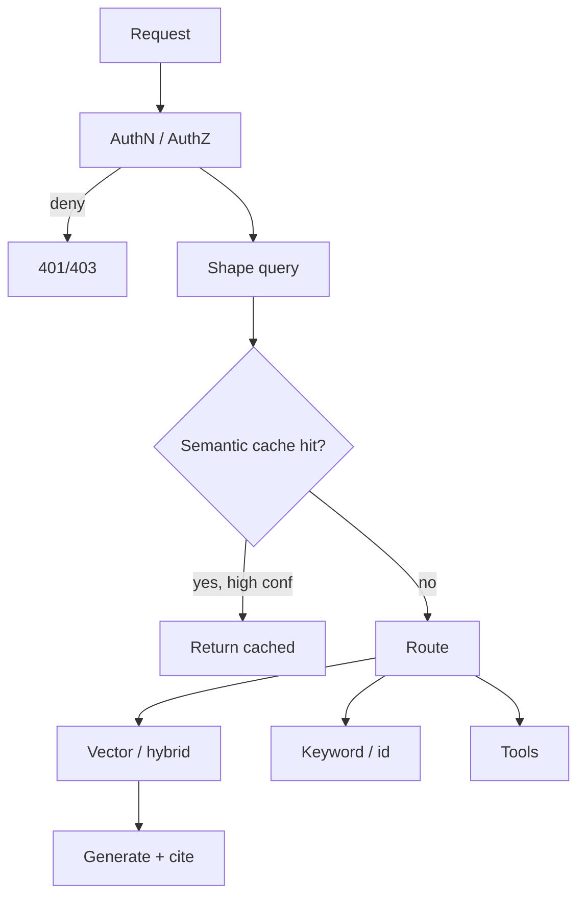

A vector index is a powerful hammer. Hitting it on every raw chat message is how you leak tenants, burn embed+ANN budget on duplicate questions, and retrieve from the wrong corpus. A **retrieval gateway** is the thin control plane in front of search: authenticate, authorize, shape the query, maybe answer from cache, then route to the right index with the right filters.

## Intuition

Treat retrieval like a privileged API, not a library call sprinkled through prompt templates. The gateway’s job is four verbs: **who**, **what**, **whether**, **where**.

1. **Who** — identity and tenant before any embedding is computed.
2. **What** — normalize and classify the query (FAQ vs doc search vs “no retrieval”).
3. **Whether** — semantic cache: have we already answered a near-duplicate?
4. **Where** — which collection, hybrid stack, or tool path; which metadata ACL.

:::key
A false cache hit is worse than a cache miss. Serving yesterday’s answer for a different intent looks “fast” in metrics and wrong in the product. Prefer miss + retrieve over a confident wrong hit.
:::

## How it works

### Auth before retrieval

Order matters:

```
authenticate -> authorize (tenant, roles, doc ACL) -> embed / cache / search -> generate
```

Never embed first and “filter later” in the prompt. Metadata filters in the vector DB are necessary; they are not a substitute for rejecting unauthenticated calls. Log `subject_id`, `tenant_id`, and `policy_version` on every retrieval span so incidents are reconstructible.

Multi-tenant rule of thumb: **tenant_id is a mandatory filter**, enforced in gateway code that builds the search request — not an optional argument the model can omit.

### Semantic cache threshold tradeoff

Cache keys are often the query embedding (or a normalized string + embedding). On a new query, if `cosine(q, cached_q) >= threshold` (and same tenant, locale, product surface), return the cached answer or cached chunks.

- **Threshold too low** -> false hits: “reset password” matches “reset API key”; user gets the wrong runbook.
- **Threshold too high** -> mostly misses; cache barely helps.

Tune on a labeled pair set: same-intent vs different-intent. Optimize for **low false-hit rate** first; accept a lower hit rate. Invalidate on corpus or policy change (TTL alone is not enough when docs update). For regulated answers, cache **chunk ids + generation inputs**, not only final prose, so you can rebuild with the new model.

### Query shaping

Before search:

- Strip boilerplate (“hi”, “please”, email signatures).
- Expand acronyms known for that tenant.
- Rewrite follow-ups with conversation context (“what about the SLA?” -> “What is the SLA for plan Pro?”).
- Detect **no-retrieval** intents (chitchat, pure math) and skip the index.

Shaping is a small model or rules + templates. Cap rewrite length; log both raw and shaped queries for eval.

### Routing

Not every query should hit the same top-k dense search:

| Signal | Route |
|--------|--------|
| Exact FAQ / policy id | Keyword or id lookup |
| Navigational “section 4.2” | Structured doc store |
| Open semantic question | Dense / hybrid ANN |
| Multi-entity comparison | Multi-hop planner |
| Toolable (“order status 123”) | API tool, not RAG |

A lightweight classifier or rules router sits in the gateway. Wrong route is a quality bug: dense search over a tracking-number question invents prose instead of calling the order API.



## In code

A sketch of gateway decisions: ACL gate, cache with a conservative threshold, and a tiny router.

```python
from dataclasses import dataclass
import numpy as np

@dataclass
class Principal:
    user_id: str
    tenant_id: str
    roles: set[str]

@dataclass
class CacheEntry:
    query_vec: np.ndarray
    tenant_id: str
    answer: str

CACHE: list[CacheEntry] = []
THRESHOLD = 0.92  # tune up if false hits appear

def cosine(a, b):
    return float(np.dot(a, b) / ((np.linalg.norm(a) * np.linalg.norm(b)) + 1e-9))

def authorize(p: Principal, resource_tenant: str) -> bool:
    return p.tenant_id == resource_tenant and "reader" in p.roles

def shape(raw: str) -> str:
    q = raw.strip().lower()
    for noise in ("please ", "hey ", "can you "):
        if q.startswith(noise):
            q = q[len(noise):]
    return q

def cache_lookup(tenant_id: str, qvec: np.ndarray) -> str | None:
    best, best_s = None, -1.0
    for e in CACHE:
        if e.tenant_id != tenant_id:
            continue
        s = cosine(qvec, e.query_vec)
        if s > best_s:
            best, best_s = e, s
    if best is not None and best_s >= THRESHOLD:
        return best.answer
    return None  # miss — safer than a weak hit

def route(shaped: str) -> str:
    if shaped.startswith("order status") or shaped[:3].isdigit():
        return "orders_api"
    if "section" in shaped and any(c.isdigit() for c in shaped):
        return "structured_docs"
    return "hybrid_rag"

def gateway(p: Principal, raw_query: str, embed_fn, search_fn, generate_fn):
    if not authorize(p, p.tenant_id):
        raise PermissionError("forbidden")
    shaped = shape(raw_query)
    qvec = embed_fn(shaped)
    hit = cache_lookup(p.tenant_id, qvec)
    if hit is not None:
        return {"source": "cache", "answer": hit}
    path = route(shaped)
    if path != "hybrid_rag":
        return {"source": path, "answer": f"delegate:{path}:{shaped}"}
    chunks = search_fn(qvec, tenant_id=p.tenant_id)  # filter mandatory
    answer = generate_fn(shaped, chunks)
    CACHE.append(CacheEntry(qvec, p.tenant_id, answer))
    return {"source": "rag", "answer": answer}
```

Wire real embed/search clients; keep authorize and tenant filters in this layer, not in the prompt.

## What goes wrong

- **Retrieve then auth.** Embeddings and chunk text from another tenant briefly exist in logs and prompts. Gate first.
- **Global semantic cache.** Cross-tenant hits are a data breach, not a performance win. Cache key must include tenant (and often surface + locale).
- **Aggressive thresholds.** Hit rate looks great; support tickets rise. Track false-hit labels from thumbs-down.
- **Cache without invalidation.** Policy updated at 10:00; cache serves 09:00 answer until TTL. Tie purge to publish events.
- **Router always “RAG”.** Toolable intents become hallucinations with citations from unrelated docs.
- **Shaping that invents constraints.** Rewriters that add filters the user never stated (“only 2024”) silently drop evidence.

Track auth denies, cache hit rate, sampled **false-hit rate**, route mix, and empty-result rate. Start with tenant filter + FAQ string cache; add semantic cache and multi-route when traces show duplicate traffic and intent diversity.

## One-line summary

A retrieval gateway authenticates first, uses a conservative semantic cache (false hits hurt more than misses), shapes queries, and routes to the right index or tool with tenant filters enforced in code.

## Key terms

- **Retrieval gateway:** control plane in front of search (auth, cache, shape, route).
- **Semantic cache:** reuse answers/chunks when query embeddings are near-duplicates.
- **False hit:** cache returns an answer for a different user intent.
- **Query shaping:** normalize/rewrite before embedding and search.
- **Routing:** choose RAG vs keyword vs tools vs no-retrieval.
- **Tenant filter:** mandatory metadata constraint so ANN cannot cross customers.
