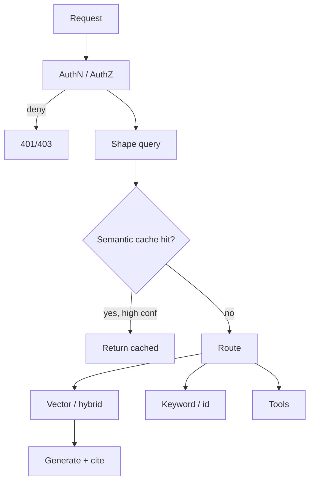

A vector index is powerful. Hitting it on every raw chat message is how you leak tenants, burn embed+search budget on duplicate questions, and retrieve from the wrong corpus. A **retrieval gateway** is the control plane in front of search: authenticate, authorize, shape the query, maybe answer from cache, then route to the right index.

## Intuition

Treat retrieval like a privileged API, not a library call sprinkled through prompts. The gateway's job is four questions:

| Question | Plain-English idea |
| --- | --- |
| **Who?** | Identity and tenant before any embedding |
| **What?** | Normalize and classify the query |
| **Whether?** | Semantic cache—near-duplicate already answered? |
| **Where?** | Which collection, hybrid stack, or tool path |

:::key
A false cache hit is worse than a cache miss. Prefer miss + retrieve over a confident wrong hit.
:::



## How it works

### Auth before retrieval

Order matters:

```
authenticate → authorize (tenant, roles, doc ACL) → embed / cache / search → generate
```

**Authorization (AuthZ)** must happen **before** retrieval—not only after generation. Metadata filters in the vector DB are necessary; they are not a substitute for rejecting unauthenticated calls.

### Semantic cache

Embed the query; if `cosine(q, cached_q) >= threshold` (same tenant, locale, surface), reuse the cached answer or chunks.

| Threshold | Effect |
| --- | --- |
| **Too low** | False hits—"reset password" matches "reset API key" |
| **Too high** | Mostly misses; cache barely helps |

Tune for **low false-hit rate** first. Invalidate on corpus or policy change—not TTL alone.

### Query shaping (request shaping)

Before search:

| Transformation | Plain-English idea | Example |
| --- | --- | --- |
| **Rewriting** | Expand vague prompts | "OOMKilled" → Kubernetes OOM exit code question |
| **Follow-up question** | Resolve pronouns | "Does it apply to contractors?" → standalone policy question |
| **Multi-query** | Several related queries | Split comparison into one query per entity |
| **Step-back** | Broader question first | Specific case → foundational rule |

Cap rewrite length; log both raw and shaped queries.

### Query routing

Not every query should hit the same dense search.

| Signal | Route to |
| --- | --- |
| Exact FAQ / policy id | Keyword or id lookup |
| Navigational "section 4.2" | Structured doc store |
| Open semantic question | Dense / hybrid ANN |
| Multi-entity comparison | Multi-hop planner |
| Toolable ("order status 123") | API tool, not RAG |

**Hybrid routing waterfall:** try cheap methods first, escalate only when uncertain.

```
if rule_match(query):        route = rule_route(query)
elif embed_confidence OK:    route = embedding_route(query)
else:                        route = llm_route(query)
```

### Gateway responsibilities

| Responsibility | What it does | Why it helps |
| --- | --- | --- |
| **AuthZ** | Blocks unauthorized retrieval | Prevents data leakage |
| **Caching** | Serves repeated semantic queries | Saves latency and cost |
| **Budgeting** | Tracks usage; throttles heavy loops | Prevents runaway spend |
| **Logging** | Traces query, chunks, latency | Makes debugging possible |

## In code

Gateway sketch: ACL gate, conservative cache, tiny router.

```python
THRESHOLD = 0.92  # tune up if false hits appear

def gateway(p, raw_query, embed_fn, search_fn, generate_fn):
    if not authorize(p, p.tenant_id):
        raise PermissionError("forbidden")
    shaped = shape(raw_query)
    qvec = embed_fn(shaped)
    hit = cache_lookup(p.tenant_id, qvec, THRESHOLD)
    if hit is not None:
        return {"source": "cache", "answer": hit}
    path = route(shaped)
    if path != "hybrid_rag":
        return {"source": path, "answer": f"delegate:{path}"}
    chunks = search_fn(qvec, tenant_id=p.tenant_id)  # filter mandatory
    return {"source": "rag", "answer": generate_fn(shaped, chunks)}
```

## What goes wrong

- **Retrieve then auth** — Another tenant's chunks briefly exist in logs and prompts.
- **Global semantic cache** — Cross-tenant hits are a data breach.
- **Aggressive thresholds** — Hit rate looks great; support tickets rise.
- **Cache without invalidation** — Policy updated; cache serves old answer until TTL.
- **Router always "RAG"** — Toolable intents become hallucinations with unrelated citations.

## One-line summary

A retrieval gateway authenticates first, uses a conservative semantic cache, shapes queries, and routes to the right index or tool with tenant filters enforced in code.

## Key terms

- **Retrieval gateway:** control plane in front of search (auth, cache, shape, route).
- **AuthN (authentication):** confirming who the user is.
- **AuthZ (authorization):** deciding what the user may access.
- **Semantic cache:** reuse answers when query embeddings are near-duplicates.
- **Query shaping / request shaping:** normalize or rewrite before search.
- **Hybrid routing:** waterfall from cheap rules to expensive LLM routing.
