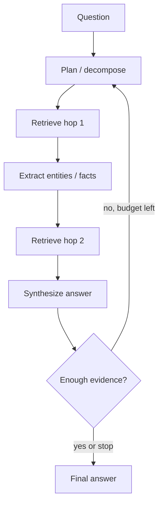

Some questions die in a single search. "Which teams own services that still call the deprecated Auth v1 API, and what is their on-call?" needs a **hop**: find services using Auth v1, then look up ownership, then on-call. **Multi-hop retrieval** chains those lookups. **Agentic RAG** lets an LLM decide the next query, tool, or stop condition instead of a fixed one-shot pack.

## Intuition

| Pattern | Plain-English idea |
| --- | --- |
| **Single-hop RAG** | One library visit—retrieve once, answer |
| **Multi-hop RAG** | Research session—read, realize you need more, search again |
| **Agentic RAG** | Model plans what to search, which tool to use, whether to search again |

Not every question deserves an agent. Hopping increases latency, cost, and failure modes. Use it when the answer **structurally depends on intermediate entities**.

:::key
Single-shot RAG is linear; real problem solving is often a loop: search → inspect → search again → generate.
:::



## How it works

### Why single-shot RAG breaks

Two bad assumptions:

1. Perfect retrieval means one search is enough.
2. Retrieved chunks already contain the final answer—not just a clue.

**Example task:** find the error in the payment container, check if it relates to yesterday's auth commit, draft a Slack update for QA. One embedding pass gets confused; the system needs to **search, inspect, decide what is missing, search again, then generate**.

### Multi-hop patterns

| Pattern | Plain-English idea |
| --- | --- |
| **Decomposition** | Split into sub-questions |
| **Seed-and-expand** | Retrieve once; extract entity IDs; targeted follow-up queries |
| **CoRAG (chain-of-RAG)** | Chain of sub-questions and sub-answers; each step guides the next |

### Agentic loop patterns

| Pattern | Plain-English idea |
| --- | --- |
| **ReAct** | Interleave reasoning traces with search/tool actions |
| **Router** | Classify single-hop vs multi-hop vs SQL tool vs refuse |
| **Planner–executor** | Planner emits a JSON plan; executor runs steps |

### Budgets and memory

- Cap **hops** (e.g. 3), tokens, and wall time.
- Persist intermediate evidence with citations.
- Short-term **scratchpad** holds hop results; long-term stores are still your indexes.
- Each hop must re-apply **ACL** filters.

## In code

Minimal two-hop toy: find services on Auth v1, then look up owners.

```python
SERVICES = [
    {"id": "svc_billing", "text": "billing-api still calls auth-v1 verifyToken"},
    {"id": "svc_edge", "text": "edge-gateway migrated to auth-v2"},
    {"id": "svc_jobs", "text": "jobs-worker uses auth-v1 for batch auth"},
]
OWNERS = {
    "svc_billing": "Payments Team — oncall +payments",
    "svc_jobs": "Data Platform — oncall +data-plat",
}

def retrieve(corpus, query: str, k: int = 5):
    q = set(query.lower().split())
    scored = [(len(q & set(r["text"].lower().split())), r) for r in corpus]
    scored.sort(reverse=True)
    return [r for s, r in scored[:k] if s > 0]

hop1 = retrieve(SERVICES, "auth-v1")
hop2 = [{"id": h["id"], "owner": OWNERS[h["id"]]}
        for h in hop1 if h["id"] in OWNERS]
print("hop1:", [h["id"] for h in hop1])
print("hop2:", hop2)
```

## What goes wrong

- **Hop explosion** — Each hop fans out; costs explode. Cap fan-out.
- **Compounding errors** — Wrong entity at hop 1 guarantees wrong hop 2.
- **Agent loops** — Same search repeated without budget. Detect duplicate queries.
- **Over-agentifying** — FAQ "how many leaves?" should stay single-hop.
- **Lost citations across hops** — Final answers without pointers are unauditable.

## One-line summary

Multi-hop and agentic retrieval chain planned searches when one lookup cannot gather all entities, under strict budgets and citation discipline.

## Key terms

- **Single-hop vs multi-hop:** one retrieval vs chained lookups with intermediates.
- **Agentic RAG:** LLM-controlled loop over search/tools with stop conditions.
- **CoRAG (chain-of-RAG):** retrieval through a chain of sub-questions and sub-answers.
- **ReAct:** reason + act pattern interleaving thoughts and tool calls.
- **Multi-hop query:** question needing more than one retrieval or reasoning step.
- **Scratchpad:** short-term memory of intermediate evidence.
