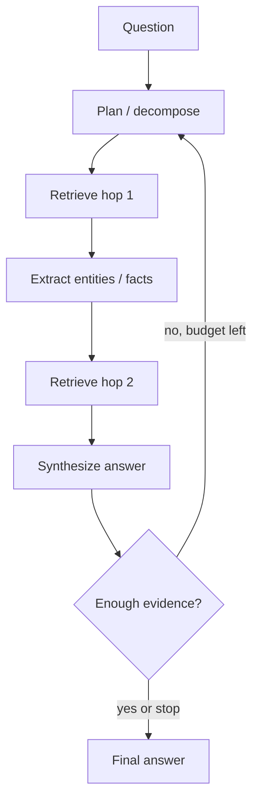

Some questions die in a single search. “Which teams own services that still call the deprecated Auth v1 API, and what is their on-call?” needs a **hop**: find services using Auth v1, then look up ownership, then on-call. **Multi-hop retrieval** chains those lookups. **Agentic retrieval** lets an LLM decide the next query, tool, or stop condition instead of a fixed one-shot RAG pack.

## Intuition

Single-hop RAG is a one-trip library visit. Multi-hop is a research session: read something, realize you need another source, go again. Agents add a clipboard — goals, scratch notes, and a loop: think -> act (search/tool) -> observe -> until done or budget exhausted.

Not every question deserves an agent. Hopping increases latency, cost, and failure modes. Use it when the answer structurally depends on intermediate entities.



## How it works

**Decomposition.** Prompt or route the question into sub-questions: (1) list services on Auth v1, (2) for each service, fetch owner. Graph-shaped knowledge (entities and relations) especially benefits.

**Seed-and-expand.** Retrieve once; extract missing entity IDs from chunks; issue targeted follow-up queries. Stop when no new entities appear or hop limit hits.

**Agentic loop patterns.**

- **ReAct-style:** interleave reasoning traces with `search("...")` actions.
- **Router:** classify single-hop vs multi-hop vs SQL tool vs refuse.
- **Planner–executor:** planner emits a JSON plan; executor runs retrieval steps without free-form wandering.

**Budgets.** Cap hops (e.g. 3), tokens, and wall time. Persist intermediate evidence with citations so the final synthesis cannot invent links between hops.

**Memory.** Short-term scratchpad holds hop results; long-term stores are still your indexes. Do not confuse the agent’s notes with ground truth — re-cite source chunks.

## In code

A minimal two-hop toy: first find services mentioning a dependency, then look up owners from a second store.

```python
SERVICES = [
    {"id": "svc_billing", "text": "billing-api still calls auth-v1 verifyToken"},
    {"id": "svc_edge", "text": "edge-gateway migrated to auth-v2"},
    {"id": "svc_jobs", "text": "jobs-worker uses auth-v1 for batch auth"},
]
OWNERS = {
    "svc_billing": "Payments Team — oncall +payments",
    "svc_jobs": "Data Platform — oncall +data-plat",
    "svc_edge": "Edge — oncall +edge",
}

def retrieve(corpus, query: str, k: int = 5):
    q = set(query.lower().split())
    scored = []
    for row in corpus:
        toks = set(row["text"].lower().split())
        scored.append((len(q & toks), row))
    scored.sort(reverse=True)
    return [r for s, r in scored[:k] if s > 0]

def multi_hop_auth_v1():
    hop1 = retrieve(SERVICES, "auth-v1")
    service_ids = [h["id"] for h in hop1]
    hop2 = [{"id": sid, "owner": OWNERS[sid]} for sid in service_ids if sid in OWNERS]
    return hop1, hop2

h1, h2 = multi_hop_auth_v1()
print("hop1 services:", [h["id"] for h in h1])
print("hop2 owners:")
for row in h2:
    print(" ", row["id"], "->", row["owner"])

# Agentic-style control: stop when hops==max or no new ids
```

Replace lexical `retrieve` with hybrid search and wrap the loop in an LLM planner when questions vary in shape.

## What goes wrong

- **Hop explosion.** Each hop fans out to many entities; costs explode. Cap fan-out and prioritize.
- **Compounding errors.** Wrong entity at hop 1 guarantees wrong hop 2. Verify intermediate extractions.
- **Agent loops.** ReAct without budgets repeats the same search. Detect duplicate queries.
- **Over-agentifying.** FAQ “how many leaves?” should stay single-hop RAG.
- **Lost citations across hops.** Final answers that merge facts without pointers become unauditable.

## Guardrails for hopping agents

**Stop conditions.** Stop on: answer confidence with citations, hop limit, repeated query detection, or empty retrieval twice in a row. Persist the trace (`hop`, `query`, `doc_ids`) for eval and for support when a user asks how the bot concluded X.

**Graph-shaped shortcuts.** If you already have a knowledge graph or service catalog API, prefer structured lookups for hop 2 (“owner of svc_billing”) over another fuzzy text search. Agents should use the sharpest tool available, not only the vector DB hammer.

**Deterministic skeletons.** For known question templates (“who owns services depending on X?”), a coded plan beats an open-ended agent: fewer tokens, fewer loops, easier tests. Reserve free-form agency for long-tail questions after a router says “complex.”

**Eval for hops.** Label not only final answers but required intermediate entities. Score hop success separately so you know whether failures are planning bugs or retrieval bugs.

## Cost and UX for multi-hop

Show users that work is happening: “Looking up services... checking owners...” reduces perceived latency and builds trust. Cap wall-clock time and return a partial answer with citations plus “incomplete: hop budget reached” rather than spinning. Cache hop-1 results for repeated entity hubs (popular dependencies) with short TTLs.

Security: each hop must re-apply ACL filters. An agent that retrieves a public architecture doc in hop 1 must not be allowed to open a restricted HR note in hop 2 just because the plan mentioned an employee name extracted earlier.

## One-line summary

Multi-hop and agentic retrieval chain planned searches when one lookup cannot gather all entities, under strict budgets and citation discipline.

## Key terms

- **Single-hop vs multi-hop:** one retrieval vs chained lookups with intermediates.
- **Decomposition:** splitting a complex question into sub-queries.
- **Agentic retrieval:** LLM-controlled loop over search/tools with stop conditions.
- **ReAct:** reason + act pattern interleaving thoughts and tool calls.
- **Fan-out:** number of follow-up queries spawned per hop.
- **Scratchpad:** short-term memory of intermediate evidence.
