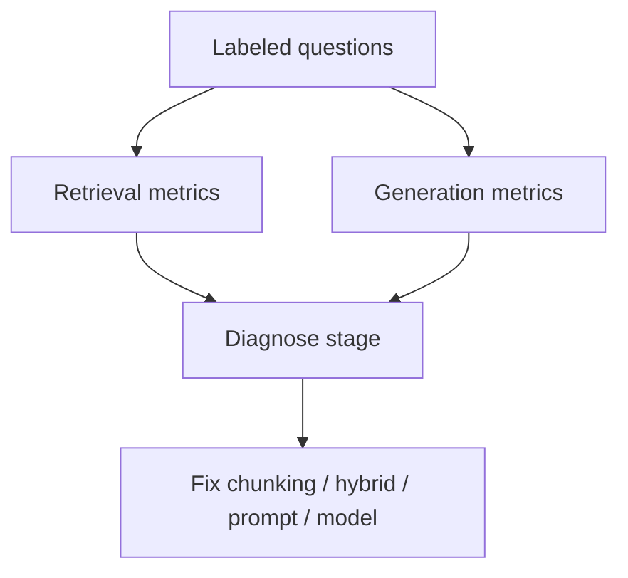

When a RAG answer is wrong, the bug might be chunking, hybrid weights, reranking, prompting, or the model ignoring perfect evidence. **Evaluation** splits the pipeline so you fix the guilty stage. Without metrics, teams endlessly tweak prompts while the retriever never saw the right document.

## Intuition

Grade the **librarian** (retrieval) and the **writer** (generation) apart.

| Stage | Plain-English question |
| --- | --- |
| **Retrieval metrics** | Was the needed chunk in the top-k? |
| **Generation metrics** | Given those chunks, was the answer faithful and complete? |

End-to-end scores matter for releases; stage metrics tell you where to invest time.



## How it works

### Offline dataset

Collect questions with reference answers and, ideally, gold document IDs. Include multi-hop, ID-heavy, and adversarial empties ("teleportation policy?" → should refuse).

### Retrieval metrics

| Metric | Plain-English idea |
| --- | --- |
| **Recall@k** | Fraction of questions where a gold chunk appears in top-k |
| **MRR / nDCG** | Care about rank position, not only presence |
| **Context precision** (RAGAS) | How much retrieved context was actually useful |
| **Context recall** (RAGAS) | Did we fetch enough needed evidence |

**RAGAS** (Retrieval-Augmented Generation Assessment Suite) is an open-source framework for these scores.

### Generation metrics

| Metric | Plain-English idea |
| --- | --- |
| **Faithfulness / groundedness** | Claims supported by context |
| **Answer relevancy** | Addresses the question asked |
| **Citation accuracy** | Cited IDs actually contain the claim |

### Classic failure modes

| Symptom | Likely stage |
| --- | --- |
| Right doc never in top-50 | Chunking, embedding model, missing hybrid/BM25 |
| In top-50, not in top-5 | Need rerank / better fusion |
| In prompt, answer invents | Prompt, temperature, model adherence |
| Mixes two policies | Conflict handling / recency metadata |
| Leaks other tenant | Metadata filter / ACL |
| Good yesterday, bad today | Index staleness or model provider change |

### Retrieval vs context vs generation failures

| Category | Examples |
| --- | --- |
| **Retrieval** | Wrong chunk; incomplete multi-doc fetch; stale knowledge base |
| **Context** | Lost in the middle; too many chunks; irrelevant noise |
| **Generation** | Hallucination despite retrieval; knowledge conflict; wrong citation |

## In code

Toy recall@k and faithfulness check.

```python
from dataclasses import dataclass

@dataclass
class Example:
    gold_ids: set[str]
    retrieved_ids: list[str]
    context: str
    answer: str

def recall_at_k(ex: Example, k: int) -> float:
    if ex.gold_ids == {"none"}:
        return 1.0
    top = set(ex.retrieved_ids[:k])
    return 1.0 if top & ex.gold_ids else 0.0

def toy_faithfulness(ex: Example) -> float:
    if "not in sources" in ex.answer.lower():
        return 1.0
    ctx = set(ex.context.lower().split())
    ans = [t for t in ex.answer.lower().split() if t.isalnum()]
    return sum(t in ctx for t in ans) / len(ans) if ans else 0.0
```

Replace toy faithfulness with a calibrated judge or entailment model in production.

## What goes wrong

- **Only end-to-end vibes** — You never learn that recall@50 is 40%.
- **Gold labels on wrong chunk IDs** — Metrics lie.
- **Judge circularity** — Same model family judges itself generously.
- **Optimizing k until metrics pass** — Huge k inflates recall and destroys generation.
- **Ignoring empty-retrieval cases** — Systems must abstain cleanly when nothing is relevant.

:::key
Report a small scorecard—recall@k, faithfulness, answer relevancy—not a single vanity number.
:::

## One-line summary

Evaluate retrieval and generation separately, map symptoms to stages, and feed production failures back into a labeled suite so RAG improves on purpose.

## Key terms

- **Recall@k:** whether gold evidence appears in the top k results.
- **Faithfulness:** answer claims supported by retrieved context.
- **RAGAS:** open-source RAG evaluation framework.
- **Context precision / recall:** quality and completeness of retrieved context.
- **Failure-mode map:** linking symptoms to pipeline stages.
- **Offline vs online eval:** labeled suites versus live user feedback.
