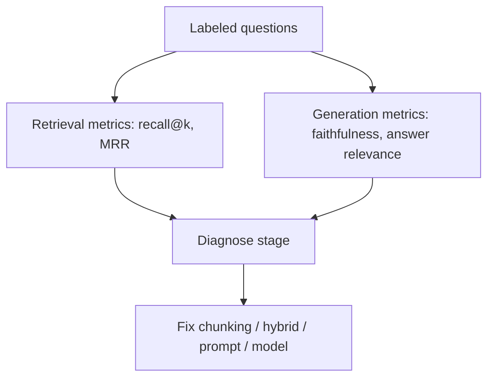

When a RAG answer is wrong, the bug might be chunking, hybrid weights, reranking, prompting, or the model ignoring perfect evidence. **Evaluation** splits the pipeline so you fix the guilty stage. Without metrics, teams endlessly tweak prompts while the retriever never saw the right document.

## Intuition

Grade the librarian and the writer apart. **Retrieval metrics** ask: was the needed chunk in the top-k? **Generation metrics** ask: given those chunks (or ideal chunks), was the answer faithful and complete? End-to-end scores matter for releases, but stage metrics tell you where to invest engineering time.



## How it works

**Offline dataset.** Collect questions with reference answers and, ideally, gold document IDs. Include multi-hop, ID-heavy, and adversarial empties (“what is our policy on teleportation?” → should refuse).

**Retrieval metrics.**

- **Recall@k:** fraction of questions where at least one gold chunk appears in top-k.
- **MRR / nDCG:** care about rank position, not only presence.
- **Context precision/recall** (RAGAS-style): estimated relevance of packed context.

**Generation metrics.**

- **Faithfulness / groundedness:** claims supported by context (LLM-judge or NLI-style).
- **Answer relevance:** addresses the question asked.
- **Exact / token F1** against references when answers are short and stable.
- **Citation accuracy:** cited IDs actually contain the claim.

**Classic failure modes (debug map).**

| Symptom | Likely stage |
| --- | --- |
| Right doc never in top-50 | Chunking, embedding model, missing hybrid/BM25 |
| In top-50, not in top-5 | Need rerank / better fusion |
| In prompt, answer invents | Prompt, temperature, or weak model adherence |
| Mixes two policies | Conflict handling / recency metadata |
| Leaks other tenant | Metadata filter / ACL |
| Good yesterday, bad today | Index staleness or model provider change |

**Online signals.** Thumbs-down, “wrong source,” escalation to humans — route into the golden set weekly.

## In code

Compute recall@k and a toy faithfulness check (answer tokens subset of context) on a mini labeled set.

```python
from dataclasses import dataclass

@dataclass
class Example:
    q: str
    gold_ids: set[str]
    retrieved_ids: list[str]  # ranked
    context: str
    answer: str

examples = [
    Example("casual leaves?", {"hr_1"}, ["hr_1", "eng_1"],
            "Employees receive 12 casual leaves per year.",
            "You get 12 casual leaves per year."),
    Example("teleportation policy?", {"none"}, ["eng_1", "hr_2"],
            "Services must expose /healthz.",
            "Not in sources."),
]

def recall_at_k(ex: Example, k: int) -> float:
    if ex.gold_ids == {"none"}:
        return 1.0  # no gold doc expected
    top = set(ex.retrieved_ids[:k])
    return 1.0 if top & ex.gold_ids else 0.0

def toy_faithfulness(ex: Example) -> float:
    if "not in sources" in ex.answer.lower():
        return 1.0
    ctx = set(ex.context.lower().split())
    ans = [t for t in ex.answer.lower().split() if t.isalnum()]
    if not ans:
        return 0.0
    return sum(t in ctx for t in ans) / len(ans)

rec = sum(recall_at_k(e, 2) for e in examples) / len(examples)
faith = sum(toy_faithfulness(e) for e in examples) / len(examples)
print(f"recall@2={rec:.2f} toy_faithfulness={faith:.2f}")
```

Replace the toy faithfulness scorer with a calibrated judge or entailment model for production.

## What goes wrong

- **Only end-to-end vibes.** You never learn that recall@50 is 40%.
- **Gold labels on wrong chunk IDs.** Metrics lie; curation matters.
- **Judge circularity.** Same model family judges itself generously; spot-check with humans.
- **Optimizing k until metrics pass.** Huge k inflates recall and destroys generation; report generation quality at the k you actually ship.
- **Ignoring empty-retrieval cases.** Systems must abstain cleanly when nothing is relevant.

## Building an eval practice that sticks

**Ownership.** Assign a DRI for the golden set. Without ownership, suites rot and everyone ignores failing dashboards. Pair eng with a domain expert who can adjudicate controversial gold labels.

**Synthetic + real.** LLM-generated questions help coverage early, but always include real user phrasings — typos, code-switches, and terse fragments. Synthetic-only suites overestimate readiness.

**Regression gates.** Block deploys on: recall@k drop beyond ε, faithfulness drop beyond ε, or any failed mandatory abstention case. Allow UX wording changes to ship with softer gates if retrieval metrics hold.

**Incident learning.** After each wrong-answer incident, add one example that would have caught it, link the PR that fixed the stage, and note which metric moved. That feedback loop is how RAG systems mature past demo quality.

## Metric pitfalls

Recall@k can look perfect while every packed chunk is only tangentially related — hence context precision. Faithfulness can look perfect on extractive answers that ignore the question — hence answer relevance. Report a small **scorecard**, not a single vanity number. When stakeholders ask “is RAG good now?”, answer with the scorecard and the top failing slices (`ids`, `multi-hop`, `multilingual`), not a gut feel.

## Slice-level reporting

Always break metrics down by question type. A system can post 90% average recall while scoring 20% on `error_code` queries — exactly the tickets your support org cares about. Maintain a living taxonomy of slices in the golden YAML (`ids`, `paraphrase`, `multi-hop`, `abstain`, `acl`) and review the worst two slices in every sprint planning meeting.

## One-line summary

Evaluate retrieval and generation separately, map symptoms to stages, and feed production failures back into a labeled suite so RAG improves on purpose.

## Key terms

- **Recall@k:** whether gold evidence appears in the top k results.
- **MRR / nDCG:** rank-aware retrieval quality metrics.
- **Faithfulness / groundedness:** answer claims supported by context.
- **Context precision:** how much packed context is actually relevant.
- **Failure-mode map:** linking symptoms to pipeline stages.
- **Offline vs online eval:** labeled suites versus live user feedback.
