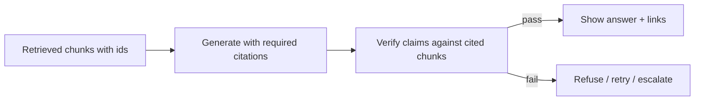

RAG's promise is not merely "better answers"—it is **answers you can check**. **Citations** point to evidence. **Grounding** means claims stay inside that evidence. **Hallucination control** stops fluent lies when retrieval is empty, partial, or ignored.

## Intuition

A student who quotes page numbers is easier to trust than one who speaks confidently from memory. Force the model to show its work as `[doc_id]` spans, then verify those spans support the sentence.

**Grounding** is a closed-book exam with an open appendix—the appendix is the only legal source.

| Term | Plain-English idea |
| --- | --- |
| **Citation** | Pointer from a claim to a source chunk |
| **Grounding** | Restricting answers to provided evidence |
| **Hallucination** | Fluent content not supported by sources |
| **Abstention** | Refusing when evidence is insufficient |
| **Fail closed** | Block or escalate on validation failure |



## How it works

### Citation UX

- Assign stable IDs at pack time (`[hr_1]`).
- Ask for inline citations per factual sentence.
- Render IDs as links to the source passage in the UI.

### Prompt contracts for grounding

- "Use only SOURCES. Cite every factual claim. If missing, say `Not in sources.`"
- Forbid blending world knowledge with docs unless explicitly allowed.
- Lower temperature for factual modes.

### Automatic checks

| Check | Plain-English idea |
| --- | --- |
| **Citation presence** | Factual answers without IDs fail a linter |
| **Citation validity** | IDs exist in the packed set |
| **Support check** | Sentence entailed by cited text (NLI or LLM-judge) |
| **Numeric match** | Amounts and dates in answer appear in sources |

### Faithfulness example

**Question:** Who wrote *Romeo and Juliet*?

**Retrieved context:** *Romeo and Juliet* is a tragedy by William Shakespeare.

**Bad answer:** William Shakespeare wrote *Romeo and Juliet* in 1597.

**Why bad:** "in 1597" is not in the retrieved context—partly unsupported even though the author is correct. **Faithfulness** catches this.

### When retrieval is weak

Prefer abstention over guesswork. "I don't have that in the knowledge base" is a successful grounded outcome.

## In code

Validate citations and numeric claims.

```python
import re

sources = {
    "hr_1": "Employees receive 12 casual leaves per calendar year.",
    "hr_2": "Up to 5 unused casual leaves may carry to the next year.",
}

def validate_answer(answer: str, sources: dict) -> list[str]:
    errors = []
    ids = re.findall(r"\[([a-z0-9_]+)\]", answer)
    if not ids:
        errors.append("no_citations")
    for i in ids:
        if i not in sources:
            errors.append(f"unknown_citation:{i}")
    cited_text = " ".join(sources[i] for i in ids if i in sources)
    for num in re.findall(r"\b\d+\b", answer):
        if num not in cited_text:
            errors.append(f"unsupported_number:{num}")
    return errors

good = "You get 12 casual leaves per year [hr_1]. Up to 5 may carry over [hr_2]."
bad = "You get 18 casual leaves per year [hr_1]."
print("good:", validate_answer(good, sources))
print("bad:", validate_answer(bad, sources))
```

Run validators **before** the response hits the client. On failure: one repair attempt, then abstain.

## What goes wrong

- **Decorative citations** — Model cites `[hr_1]` while inventing content not in that chunk.
- **Citation stuffing** — Every sentence cites every doc; users drown.
- **World-knowledge bleed** — Model adds unofficial advice absent from sources.
- **Stale cited docs** — Citation accurate to outdated chunk; re-ingest matters.
- **UI without passages** — Filenames without highlights make audit painful.

:::key
Grounding is a social contract too. Teach teams not to celebrate demos that answer brilliantly with empty retrieval.
:::

## One-line summary

Require citeable grounding, verify that citations support claims, and abstain when evidence is missing so RAG fails closed instead of hallucinating fluently.

## Key terms

- **Citation:** pointer from a claim to a source chunk or span.
- **Grounding:** restricting answers to provided evidence.
- **Hallucination:** fluent content not supported by sources or reality.
- **Faithfulness:** automated check that claims are entailed by citations.
- **Abstention:** refusing to answer when evidence is insufficient.
- **Fail closed:** block or escalate on validation failure rather than shipping guesses.
