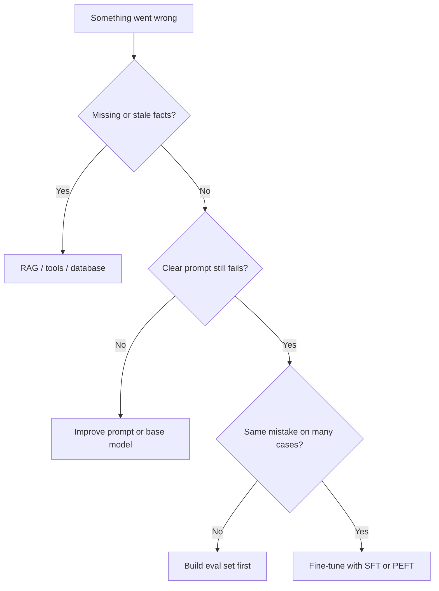

Most teams reach for fine-tuning too early. In practice, bad answers usually come from missing context, unclear instructions, or a weak base model—not from a lack of training. This lesson gives you a simple ladder so you spend GPU budget only when the problem really needs it.

## Intuition

You have three levers, and each one changes something different.

| Strategy | Plain-English idea | When to use it |
| --- | --- | --- |
| **Prompting** | Rewrite the instruction you send to the model. | Fast experiments, low cost, or the task is simple enough to describe in text. |
| **RAG** (retrieval-augmented generation) | Fetch fresh documents at answer time and paste them into the prompt. | Facts change often, or answers must come from private or current files. |
| **Fine-tuning** | Update model weights on your labeled examples. | You want a stable style, format, or domain habit that should stick across many future prompts. |

:::key
Prompting steers behavior. RAG supplies facts. Fine-tuning rewires habits. Pick the lever that matches the bug.
:::

Picture it this way:

- Prompting only changes the **instruction** you send in.
- RAG changes the **context** the model reads at answer time.
- Fine-tuning changes the **model itself**.

If the model "does not know Tuesday's policy," that is a knowledge problem—use RAG or an API, not fine-tuning. If it knows the answer but keeps wrapping JSON in markdown despite a clear schema, that is a habit problem—fine-tuning may help after prompting fails.

## How it works

### A decision ladder (use in order)

1. **Stronger base + clearer prompt** — Many "we need to fine-tune" tickets die here. Add roles, constraints, few-shot examples, and an output schema.
2. **Retrieval / tools** — If errors are wrong or stale facts, fetch docs, tickets, or database rows. If the task needs actions (create ticket, look up order), wire tools.
3. **Measure remaining errors** — Label 50–200 real failures. Cluster them: format? tone? missing skill? missing fact?
4. **Fine-tune only for systematic, data-backed gaps** — You need a clean dataset, an offline eval, and a rollback plan.



### Five questions from the decision framework

Before you train anything, ask:

1. **Does the knowledge change often?** If yes, start with RAG.
2. **Do you need stable, reusable behavior?** If yes, fine-tuning becomes more attractive.
3. **How much labeled data do you have?** Small data usually favors prompting, RAG, or PEFT (parameter-efficient fine-tuning) before full fine-tuning.
4. **Is this one task or several related tasks?** Related tasks can share one model through multi-task learning (covered in the SFT lesson).
5. **Is the base model already close to correct?** If yes, freeze more layers and train less (covered in the freeze-strategies lesson).

### Where should knowledge live?

Research papers like *Fine-Tuning or Retrieval? Comparing Knowledge Injection in LLMs* help you decide: should facts sit **inside model weights**, or in an **external store** you retrieve from?

| If your situation looks like... | Lean toward |
| --- | --- |
| Policy docs update every month and must be quoted accurately | RAG |
| Tone of voice must stay the same across thousands of emails | Fine-tuning |
| Task is simple and a good prompt already works | Prompting only |
| Fresh facts for one workflow, permanent style for another | RAG for facts, fine-tuning for style |

### Cost and speed trade-offs

- **Prompting** — Cheapest to try; you can iterate in hours. Cost grows with prompt length and retries.
- **RAG** — More engineering (ingest, chunking, ranking). Knowledge stays editable without retraining.
- **Fine-tuning** — Dataset + training + eval + serving a new model file. Wins when high volume makes long prompts expensive, or when style and format must be rock-solid.

### When fine-tuning earns its keep

- Stable **output contracts** (JSON schemas, ticket templates) at high volume where long prompts hurt latency or cost.
- **Domain language** rare in the base model (internal jargon, regulated phrasing) that few-shot examples cannot fix.
- Consistent **tone or workflow** across thousands of similar tasks (support triage, code review comments).
- Preference or safety behavior that prompting alone cannot lock in (later: RLHF / DPO).

### When it does not

- Living catalogs, prices, policies, or user-specific data.
- One-off tasks with tiny labeled sets (you will overfit).
- Problems that are really retrieval or tool gaps dressed up as "the model is dumb."

:::tip
Write the failure mode in one sentence before touching training configs. If you cannot, you are not ready to fine-tune.
:::

## In code

A tiny "router" that classifies a failure mode—no GPU required. Use it as a checklist in reviews.

```python
from dataclasses import dataclass


@dataclass
class Failure:
    description: str
    needs_fresh_facts: bool
    prompt_already_clear: bool
    systematic_across_cases: bool
    labeled_examples: int


def recommend(f: Failure) -> str:
    if f.needs_fresh_facts:
        return "Use RAG / tools — do not bake facts into weights"
    if not f.prompt_already_clear:
        return "Improve prompt, few-shots, and schema first"
    if f.labeled_examples < 50 or not f.systematic_across_cases:
        return "Build a labeled eval set and cluster errors"
    return "Candidate for SFT / LoRA with held-out eval"


cases = [
    Failure("Wrong leave balance", True, True, True, 200),
    Failure("JSON wrapped in markdown", False, True, True, 120),
    Failure("Vague answers, no schema tried", False, False, False, 10),
]

for c in cases:
    print(c.description, "->", recommend(c))
```

Illustrative HuggingFace-style intent (conceptual—do not treat as a full trainer):

```python
# Pseudocode: only after recommend() says fine-tune
# dataset = load_dataset("json", data_files="sft_train.jsonl")
# model = AutoModelForCausalLM.from_pretrained("base-model")
# trainer = Trainer(model=model, train_dataset=dataset, ...)
# trainer.train()  # changes weights; RAG would instead change `context` at generate()
```

## What goes wrong

- **Fine-tuning as a content store** — Policies change; weights do not. Stale "truth" baked into parameters is a product liability.
- **Skipping measurement** — Training on vibes produces a model that looks good in a demo chat and fails on live traffic.
- **Prompt debt** — A 4k-token prompt that almost works is a signal to simplify or retrieve—not always to fine-tune.
- **Wrong success metric** — Lower training loss is not "users are happier." Track task rubrics and regression suites.
- **No rollback** — Shipping a fine-tune without keeping the previous model and prompt baseline is how weekends get ruined.

:::warn
If yesterday's knowledge must be correct tomorrow, put it in retrieval or a database. Fine-tuning is for durable behavior, not a weekly fact dump.
:::

## One-line summary

Choose **prompting** to steer, **RAG/tools** for fresh knowledge and actions, and **fine-tuning** only when systematic behavioral gaps remain after a clear prompt and a labeled eval.

## Key terms

- **Prompting** — Steering the model by changing inputs at inference without updating weights.
- **RAG** (retrieval-augmented generation) — Fetching external evidence into the prompt so answers can cite current sources.
- **Fine-tuning** — Updating model weights (or adapters) on task-specific data.
- **PEFT** (parameter-efficient fine-tuning) — Updating only a small slice of parameters (e.g., LoRA adapters) instead of the whole model.
- **Base model** — Pretrained checkpoint before your adaptation.
- **Failure mode** — The recurring error pattern you are trying to fix.
- **Eval set** — Held-out examples with rubrics used to decide if a change helped.
- **Knowledge injection** — The general goal of putting task or domain knowledge into model behavior—via weights, retrieval, or both.
