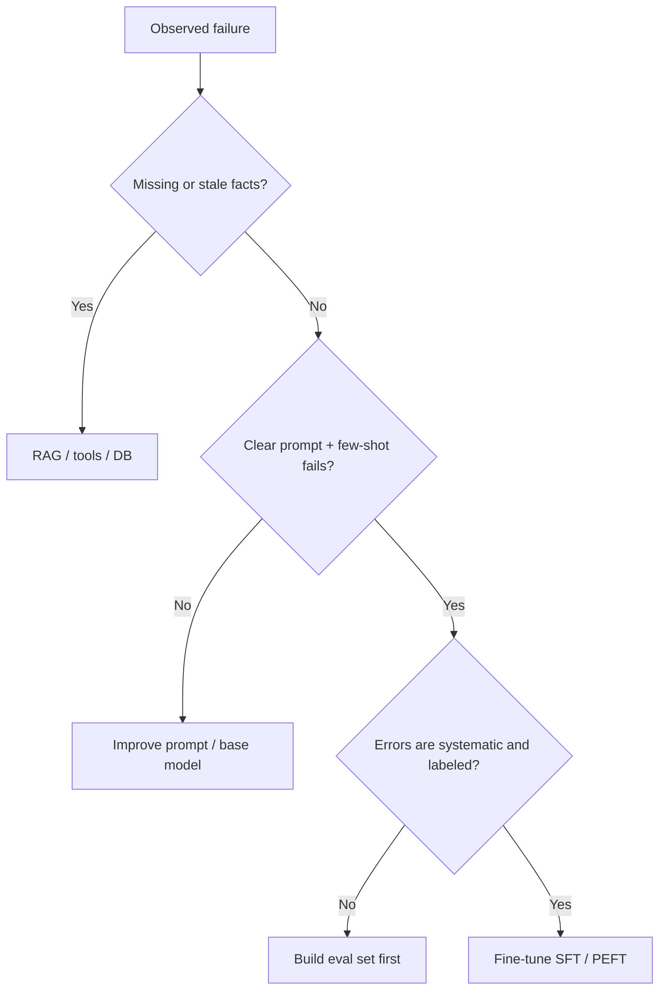

Teams often jump to fine-tuning because it sounds like "real ML." The expensive truth: most product failures are missing context, unclear instructions, or a weak base model—not missing gradient steps. This lesson gives you a practical ladder so you spend GPU budget only when the failure mode demands it.

## Intuition

Think of three levers that change different things:

| Lever | What you change | Persists across calls? | Best for |
| --- | --- | --- | --- |
| **Prompting** | Instructions, examples, format in the input | Only if you ship the same prompt | Behavior you can describe in text |
| **RAG / tools** | Evidence and actions at inference | Knowledge lives outside the model | Fresh facts, docs, systems of record |
| **Fine-tuning** | Model weights (full or adapters) | Yes, until you retrain | Stable style, format, domain phrasing |

:::key
Prompt steers behavior. RAG supplies facts. Fine-tuning rewires habits. Pick the lever that matches the bug.
:::

If the model "doesn't know Tuesday's policy," that is a knowledge problem—RAG or an API, not a fine-tune. If it knows the answer but keeps wrapping JSON in markdown despite a clear schema, that is a habit problem—candidates for fine-tuning after prompting fails.

## How it works

### A decision ladder (use in order)

1. **Stronger base + clearer prompt** — Many "need to fine-tune" tickets die here. Add roles, constraints, few-shot examples, and an output schema.
2. **Retrieval / tools** — If errors are wrong or stale facts, fetch docs, tickets, or DB rows. If the task needs actions (create ticket, look up order), wire tools.
3. **Measure remaining errors** — Label 50–200 real failures. Cluster them: format? tone? missing skill? missing fact?
4. **Fine-tune only for systematic, data-backed gaps** — You need a clean dataset, an offline eval, and a rollback plan.



### Cost and speed trade-offs

- **Prompting** — Cheapest to try; iteration in hours. Cost scales with prompt length and retries.
- **RAG** — Engineering cost (ingest, chunking, retrieval quality). Knowledge stays editable without retraining.
- **Fine-tuning** — Dataset + training + eval + serving a new artifact. Wins when high volume makes long prompts expensive, or when style/format must be rock-solid.

### When fine-tuning earns its keep

- Stable **output contracts** (JSON schemas, ticket templates) at high QPS where long prompts hurt latency/cost.
- **Domain language** rare in the base model (internal jargon, regulated phrasing) that few-shot cannot fix.
- Consistent **tone or workflow** across thousands of similar tasks (support triage, code review comments).
- Preference or safety behavior that prompting alone cannot lock in (later: RLHF / DPO).

### When it does not

- Living catalogs, prices, policies, or user-specific data.
- One-off tasks with tiny labeled sets (you will overfit).
- Problems that are really retrieval or tool gaps dressed up as "the model is dumb."

:::tip
Write the failure mode in one sentence before touching training configs. If you cannot, you are not ready to fine-tune.
:::

## In code

A tiny "router" that classifies a failure mode—no GPU required. Use it as a checklist in reviews.

```python
from dataclasses import dataclass


@dataclass
class Failure:
    description: str
    needs_fresh_facts: bool
    prompt_already_clear: bool
    systematic_across_cases: bool
    labeled_examples: int


def recommend(f: Failure) -> str:
    if f.needs_fresh_facts:
        return "Use RAG / tools — do not bake facts into weights"
    if not f.prompt_already_clear:
        return "Improve prompt, few-shots, and schema first"
    if f.labeled_examples < 50 or not f.systematic_across_cases:
        return "Build a labeled eval set and cluster errors"
    return "Candidate for SFT / LoRA with held-out eval"


cases = [
    Failure("Wrong leave balance", True, True, True, 200),
    Failure("JSON wrapped in markdown", False, True, True, 120),
    Failure("Vague answers, no schema tried", False, False, False, 10),
]

for c in cases:
    print(c.description, "->", recommend(c))
```

Illustrative HuggingFace-style intent (conceptual—do not treat as a full trainer):

```python
# Pseudocode: only after recommend() says fine-tune
# dataset = load_dataset("json", data_files="sft_train.jsonl")
# model = AutoModelForCausalLM.from_pretrained("base-model")
# trainer = Trainer(model=model, train_dataset=dataset, ...)
# trainer.train()  # changes weights; RAG would instead change `context` at generate()
```

## What goes wrong

- **Fine-tuning as a CMS** — Policies change; weights do not. Stale "truth" in parameters is a product liability.
- **Skipping measurement** — Training on vibes produces a model that looks good in a demo chat and fails on live traffic.
- **Prompt debt** — A 4k-token prompt that almost works is a signal to simplify or retrieve—not always to fine-tune.
- **Wrong success metric** — Lower training loss is not "users are happier." Track task rubrics and regression suites.
- **No rollback** — Shipping a fine-tune without keeping the previous artifact and prompt baseline is how weekends get ruined.

:::warn
If yesterday's knowledge must be correct tomorrow, put it in retrieval or a database. Fine-tuning is for durable behavior, not a weekly fact dump.
:::

## One-line summary

Choose **prompting** to steer, **RAG/tools** for fresh knowledge and actions, and **fine-tuning** only when systematic behavioral gaps remain after a clear prompt and a labeled eval.

## Key terms

- **Prompting** — Steering the model by changing inputs at inference without updating weights.
- **RAG** — Retrieving external evidence into the prompt so answers can cite current sources.
- **Fine-tuning** — Updating model weights (or adapters) on task-specific data.
- **Base model** — Pretrained checkpoint before your adaptation.
- **Failure mode** — The recurring error pattern you are trying to fix.
- **Eval set** — Held-out examples with rubrics used to decide if a change helped.
- **Systematic error** — A repeated mistake across many cases, not a one-off hallucination.
