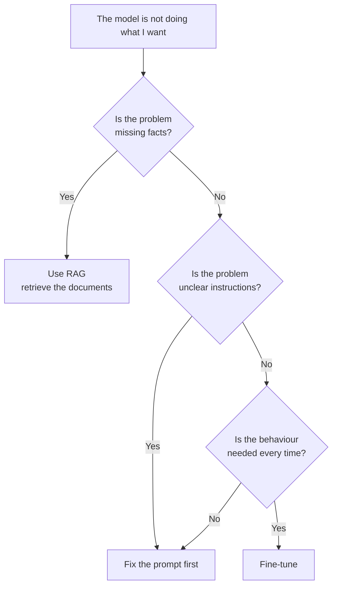

You have three pathways to get useful work from an LLM. The big mental model:

- **Prompting** changes the instruction
- **RAG** changes the context (retrieved documents)
- **Fine-tuning** changes the model weights

Pick the lever that matches the bug.

## Intuition

:::note Analogy
Imagine a capable new employee who joined last week.

- **Prompting** is leaving a sticky note on their desk: “reply in three bullet points, keep it polite.” Instant, free, but you must write it every time — and if the note is vague, the work drifts.
- **RAG** is handing them the company handbook and saying “look it up before answering.” They do not need to memorise anything, and when the handbook is updated, their answers update too.
- **Fine-tuning** is sending them on a three-week training course. Expensive and slow, but afterwards the behaviour is simply *how they work* — no sticky note required.

Nobody sends an employee on a training course to learn today's cafeteria menu. That belongs on the noticeboard (RAG). But you do train them on how your company writes to customers, because that should never change from one email to the next.
:::

| Method | What changes | Best when | Main trade-off |
| --- | --- | --- | --- |
| **Prompting** | Only the input instruction | Fast experiments, low cost, simple tasks | Can be inconsistent; wording-sensitive |
| **RAG** | Model gets retrieved external knowledge at answer time | Facts change often, or answers must come from private/current docs | Quality depends on retrieval and chunking |
| **Fine-tuning** | Model weights update on task data | You want a stable style, format, or domain habit | Training cost, data quality, forgetting risk |

:::key
If knowledge changes every week, start with RAG. If behavior must stay stable across many future prompts, consider fine-tuning. If a clear prompt already works, stay with prompting.
:::

## How it works

### A practical decision checklist

1. Does the knowledge change often? → Prefer **RAG** first.
2. Do you need a stable, reusable behavior (tone, schema, domain phrasing)? → **Fine-tuning** becomes attractive.
3. How much labeled data do you have? Small data usually favors prompting, RAG, or light PEFT before full fine-tuning.
4. Is this one task or many related tasks? Related tasks can share one multi-task fine-tune later.
5. Is the base model already almost right? If yes, train less (freeze more / lighter methods).

### Three ways the same bug looks

Suppose a banking assistant gives a bad answer. The cause decides the cure:

| What actually went wrong | Symptom | Right fix |
| --- | --- | --- |
| It did not know the new overdraft fee | Confidently quotes last year's fee | **RAG** — the fee lives in a document, not in the weights |
| It answered in a paragraph when you needed JSON | Correct facts, unusable format | **Prompting** — say the format explicitly |
| It writes JSON correctly 9 times out of 10 | Occasional format break at scale | **Fine-tuning** — make the format a habit |

Notice that only the third row needs training. The first two are cheaper and faster to fix, which is why they come first.

### Cost and speed, roughly

| Method | Setup time | Cost per change | How fast you can undo it |
| --- | --- | --- | --- |
| Prompting | Minutes | Nearly zero | Instantly |
| RAG | Days | Low | Update the documents |
| Fine-tuning | Days to weeks | High (GPU time + data work) | Retrain or roll back the model |

This is the honest reason prompting and RAG are tried first: when you are wrong, you find out cheaply.

### Split workflows are normal

One product can use **both**:

- Fresh policy facts → RAG (and cite the retrieved text)
- Permanent email tone → fine-tuning

You do not have to force one tool for every workflow.

A support assistant might combine all three in a single reply: a **prompt** sets the tone and the answer format, **RAG** pulls today's refund policy, and a **fine-tuned** model makes sure the reply always ends with a structured summary block for the ticketing system.

### Where knowledge should live

A useful framing is “fine-tuning or retrieval?”:

- Put **changing facts** in an external store and retrieve them.
- Put **stable habits** into weights when you truly need them to stick.

## What goes wrong

- Full fine-tuning a model on policies that change monthly, then shipping stale answers.
- Endless prompt rewriting for a tone that never stabilizes — when labeled examples exist for fine-tuning.
- Fine-tuning with almost no data, then blaming the optimizer.

## One-line summary

Prompt for control, RAG for fresh/private facts, fine-tune for stable reusable behavior — choose by what must change.

## Key terms

- **Prompting** — Steering the model with instructions only.
- **RAG** — Retrieve documents at answer time and feed them to the model.
- **Fine-tuning** — Updating weights on task-specific data.
- **Knowledge injection** — Getting task or domain knowledge into the system’s behavior (via prompt, retrieval, or weights).
