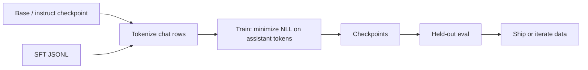

Supervised fine-tuning is the workhorse of applied LLM adaptation. You show the model many (prompt, ideal response) pairs and nudge next-token probabilities toward those responses. No reward model yet—just imitation of good demonstrations.

## Intuition

Pretraining taught general language. SFT says: "In our product, answers look like this." It is apprenticeship by example.

- The model still predicts the next token.
- You bias that prediction toward your curated assistant text.
- After SFT, the model is more likely to follow your format, tone, and task patterns—even with shorter prompts.

:::key
SFT teaches imitation. It does not automatically teach "pick the better of two answers"—that is preference alignment (RLHF/DPO).
:::

If your gold demos are excellent and cover the task, SFT alone often ships. If demos are "okay" but humans can rank better vs worse, preference methods refine further.

## How it works

### Objective

For a tokenized sequence `x_1..x_T` built from the chat template, causal SFT minimizes:

```text
L_SFT = - sum_{t in assistant_tokens} log p_theta(x_t | x_<t)
```

User/system tokens are usually present as context but excluded from the sum (masked).

### Typical pipeline

1. Start from a **base** or already-instructed checkpoint.
2. Tokenize with the model's chat template.
3. Train for a small number of epochs (often 1–3) with modest learning rates.
4. Checkpoint often; evaluate on a held-out rubric.
5. Export full weights or adapters for serving.



### Full vs efficient

- **Full SFT** — Update all (or most) parameters. Maximum flexibility; expensive; higher forgetting risk.
- **PEFT / LoRA SFT** — Update small adapters. Default for most product teams (next chapter).

Conceptually both are "SFT"; they differ in which parameters receive gradients.

### What SFT is good at

- Output schemas and house style.
- Task framing (triage, classify, rewrite).
- Domain phrasing and abbreviations.
- Teaching tool-call syntax when demos include correct calls.

### What SFT is weak at

- Choosing among subtle preference trade-offs (brief vs thorough, refuse vs answer).
- Staying calibrated when demos disagree.
- Encoding frequently changing facts (use RAG).

:::tip
Run a "prompt-only" baseline on the same eval set before celebrating an SFT win. Credit only the lift over that baseline.
:::

## In code

A minimal loop that shows the idea: maximize log-prob of target tokens (toy bigram model).

```python
import math
from collections import defaultdict


def normalize(logits: dict[str, float]) -> dict[str, float]:
    m = max(logits.values())
    exps = {k: math.exp(v - m) for k, v in logits.items()}
    z = sum(exps.values())
    return {k: v / z for k, v in exps.items()}


# Toy "model": logits for next token given previous
logits = defaultdict(lambda: defaultdict(float))
vocab_next = {
    "reset": ["password", "mfa", "please"],
    "password": ["link", "now", "}"],
}


def ensure_keys(prev: str):
    for w in vocab_next[prev]:
        logits[prev].setdefault(w, 0.0)


# One SFT example: assistant should say "password" then "link"
pairs = [("reset", "password"), ("password", "link")]
lr = 1.0  # exaggerated for demo

for prev, target in pairs:
    ensure_keys(prev)
    probs = normalize(logits[prev])
    # Gradient of -log p(target): increase target logit, decrease others
    for w in logits[prev]:
        grad = (1.0 if w == target else 0.0) - probs[w]
        logits[prev][w] += lr * grad

for prev, target in pairs:
    p = normalize(logits[prev])[target]
    print(f"p({target}|{prev}) = {p:.3f}")
```

HuggingFace-style sketch (illustrative):

```python
# model, tokenizer = load_checkpoint("base-instruct")
# for batch in dataloader:
#     tokens = tokenizer.apply_chat_template(batch["messages"], return_tensors="pt")
#     labels = tokens.clone()
#     labels[batch["prompt_mask"]] = -100  # ignore user/system in loss
#     loss = model(input_ids=tokens, labels=labels).loss
#     loss.backward()
#     optimizer.step(); optimizer.zero_grad()
```

No GPU required to understand the loop: forward → loss on assistant tokens → backward → step.

## What goes wrong

- **Too many epochs on tiny data** — Memorization and brittle parroting of train tickets.
- **Learning rate too high** — Destroys general instruction following (catastrophic forgetting).
- **Unmasked loss on user text** — Model wastes capacity copying user typos into the objective.
- **Evaluating only train loss** — Loss can fall while product rubrics flatline.
- **SFT when you needed preferences** — Imitating average demos cannot encode "prefer A over B" trade-offs.

:::warn
If two equally common labels conflict (refuse vs answer), SFT averages the mess. Resolve policy in the data—or move to preference tuning with clear rankings.
:::

### Mini case: triage JSON

Suppose baseline intent accuracy is 55% with frequent markdown wrappers. You collect 150 gold chat rows where every assistant message is bare JSON. After one epoch of LoRA SFT, schema validity jumps and intent accuracy follows—if the labels are consistent. If ten rows still wrap JSON in prose, those ten rows fight the other 140 in gradient space. Clean the minority pattern before you add epochs.

### Scheduling and regularization (practical)

- Prefer **cosine decay** with a short warmup over a constant high LR.
- Weight decay helps a little; **data diversity** helps more.
- For instruct-tuned bases, start conservative: you are polishing behavior, not pretraining again.
- Log both token NLL and a cheap task metric each eval cycle so you do not worship loss alone.

### SFT data mixture tricks

When the task is narrow, mix 10–30% general instruction rows (public or internal "replay") so the model remembers how to follow ordinary requests. This is a cheap hedge against forgetting without jumping to full RLHF.

## One-line summary

**SFT** adapts a pretrained LM by minimizing next-token loss on curated assistant responses so the model imitates your task format and style.

## Key terms

- **Supervised fine-tuning (SFT)** — Training on labeled prompt→response demonstrations.
- **Negative log-likelihood (NLL)** — Standard token-level loss for causal LMs.
- **Instruct model** — Checkpoint already tuned to follow instructions; often the SFT starting point.
- **Checkpoint** — Saved weights during or after training.
- **Epoch** — One pass over the training set.
- **Demonstration / demo** — A single curated example of desired behavior.
- **Preference tuning** — Methods (RLHF, DPO) that learn from ranked comparisons, not only imitation.
