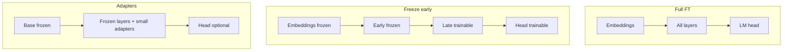

Not every fine-tune should touch every parameter. Compute, memory, and catastrophic forgetting all scale with how much of the network you open for gradients. This lesson compares full updates, partial freezes, and the intuition that leads into PEFT.

## Intuition

A transformer is a stack of reusable blocks plus embeddings and a language-model head. Fine-tuning is a budget decision: **which knobs are allowed to turn?**

| Strategy | What updates | Relative cost | Flexibility | Forgetting risk |
| --- | --- | --- | --- | --- |
| **Full fine-tune** | Nearly all weights | Highest | Highest | Highest |
| **Freeze early layers** | Later blocks + head | Medium | Medium-high | Medium |
| **Head-only / last-N** | Top layers only | Lower | Lower | Lower |
| **Adapters / LoRA** | Tiny add-on matrices | Lowest–low | High for many tasks | Usually lowest |

:::key
Update the smallest set of parameters that can absorb your task—then stop. Extra trainable weights are extra ways to overfit and forget.
:::

Full fine-tuning still matters for large domain shifts with lots of data and serious compute. Most product SFT jobs today start with freeze-heavy or LoRA recipes.

## How it works

### Full fine-tune

Every attention and MLP weight (and usually embeddings) receives gradients. The optimizer state alone can multiply memory (Adam stores moments per parameter). Use when:

- You have substantial, diverse task data.
- You need deep behavioral change, not a light style nudge.
- You can afford multi-GPU training and careful eval for regressions.

### Freeze strategies

**Freeze embeddings** — Keeps the token geometry stable; useful when vocab meaning should not drift.

**Freeze bottom N layers** — Early layers often encode generic features; later layers specialize. Freezing bottoms reduces memory and can preserve general language skill.

**Train last N layers + LM head** — Classic transfer learning pattern from vision/NLP. Limited capacity: may underfit hard format or reasoning shifts.



### Practical selection rule

1. Try **LoRA / adapters** on attention (and maybe MLP) projections first.
2. If undercapacity (eval stuck, loss high), widen rank or unfreeze last blocks.
3. Escalate to **full FT** only with data volume and eval discipline to match.

### Optimizer and memory notes

Rough intuition (not a calculator):

```text
trainable_params = count of weights with requires_grad=True
train_memory ~= model_weights + gradients + optimizer_state + activations
```

Halving trainable params does not always half memory (activations still dominate with long sequences), but it often enables larger batches or smaller GPUs—and reduces how violently the base model can drift.

:::tip
Log `trainable_params / total_params` at job start. If it is near 100% for a "quick style tweak," you probably over-opened the model.
:::

## In code

Simulate freeze vs full by toggling which parameter groups receive updates.

```python
from dataclasses import dataclass, field


@dataclass
class FakeBlock:
    name: str
    weight: float
    trainable: bool = True


@dataclass
class ToyModel:
    blocks: list[FakeBlock] = field(default_factory=list)

    def trainable_params(self) -> int:
        return sum(1 for b in self.blocks if b.trainable)

    def freeze_prefix(self, n: int) -> None:
        for i, b in enumerate(self.blocks):
            b.trainable = i >= n


def sgd_step(model: ToyModel, grads: dict[str, float], lr: float) -> None:
    for b in model.blocks:
        if b.trainable:
            b.weight -= lr * grads.get(b.name, 0.0)


model = ToyModel(
    blocks=[
        FakeBlock("embed", 1.0),
        FakeBlock("L0", 1.0),
        FakeBlock("L1", 1.0),
        FakeBlock("L2", 1.0),
        FakeBlock("head", 1.0),
    ]
)

# Strategy A: full
grads = {b.name: 0.1 for b in model.blocks}
sgd_step(model, grads, lr=0.1)
print("full trainable", model.trainable_params(), "head", model.blocks[-1].weight)

# Strategy B: freeze first 3 modules
model.freeze_prefix(3)
print("after freeze trainable", model.trainable_params())
sgd_step(model, grads, lr=0.1)
print("L0 (frozen)", model.blocks[1].weight, "L2 (open)", model.blocks[3].weight)
```

HuggingFace-style freeze (pseudocode):

```python
# for name, p in model.named_parameters():
#     p.requires_grad = name.startswith("model.layers.31") or "lm_head" in name
# optimizer = AdamW([p for p in model.parameters() if p.requires_grad], lr=2e-5)
```

Adapter/LoRA keeps the base `requires_grad=False` and injects small trainable modules—covered in the PEFT chapter.

## What goes wrong

- **Full FT on a few hundred rows** — The model memorizes and sheds general skills.
- **Frozen too hard** — Last-layer-only cannot learn new multi-step patterns; people blame "LoRA" when the real issue is capacity or data.
- **Inconsistent freezes across runs** — Comparing evals when different layers were open is apples-to-oranges.
- **Forgetting embeddings while changing vocab use** — Rare domain tokens may need embedding updates or careful tokenizer handling.
- **Ignoring serving** — Full FT produces a whole new weight set; plan storage and rollback.

:::warn
"More trainable parameters" is not a virtue metric. Track eval lift per trainable million parameters and per GPU-hour.
:::

## One-line summary

Choose **full fine-tuning** for deep shifts with enough data, and prefer **freezing or adapters** when you want cheaper training and less damage to the base model's general skills.

## Key terms

- **Full fine-tuning** — Updating (nearly) all model parameters on the task data.
- **Freezing** — Setting `requires_grad=False` so parameters stay at pretrained values.
- **Transfer learning** — Reusing a pretrained network and adapting part of it.
- **LM head** — Final projection from hidden states to vocabulary logits.
- **Trainable parameter ratio** — Trainable params divided by total params.
- **Adapter** — Small trainable module inserted into a frozen backbone.
- **Catastrophic forgetting** — Loss of prior capabilities after aggressive updates.
