Not every fine-tune should touch every parameter. Compute, memory, and catastrophic forgetting all grow with how much of the network you open for training.

## Intuition

A transformer is a stack of reusable blocks plus embeddings and a language-model head. Fine-tuning is a budget decision: **which knobs are allowed to turn?**

| Strategy | Plain-English idea | When to use it |
| --- | --- | --- |
| **Full fine-tune** | Update nearly every weight. | Large domain shift, enough labeled data, and you need deep behavioral change. |
| **Freeze early layers** | Lock bottom blocks; train later ones + head. | Smaller datasets or when you want to keep general language skills. |
| **Head-only / last-N** | Train only the top layers. | Base model already understands the task; you need a light nudge. |
| **Gradual unfreezing** | Start with head only, then open deeper layers one at a time. | Cautious adaptation when data is limited. |
| **Adapters / LoRA** (PEFT) | Keep base frozen; train tiny add-on matrices. | Strong middle ground—most benefits of fine-tuning without updating every weight. |

:::key
Update the smallest set of parameters that can absorb your task—then stop. Extra trainable weights are extra ways to overfit and forget.
:::

Full fine-tuning still matters for large domain shifts with lots of data and serious compute. Most product SFT jobs today start with freeze-heavy or LoRA recipes.

## How it works

### Full fine-tune

Full fine-tuning means every model weight is allowed to update. This is the most powerful and the most expensive form of adaptation.

- **Good for:** strong domain shift, consistent output format, or a high-value task.
- **Risk:** the model may forget some general abilities or overfit on small data.
- **Example:** a legal-team assistant that must learn a very specific drafting style.

Every attention and MLP weight (and usually embeddings) receives gradients. The optimizer state alone can multiply memory (Adam stores moments per parameter). Use when:

- You have substantial, diverse task data.
- You need deep behavioral change, not a light style nudge.
- You can afford multi-GPU training and careful eval for regressions.

### Freeze vs tune

A **frozen layer** keeps its weights fixed. A **trainable layer** can move during training.

| Situation | What to do |
| --- | --- |
| Small dataset or base model already close to the task | Freeze more layers |
| Target style, domain, or format clearly different from pretraining | Tune more layers |
| Want to preserve general knowledge and cut compute | Freeze more; consider PEFT |

**Freeze embeddings** — Keeps the token geometry stable; useful when vocab meaning should not drift.

**Freeze bottom N layers** — Early layers often encode generic features; later layers specialize. Freezing bottoms reduces memory and can preserve general language skill.

**Train last N layers + LM head** — Classic transfer learning pattern. Limited capacity: may underfit hard format or reasoning shifts.

### Gradual unfreezing (layer-wise)

Gradual unfreezing starts by training only the task head or top layers, then slowly opens deeper layers. This is a cautious way to adapt a pretrained model without shocking the entire network at once.

- **Good for:** smaller datasets or when you want to preserve general knowledge.
- **Example:** first train a classification head, then unfreeze the last transformer block, then the next one.

```mermaid
flowchart TB
    subgraph full [Full fine-tune]
        E1[Embeddings] --> L1[All layers] --> H1[LM head]
    end
    subgraph freeze [Freeze early]
        E2[Embeddings frozen] --> L2a[Early frozen]
        L2a --> L2b[Late trainable]
        L2b --> H2[Head trainable]
    end
    subgraph gradual [Gradual unfreezing]
        E3[Most layers frozen] --> S1[Step 1: train head]
        S1 --> S2[Step 2: unfreeze last block]
        S2 --> S3[Step 3: unfreeze next block]
    end
    subgraph peft [Adapters / LoRA]
        E4[Base frozen] --> L4[Frozen layers + small adapters]
        L4 --> H4[Head optional]
    end
```



### PEFT as a middle ground

Parameter-efficient fine-tuning (PEFT) methods such as adapters and LoRA change only a small number of parameters. That makes fine-tuning cheaper and easier to store.

- Useful when you want most of the benefits of fine-tuning without updating every weight.
- Often a strong middle ground between plain prompting and full fine-tuning.

### Practical selection rule

1. Try **LoRA / adapters** on attention (and maybe MLP) projections first.
2. If undercapacity (eval stuck, loss high), widen rank or unfreeze last blocks.
3. Escalate to **full fine-tune** only with data volume and eval discipline to match.
4. If the base model is already very close and data is limited, **freeze most layers** and adapt cautiously.

### Optimizer and memory notes

Rough intuition (not a calculator):

```text
trainable_params = count of weights with requires_grad=True
train_memory ~= model_weights + gradients + optimizer_state + activations
```

Halving trainable params does not always half memory (activations still dominate with long sequences), but it often enables larger batches or smaller GPUs—and reduces how violently the base model can drift.

:::tip
Log `trainable_params / total_params` at job start. If it is near 100% for a "quick style tweak," you probably over-opened the model.
:::

## In code

The point is the training strategy—not the exact library syntax. You do not have to open the whole model on day one.

```python
# Step 1: freeze most of the pretrained model
for param in model.base_model.parameters():
    param.requires_grad = False

# Step 2: train only the task head first
for param in model.classifier.parameters():
    param.requires_grad = True

# Step 3: later, unfreeze the last transformer block
for param in model.base_model.layers[-1].parameters():
    param.requires_grad = True
```

What this teaches: you can control how much of the network is allowed to learn. That is often the difference between stable training and overfitting.

Simulate freeze vs full by toggling which parameter groups receive updates:

```python
from dataclasses import dataclass, field


@dataclass
class FakeBlock:
    name: str
    weight: float
    trainable: bool = True


@dataclass
class ToyModel:
    blocks: list[FakeBlock] = field(default_factory=list)

    def trainable_params(self) -> int:
        return sum(1 for b in self.blocks if b.trainable)

    def freeze_prefix(self, n: int) -> None:
        for i, b in enumerate(self.blocks):
            b.trainable = i >= n


def sgd_step(model: ToyModel, grads: dict[str, float], lr: float) -> None:
    for b in model.blocks:
        if b.trainable:
            b.weight -= lr * grads.get(b.name, 0.0)


model = ToyModel(
    blocks=[
        FakeBlock("embed", 1.0),
        FakeBlock("L0", 1.0),
        FakeBlock("L1", 1.0),
        FakeBlock("L2", 1.0),
        FakeBlock("head", 1.0),
    ]
)

# Strategy A: full
grads = {b.name: 0.1 for b in model.blocks}
sgd_step(model, grads, lr=0.1)
print("full trainable", model.trainable_params(), "head", model.blocks[-1].weight)

# Strategy B: freeze first 3 modules
model.freeze_prefix(3)
print("after freeze trainable", model.trainable_params())
sgd_step(model, grads, lr=0.1)
print("L0 (frozen)", model.blocks[1].weight, "L2 (open)", model.blocks[3].weight)
```

HuggingFace-style freeze (pseudocode):

```python
# for name, p in model.named_parameters():
#     p.requires_grad = name.startswith("model.layers.31") or "lm_head" in name
# optimizer = AdamW([p for p in model.parameters() if p.requires_grad], lr=2e-5)
```

Adapter/LoRA keeps the base `requires_grad=False` and injects small trainable modules—covered in the PEFT chapter.

## What goes wrong

- **Full fine-tune on a few hundred rows** — The model memorizes and sheds general skills (catastrophic forgetting).
- **Frozen too hard** — Last-layer-only cannot learn new multi-step patterns; people blame "LoRA" when the real issue is capacity or data.
- **Inconsistent freezes across runs** — Comparing evals when different layers were open is apples-to-oranges.
- **Forgetting embeddings while changing vocab use** — Rare domain tokens may need embedding updates or careful tokenizer handling.
- **Ignoring serving** — Full fine-tune produces a whole new weight set; plan storage and rollback.

:::warn
"More trainable parameters" is not a virtue metric. Track eval lift per trainable million parameters and per GPU-hour.
:::

## One-line summary

Choose **full fine-tuning** for deep shifts with enough data, and prefer **freezing, gradual unfreezing, or adapters** when you want cheaper training and less damage to the base model's general skills.

## Key terms

- **Full fine-tuning** — Updating (nearly) all model parameters on the task data.
- **Freezing** — Setting `requires_grad=False` so parameters stay at pretrained values.
- **Gradual unfreezing** — Freezing most of the model first, then slowly opening more layers for training.
- **Frozen layer** — A layer whose weights are kept fixed during training.
- **Transfer learning** — Reusing a pretrained network and adapting part of it.
- **LM head** — Final projection from hidden states to vocabulary logits.
- **PEFT** (parameter-efficient fine-tuning) — Methods that update only a small number of parameters (e.g., LoRA, adapters).
- **Domain shift** — The gap between the data the model saw during pretraining and the data it now sees.
- **Catastrophic forgetting** — Loss of prior capabilities after aggressive updates on a narrow task.
