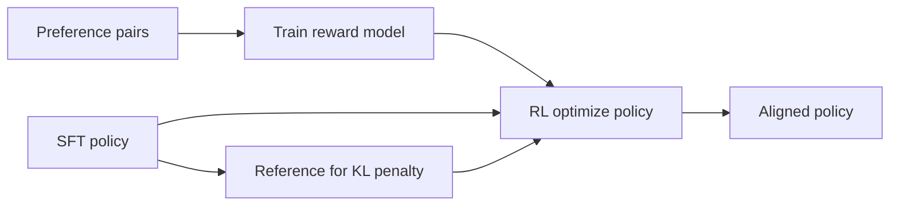

SFT teaches the model to imitate demonstrations. Alignment methods teach it to prefer better answers over worse ones—helpfulness, harmlessness, and style trade-offs that are hard to encode as a single gold string. This lesson is a map of RLHF and DPO for engineers who need to know when to reach for them.

## Intuition

Humans often cannot write the perfect answer, but they can say "A is better than B." Preference learning turns those comparisons into training signal.

```text
SFT:  learn p(y | x) from chosen y*
Prefs: learn to rank y_w > y_l given x
```

:::key
Use SFT to get into the right format neighborhood; use preference tuning when "which answer is better?" is clearer than "what is the one true answer?"
:::

**RLHF** (Reinforcement Learning from Human Feedback) trains a **reward model** on preferences, then optimizes the policy (the LLM) to score high under that reward while staying close to an SFT reference.

**DPO** (Direct Preference Optimization) skips the explicit RL loop and reward model: it updates the policy directly from preference pairs with a closed-form objective relative to a reference model.

## How it works

### Shared ingredients

1. **SFT checkpoint** — Starting policy that already follows instructions.
2. **Preference data** — For prompt `x`, winner `y_w` and loser `y_l` (human or strong-AI labeled).
3. **Reference model** — Usually the SFT model; prevents the policy from drifting into gibberish for reward hacking.
4. **Eval** — Win-rate vs baseline, safety suites, task rubrics.

### RLHF sketch



High level:

- Reward model `r(x, y)` predicts human preference.
- RL (often PPO-like) maximizes expected reward minus a KL penalty toward the reference:

```text
maximize  E[r(x, y)] - beta * KL(pi_theta || pi_ref)
```

Engineering cost: sampling trajectories, unstable training, more moving parts (RM + policy + value/critic depending on stack).

### DPO sketch

DPO reparameterizes the problem so that increasing the likelihood gap between `y_w` and `y_l` (relative to the reference) improves the preference objective—no separate RM training loop in the common recipe.

```text
increase log pi(y_w|x) - log pi(y_l|x)
relative to the same gap under pi_ref
(scaled by beta)
```

Teams like DPO when they want preference gains with a simpler trainer. Quality still hinges on preference data.

### When to use what

| Situation | Lean toward |
| --- | --- |
| Need format/style imitation only | SFT |
| Clear pairwise judgments at scale | DPO or RLHF |
| Complex multi-objective reward already modeled | RLHF-style stacks |
| Small team, limited RL ops experience | DPO (or SFT+better data) first |
| Safety-critical nuanced refusals | Preference data + strong eval; not vibes |

:::tip
Garbage preferences in -> confident wrong values out. Invest in rater guidelines and agreement checks before fancy optimizers.
:::

## In code

Toy preference update: push up winner score, push down loser, keep a reference gap in mind.

```python
import math


def sigmoid(z: float) -> float:
    return 1.0 / (1.0 + math.exp(-z))


# Log-probs under policy and frozen reference (toy scalars)
logp = {"win": -2.0, "lose": -2.1}
logp_ref = {"win": -2.0, "lose": -2.0}
beta = 0.1
lr = 0.5

for step in range(5):
    # DPO-like advantage of win vs lose vs reference
    delta = (logp["win"] - logp["lose"]) - (logp_ref["win"] - logp_ref["lose"])
    # Gradient signal: increase delta
    loss = -math.log(sigmoid(beta * delta) + 1e-9)
    # Finite-difference style updates on logp
    logp["win"] += lr * beta * (1 - sigmoid(beta * delta))
    logp["lose"] -= lr * beta * (1 - sigmoid(beta * delta))
    print(f"step {step} delta={delta:.3f} loss={loss:.3f} logp={logp}")
```

Conceptual trainer wiring:

```python
# pairs: list of {prompt, chosen, rejected}
# for batch in pairs:
#     loss = dpo_loss(policy, ref_policy, batch, beta=0.1)
#     loss.backward(); optimizer.step()
# Never required for this course: running PPO on a GPU cluster.
```

## What goes wrong

- **Reward hacking** — Policy finds loopholes (verbosity, sycophancy) that score well but annoy users.
- **Noisy or biased raters** — Alignment amplifies rater culture, not universal truth.
- **Skipping SFT** — Preference tuning from a raw base model is unstable; SFT first.
- **Over-optimizing win rate** — Anchor and safety metrics silently degrade.
- **Tiny preference sets** — Easy to overfit comparative quirks; diversity matters.

:::warn
Alignment is not a magic "make it safe" button. It is preference optimization under a KL leash—plus the eval suite you actually run.
:::

### Preference data quality bar

Good pairs share the same prompt and differ on the dimension you care about (correctness, tone, refusal). Bad pairs mix unrelated axes (one answer wrong, the other just longer). Write rater guidelines with examples of ties, and measure inter-rater agreement. If agreement is poor, fix the guide before training.

### Where SFT ends and preferences begin

Ship SFT when the main bugs are format and imitation. Reach for preferences when raters systematically prefer B over A even though both are "valid," or when safety policy needs graded judgment. Many teams do SFT -> DPO -> evaluate; RLHF stacks appear when they already invest in reward modeling infrastructure.

### KL and over-optimization (plain language)

The reference model is a leash. Without it, optimizers invent high-reward nonsense: endless apologies, empty hedging, or keyword stuffing that fooled the reward model. If outputs get strangely verbose or sycophantic after preference tuning, strengthen the leash (higher beta / KL) and revisit the preference labels.

## One-line summary

**RLHF** learns a reward model and optimizes the policy with RL; **DPO** learns from preference pairs more directly—both refine an SFT model toward ranked human (or proxy) judgments.

## Key terms

- **Alignment** — Steering models toward preferred, safe, policy-compliant behavior.
- **RLHF** — Train a reward model from feedback, then RL-optimize the policy.
- **Reward model (RM)** — Model that scores responses the way raters would.
- **DPO** — Preference optimization method that updates the policy from pairs without a separate RM RL loop.
- **Reference model** — Frozen baseline (often SFT) used to limit drift via KL or DPO terms.
- **Preference pair** — Same prompt with a chosen (winner) and rejected (loser) response.
- **KL penalty** — Term that keeps the new policy close to the reference distribution.
