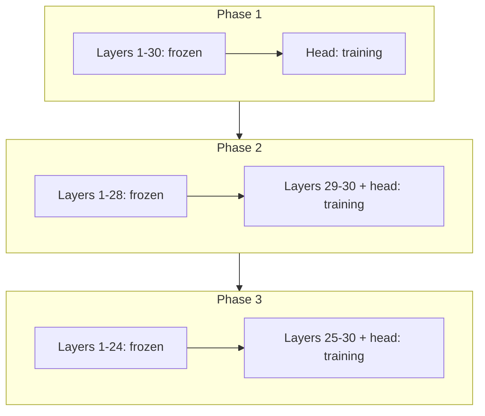

Full fine-tuning is powerful, but opening every weight from step one is not always wise. These strategies make full-parameter adaptation **more careful and often cheaper** — especially on smaller datasets.

## Intuition

A **frozen** layer keeps its weights fixed. A **trainable** layer can move.

- Freeze more → lower compute, less overfitting risk, less adaptation power
- Tune more → more adaptation, more cost, more forgetting risk

:::note Analogy
Think of the model as a building. The lower layers are the foundation and structure — they handle general things like grammar and word meaning, and they are useful for almost any task. The upper layers are the interior: they handle the specific, task-shaped decisions.

If you only need the rooms to look different, you redecorate the top floors and leave the foundation alone. Digging into the foundation is possible, but it is expensive, slow, and risks damaging a building that was working perfectly well.

Freezing lower layers is redecorating. Full fine-tuning is touching the foundation too.
:::

Why does freezing save so much? A frozen layer still passes data forward, but no gradients or optimizer state are stored for it. On a 7B model, the optimizer state alone is usually the largest item in GPU memory — so freezing most of the network can cut memory dramatically even though the model size on disk is unchanged.

:::key
If the base model is already close and your dataset is small, freeze most layers and adapt cautiously.
:::

## How it works

### Freeze versus tune

| Situation | Prefer |
| --- | --- |
| Small data; base model already understands the task well | Freeze more |
| Strong domain/style shift; enough labeled data | Tune more |
| You want a middle ground | PEFT (adapters / LoRA) — covered in lessons 3.3–3.4 |

### Gradual unfreezing (layer-wise idea)

Start small, then open more of the network:

1. Freeze almost everything; train only the task head (or top piece)
2. Later unfreeze the last transformer block
3. Optionally unfreeze the next block, and so on

This avoids shocking the entire pretrained network on day one.



A practical detail that is easy to miss: when you unfreeze deeper layers, **lower the learning rate**. Those layers hold the general knowledge you want to keep, so they should move in small steps. Some recipes use a different learning rate per layer for exactly this reason — small near the foundation, larger near the top.

### Block-wise fine-tuning

Instead of one layer at a time, open a **block** (a group of layers), train, then open the next block. Same spirit as gradual unfreezing; coarser steps.

### Progressive / layer-at-a-time variants

Some recipes fine-tune all layers eventually, but **not all at once** — for example, train one layer (or block) for a while, then move focus. The shared theme: control **how much** of the network is allowed to learn at each phase.

### Tiny code sketch (strategy, not library magic)

```python
# 1) Freeze the pretrained body
for param in model.base_model.parameters():
    param.requires_grad = False

# 2) Train only the task head first
for param in model.classifier.parameters():
    param.requires_grad = True

# 3) Later, unfreeze the last transformer block
for param in model.base_model.layers[-1].parameters():
    param.requires_grad = True
```

The point is the strategy: you choose how open the network is. That choice often decides stable training versus overfitting.

## What goes wrong

- Unfreezing everything immediately on a tiny niche dataset.
- Freezing so hard that the model cannot learn a real domain shift.
- Changing freeze schedule and learning rate at the same time with no eval anchors.

## One-line summary

Efficient full fine-tuning means controlling which layers may learn — freeze, then gradually open more — so adaptation stays stable and affordable.

## Key terms

- **Frozen layer** — Weights stay fixed during training.
- **Gradual unfreezing** — Open more layers over time.
- **Block-wise fine-tuning** — Train groups of layers in stages.
- **Catastrophic forgetting** — Losing older skills after narrow tuning.
