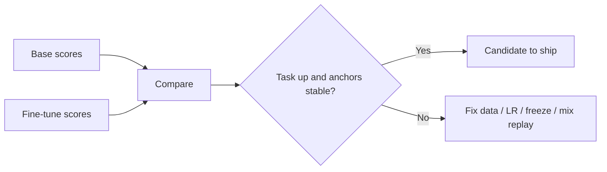

Training loss is a poor product manager. A fine-tune can look "done" because NLL fell, while live tickets get worse and the model forgets how to follow basic instructions. This lesson focuses on eval design for adaptation: task lift, generalization, and regression against the base.

## Intuition

Three failure modes dominate post-training:

1. **Underfit** — Train and eval both weak; model did not learn the task.
2. **Overfit** — Train looks great; held-out and live traffic fail (memorized quirks).
3. **Catastrophic forgetting** — Task metrics rise while general instruction-following, safety, or unrelated skills collapse.

:::key
Ship on a scorecard, not a single loss curve. Always compare to the base model on the same suite.
:::

Your scorecard needs **task metrics** (did we fix the bug?) and **anchor metrics** (did we break the world?).

## How it works

### Build an eval suite before training

| Slice | Purpose | Example |
| --- | --- | --- |
| **Task holdout** | Generalization of the new skill | 100 labeled tickets never in train |
| **Hard cases** | Stress format, ambiguity, edge policies | Multilingual, sarcasm, partial info |
| **Anchors / regressions** | Protect general behavior | MMLU-style samples, safety prompts, "hello" sanity |
| **Live shadow** | Real distribution | Offline replay of last week's queries |
| **Contamination check** | Detect leakage | n-gram overlap train vs eval |

### Metrics that matter for SFT

- **Exact / schema validity** — JSON parses; required keys present.
- **Rubric scores** — Human or LLM-as-judge against a checklist (cite with caution; calibrate).
- **Task accuracy** — Classification F1, retrieval-grounded answer correctness when facts are provided.
- **Preference win rate** — Later, for DPO/RLHF pairs.
- **Anchor delta** — Change vs base on regression prompts (should stay near zero or improve).

### Spotting overfit

Signals:

- Huge train/eval gap that widens with more epochs.
- Answers quote unique training ticket IDs or rare phrasings.
- Perfect schema on train-like prompts, collapse on paraphrases.

Mitigations: fewer epochs, more diverse data, dropout/weight decay (limited effect on LLMs), early stopping on eval, LoRA with modest rank, paraphrase augmentation.

### Spotting catastrophic forgetting

Signals:

- Base follows system rules; fine-tune ignores them.
- Safety refusals weaken or become indiscriminate.
- Coding/math/general QA tanks after a narrow support fine-tune.

Mitigations: lower LR, fewer steps, mix a replay of general instruct data, prefer PEFT, freeze more layers, multi-task sampling.



:::tip
Keep a frozen `anchors.jsonl` of 30–50 prompts that define "still a good general assistant." Run it on every checkpoint.
:::

## In code

A tiny scorecard comparing base vs fine-tune on task and anchor sets.

```python
from dataclasses import dataclass


@dataclass
class Scores:
    task_exact: float
    schema_ok: float
    anchor_pass: float


def decide(base: Scores, ft: Scores, min_task_lift: float = 0.05) -> str:
    task_lift = ft.task_exact - base.task_exact
    schema_lift = ft.schema_ok - base.schema_ok
    anchor_drop = base.anchor_pass - ft.anchor_pass
    if task_lift < min_task_lift and schema_lift < min_task_lift:
        return "reject: no meaningful task lift"
    if anchor_drop > 0.10:
        return "reject: catastrophic forgetting on anchors"
    if ft.task_exact > 0.95 and task_lift > 0.3:
        # suspiciously huge lift — check contamination
        return "review: possible overfit / leakage — audit overlap"
    return "accept_candidate"


base = Scores(task_exact=0.55, schema_ok=0.60, anchor_pass=0.92)
good = Scores(task_exact=0.78, schema_ok=0.90, anchor_pass=0.90)
overfitty = Scores(task_exact=0.99, schema_ok=0.99, anchor_pass=0.91)
forgot = Scores(task_exact=0.80, schema_ok=0.88, anchor_pass=0.70)

for name, s in [("good", good), ("overfitty", overfitty), ("forgot", forgot)]:
    print(name, decide(base, s))
```

Overlap check sketch:

```python
def jaccard(a: str, b: str) -> float:
    sa, sb = set(a.lower().split()), set(b.lower().split())
    return len(sa & sb) / max(1, len(sa | sb))


def max_train_overlap(eval_text: str, train_texts: list[str]) -> float:
    return max(jaccard(eval_text, t) for t in train_texts)


print(max_train_overlap("reset mfa after phone swap", [
    "reset mfa after phone swap please",
    "refund for double charge",
]))
```

## What goes wrong

- **Eval = train paraphrases** — You measure memorization.
- **Only automatic metrics** — BLEU/ROUGE poorly match support quality; use schema + rubric.
- **Ignoring variance** — One lucky seed is not a launch decision; note seed sensitivity on small data.
- **No base comparison** — Absolute 80% may be worse than base with a better prompt.
- **Shipping the lowest loss checkpoint** — Prefer best eval scorecard with stable anchors.

:::warn
If task metrics soar while anchors crater, you did not get a specialist—you got amnesia with a JSON habit.
:::

### Designing rubrics that humans and scripts share

Write a one-page rubric with binary checks where possible: schema valid? required keys? intent in allowed set? refusal when PII requested? Save adjudicated labels. LLM-as-judge can draft scores, but calibrate it against 30 human-labeled rows or it will drift toward verbosity and flattery.

### Offline vs online evaluation

Offline holdout is necessary but not sufficient. After a candidate passes the scorecard, run a **shadow** or **canary**: same live prompts, compare baseline vs candidate side-by-side on schema rate and human spot checks. Online metrics catch distribution shift that your static JSONL missed.

### Practical forgetting drills

Before each release, run three drills on anchors:

1. Basic instruction following ("reply with exactly one word").
2. Safety / policy prompts relevant to your product.
3. A skill you care about but did not train (e.g., short summarization).

If drill (1) fails, stop—the adapter is not ready regardless of triage F1.

## One-line summary

Evaluate fine-tunes with a **task + anchor scorecard** against the base model so you catch underfit, overfit, and catastrophic forgetting before shipping.

## Key terms

- **Held-out eval** — Examples excluded from training used to estimate generalization.
- **Overfitting** — Fitting train quirks at the expense of new inputs.
- **Catastrophic forgetting** — Losing prior capabilities after new training.
- **Regression / anchor set** — Fixed prompts that guard general behavior.
- **Early stopping** — Halt training when eval stops improving.
- **Replay / mix-in data** — General instruct examples mixed into SFT to retain skills.
- **Contamination** — Eval examples (or near-duplicates) present in training data.
