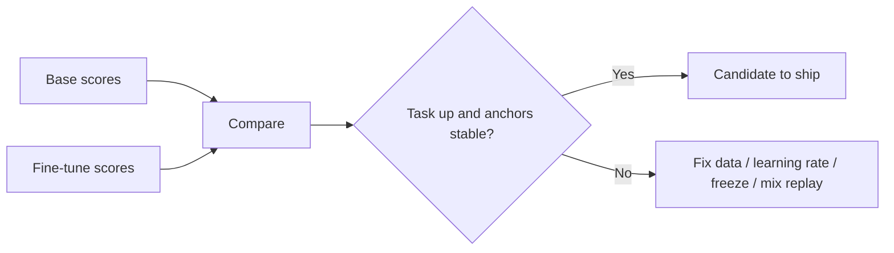

Training loss is a poor product manager. A fine-tune can look “done” because the loss number fell, while live tickets get worse and the model forgets how to follow basic instructions. This lesson is about **checking the right things** after you adapt a model: did the new skill improve, and did old skills stay healthy?

## Intuition

After fine-tuning, three common failure modes show up:

1. **Underfitting** — The model never really learned the new task. Train and test both look weak.
2. **Overfitting** — The model memorizes training quirks. Train looks great; new, real prompts fail.
3. **Catastrophic forgetting** — The new task gets better, but general skills (following instructions, safety, coding, everyday Q&A) get worse.

:::key
Ship on a **scorecard**, not a single loss curve. Always compare the fine-tune to the **base model** on the same tests.
:::

Think of two columns on that scorecard:

- **Task metrics** — “Did we fix the thing we trained for?”
- **Anchor metrics** — “Did we break the rest of the assistant?”

## How it works

### Build an eval suite before you train

Decide how you will judge success *before* you start training. Otherwise you will cherry-pick flattering numbers.

| Slice | Plain-English idea | Example |
| --- | --- | --- |
| **Task holdout** | Examples of the new skill that never appear in training | 100 labeled support tickets held out |
| **Hard cases** | Edge cases that break weak models | Ambiguous asks, mixed language, missing info |
| **Anchors / regressions** | Fixed prompts that define “still a good general assistant” | Follow a system rule, refuse unsafe asks, short summary |
| **Live shadow** | Real traffic from last week, scored offline | Replay production queries |
| **Contamination check** | Catch eval examples that leaked into train | Near-duplicate overlap between train and eval |

### Metrics that matter for supervised fine-tuning (SFT)

- **Schema / format** — Does JSON parse? Are required fields present?
- **Rubric scores** — A short checklist humans (or a carefully calibrated judge) can apply.
- **Task accuracy** — For classification or grounded answers when the facts are given.
- **Preference win rate** — Later, when you train on “chosen vs rejected” pairs.
- **Anchor delta** — Change versus the base model on regression prompts (should stay near zero or improve).

### Spotting overfitting

**What it is:** the model fits the training set too tightly and stops generalizing.

Signals:

- Huge gap between train quality and holdout quality that grows with more epochs.
- Answers quote unique training ticket IDs or rare phrasings.
- Perfect format on train-like prompts; collapse when you paraphrase the same ask.

What to try: fewer epochs, more diverse data, early stopping on eval, a smaller LoRA rank, paraphrase augmentation.

### Spotting catastrophic forgetting

**What it is:** fine-tuning on a **narrow** task overwrites weights that supported **broader** abilities. The target task improves; general skills can quietly get worse.

- Most visible after **full** fine-tuning on a small, focused dataset.
- Danger is that the failure is often **silent**: the new metric goes up while old skills slide.
- You should measure **both** the target task and a general “anchor” suite before and after tuning.

Signals:

- Base model follows system rules; fine-tune ignores them.
- Safety refusals get weaker or become random.
- Coding, math, or everyday Q&A gets worse after a narrow support fine-tune.

#### Mitigation strategies (plain English)

| Strategy | Plain-English idea | When to use it |
| --- | --- | --- |
| **Rehearsal** | Mix a little general instruction data into every batch so the model does not fully forget old skills | When you can replay representative general data |
| **Regularize toward pretrained weights** | Penalize large drift from the starting model (L2-SP or EWC-style penalties) | When you want to protect the base model’s knowledge |
| **Conservative hyperparameters** | Use a lower learning rate, fewer epochs, and early stopping | When the dataset is narrow or small |
| **Weight averaging** | Blend fine-tuned weights back with the original model after training | When you want to recover generality after the fact |
| **Freeze layers** | Keep lower layers fixed; tune only the top layers or a small adapter | When the task is close to what the base model already knows |
| **Prefer PEFT** | Change only a small set of parameters (for example LoRA) instead of every weight | Default choice when you want adaptation with less forgetting risk |



:::tip
Keep a frozen `anchors.jsonl` of 30–50 prompts that define “still a good general assistant.” Run it on **every** checkpoint.
:::

## In code

A tiny scorecard comparing base vs fine-tune on task and anchor sets. Read it as a decision helper, not as production MLOps.

```python
from dataclasses import dataclass


@dataclass
class Scores:
    task_exact: float
    schema_ok: float
    anchor_pass: float


def decide(base: Scores, ft: Scores, min_task_lift: float = 0.05) -> str:
    task_lift = ft.task_exact - base.task_exact
    schema_lift = ft.schema_ok - base.schema_ok
    anchor_drop = base.anchor_pass - ft.anchor_pass
    if task_lift < min_task_lift and schema_lift < min_task_lift:
        return "reject: no meaningful task lift"
    if anchor_drop > 0.10:
        return "reject: catastrophic forgetting on anchors"
    if ft.task_exact > 0.95 and task_lift > 0.3:
        # suspiciously huge lift — check contamination
        return "review: possible overfit / leakage — audit overlap"
    return "accept_candidate"


base = Scores(task_exact=0.55, schema_ok=0.60, anchor_pass=0.92)
good = Scores(task_exact=0.78, schema_ok=0.90, anchor_pass=0.90)
overfitty = Scores(task_exact=0.99, schema_ok=0.99, anchor_pass=0.91)
forgot = Scores(task_exact=0.80, schema_ok=0.88, anchor_pass=0.70)

for name, s in [("good", good), ("overfitty", overfitty), ("forgot", forgot)]:
    print(name, decide(base, s))
```

Quick overlap check (catches eval text that is too similar to train):

```python
def jaccard(a: str, b: str) -> float:
    sa, sb = set(a.lower().split()), set(b.lower().split())
    return len(sa & sb) / max(1, len(sa | sb))


def max_train_overlap(eval_text: str, train_texts: list[str]) -> float:
    return max(jaccard(eval_text, t) for t in train_texts)


print(max_train_overlap("reset mfa after phone swap", [
    "reset mfa after phone swap please",
    "refund for double charge",
]))
```

## What goes wrong

- **Eval is just paraphrases of train** — You measure memorization, not skill.
- **Only automatic metrics** — BLEU/ROUGE often miss support quality; prefer schema + rubric.
- **No base comparison** — Absolute 80% may still be worse than the base model with a better prompt.
- **Shipping the lowest-loss checkpoint** — Prefer the best scorecard with stable anchors.
- **Ignoring variance** — One lucky seed on small data is not a launch decision.

:::warn
If task metrics soar while anchors crater, you did not get a specialist — you got amnesia with a JSON habit.
:::

### Designing rubrics that humans and scripts share

Write a one-page rubric with binary checks where possible: schema valid? required keys? intent in allowed set? refusal when PII is requested? Save adjudicated labels. An LLM-as-judge can draft scores, but calibrate it against about 30 human-labeled rows or it will drift toward verbosity and flattery.

### Offline vs online evaluation

Offline holdout is necessary but not enough. After a candidate passes the scorecard, run a **shadow** or **canary**: same live prompts, compare baseline vs candidate on schema rate and human spot checks. Online metrics catch distribution shift that your static JSONL missed.

### Practical forgetting drills

Before each release, run three drills on anchors:

1. Basic instruction following (“reply with exactly one word”).
2. Safety / policy prompts relevant to your product.
3. A skill you care about but did **not** train (for example short summarization).

If drill (1) fails, stop — the adapter is not ready regardless of triage F1.

## One-line summary

Evaluate fine-tunes with a **task + anchor scorecard** against the base model so you catch underfitting, overfitting, and catastrophic forgetting before shipping.

## Key terms

- **Held-out eval** — Examples excluded from training used to estimate generalization.
- **Overfitting** — Fitting train quirks at the expense of new inputs.
- **Catastrophic forgetting** — Losing prior capabilities after new training on a narrow task.
- **Regression / anchor set** — Fixed prompts that guard general behavior.
- **Early stopping** — Halt training when eval stops improving.
- **Replay / rehearsal** — Mixing general instruct examples into SFT so old skills stay active.
- **Contamination** — Eval examples (or near-duplicates) present in training data.
- **PEFT** — Parameter-efficient fine-tuning: change a small part of the model instead of every weight.
