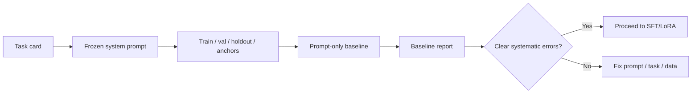

A fine-tune without a baseline is a story, not an experiment. This lesson walks you through freezing the task, data, and metrics so later training results mean something.

## Intuition

Before you touch a GPU, lock four artifacts:

1. **Task card** — what the model must do and refuse.
2. **Schema / style guide** — the exact output contract.
3. **Data splits** — train, validation, holdout (and anchors).
4. **Baseline scores** — same eval, base model + best prompt, no weight updates.

:::key
If you cannot beat your own prompt baseline on a clean holdout, do not celebrate a LoRA run.
:::

Pick a narrow task. Good lab scopes: support triage JSON, meeting → action items, SQL comment → query draft, doc → FAQ answer with a fixed template. Avoid "be a general employee assistant."

## How it works

### Step A — Write the task card

```text
Goal: Classify support tickets into intent + priority as JSON.
Inputs: raw ticket text (may be messy).
Output: {"intent": "...", "priority": "P1|P2|P3", "reason": "..."}
Out of scope: refunds execution, browsing the web, chatting.
Success: schema valid + intent accuracy + priority within 1 level.
```

### Step B — Freeze the system prompt

Put the system prompt in a file. Training rows and baseline calls must share it. Drift here invalidates comparisons.

### Step C — Build data

- 80–200 train rows for a weekend sprint (more if you have them).
- 30–50 validation for early stopping decisions.
- 50+ holdout never used for prompt fiddling after freeze (ideally).
- 20–40 anchor prompts for general instruction following.

Split by ticket id or time — not by random lines that duplicate the same incident. A random split on time-series data can leak the future into training and inflate test scores.

| Split | Plain-English idea | When to use it |
| --- | --- | --- |
| **Train** | Examples the model learns from | Always |
| **Validation** | Tune early stopping and checkpoint picks | During training only |
| **Holdout** | Final score you have not peeked at | Once, at writeup time |
| **Anchors** | General prompts that guard old skills | Every checkpoint |

### Step D — Baseline protocol

For each holdout example:

1. Call the base / instruct model with the frozen system prompt (and optional 2–3 few-shots).
2. Validate schema.
3. Score task metrics.
4. Save raw outputs for error analysis.



:::tip
Spend an hour on error clustering before training. Many "need LoRA" issues die after one schema example and stricter instructions.
:::

### Labeling session plan

Block two hours with a shared rubric. Double-annotate 20 tickets and compute agreement on intent. If you disagree often, the taxonomy is wrong — fix labels before scaling. Resist inventing ten intents when five cover 95% of volume; long-tail intents need more data than a sprint allows.

### Few-shot baseline variants

Record three baseline numbers if time allows: zero-shot, 1-shot, 3-shot. Fine-tuning should beat the **best** prompt baseline you actually tried — not a deliberately weak prompt. Otherwise you will "prove" LoRA helps when better prompting was free.

### Artifact folder layout

```text
lab/
  task_card.md
  system_prompt.txt
  data/train.jsonl
  data/val.jsonl
  data/holdout.jsonl
  data/anchors.jsonl
  baseline/report.md
  baseline/outputs.jsonl
```

Keep this layout even for dry runs so the next lesson drops in cleanly.

## In code

A lab harness that scores schema + exact intent — runs on CPU with fake model outputs.

```python
import json
from dataclasses import dataclass


SYSTEM = "Reply with JSON keys intent, priority, reason only."


@dataclass
class Example:
    id: str
    ticket: str
    gold: dict


def validate_schema(text: str) -> dict | None:
    try:
        obj = json.loads(text)
    except Exception:
        return None
    if not {"intent", "priority", "reason"} <= set(obj):
        return None
    if obj["priority"] not in {"P1", "P2", "P3"}:
        return None
    return obj


def score_baseline(examples: list[Example], predict) -> dict:
    schema_ok = intent_ok = 0
    for ex in examples:
        raw = predict(SYSTEM, ex.ticket)
        obj = validate_schema(raw)
        if obj is None:
            continue
        schema_ok += 1
        if obj["intent"] == ex.gold["intent"]:
            intent_ok += 1
    n = max(1, len(examples))
    return {
        "n": len(examples),
        "schema_rate": schema_ok / n,
        "intent_acc": intent_ok / n,
    }


holdout = [
    Example("t1", "Cannot reset MFA", {"intent": "auth", "priority": "P2", "reason": ""}),
    Example("t2", "Double charged invoice", {"intent": "billing", "priority": "P1", "reason": ""}),
]


def toy_predict(system: str, ticket: str) -> str:
    # Stand-in for an API call; deliberately imperfect baseline
    if "MFA" in ticket:
        return json.dumps({"intent": "auth", "priority": "P2", "reason": "mfa"})
    return "I think this is billing related."  # schema fail


print(score_baseline(holdout, toy_predict))
```

Pack rows for later training:

```python
def to_chat_row(ticket: str, gold: dict) -> dict:
    return {
        "messages": [
            {"role": "system", "content": SYSTEM},
            {"role": "user", "content": ticket},
            {"role": "assistant", "content": json.dumps(gold, ensure_ascii=True)},
        ]
    }
```

## What goes wrong

- **Moving the prompt while training** — You no longer know what helped.
- **Holdout peeking** — Tuning few-shots on holdout turns it into train.
- **Unlabeled "vibes" eval** — Cannot compute lift; write rubrics first.
- **Scope creep** — Mid-lab task changes invalidate the dataset.
- **Skipping anchors** — You may ship a JSON parrot that forgot how to follow basic instructions.
- **Duplicate rows in train** — Inflates metrics and teaches memorization; dedupe before you split.

:::warn
Do not start GPU jobs until the baseline report exists as a file with numbers. That file is your control group.
:::

## One-line summary

Lab prep freezes the **task, prompt, data splits, and prompt-only baseline** so later SFT/LoRA results are measurable improvements — not folklore.

## Key terms

- **Task card** — Short specification of goal, I/O, and scope.
- **Baseline** — Prompt-only performance before weight updates.
- **Holdout set** — Final eval data withheld from training and prompt tinkering.
- **Anchor set** — Regression prompts protecting general skills.
- **Schema validation** — Mechanical check that outputs meet the contract.
- **Error cluster** — Group of failures sharing a root cause.
- **System prompt freeze** — Versioned instructions shared by baseline and training.
