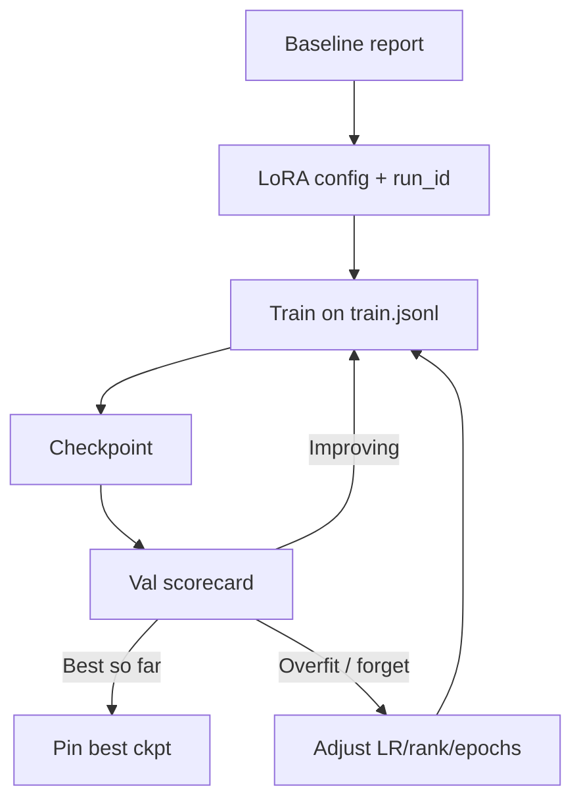

With baseline numbers in hand, run a short adaptation sprint. This lesson covers the machinery underneath every fine-tune — the loop, stability tricks, learning-rate (LR) schedules, batch size, and how to read loss curves.

## Intuition

Sprint means constrained ambition:

- One task, one schema, one adapter name.
- One recipe change at a time.
- Validation-guided early stop — not "train overnight and hope."

:::key
The sprint deliverable is a versioned artifact plus a scorecard delta vs baseline — not a vibes-based chat demo.
:::

### How large language models (LLMs) learn during fine-tuning

At training time, the model repeatedly sees a mini-batch of token IDs. It predicts the next token at every position, compares those predictions with the true text, and adjusts its parameters a tiny bit in the direction that lowers loss.

- **Tokenization** turns raw text into numbers; the model never sees letters directly.
- Training data is packed into fixed-length context windows so the GPU can process many examples efficiently.
- **Mini-batches** sit between exact but slow full-batch learning and noisy one-example learning.
- The model predicts the next token at every position, not just once at the end.

Each step follows this path:

| Stage | Plain-English idea |
| --- | --- |
| **Logits** | Raw model scores before normalization |
| **Softmax** | Turns scores into a probability distribution |
| **Cross-entropy** | Measures how wrong the predicted distribution is |
| **Backpropagation** | Computes the gradient for every trainable parameter |
| **Optimizer step** | Moves the weights to reduce loss |

Conceptually: `theta <- theta - eta * dL/dtheta`

- A **step** is one parameter update.
- An **epoch** is one full pass over the training set.
- Training usually stops when validation loss stops improving — not when training loss becomes tiny.

## How it works

### Decision: LoRA vs full SFT

| Choose LoRA when | Consider fuller updates when |
| --- | --- |
| Weekend / single GPU | Proven parameter-efficient fine-tuning (PEFT) ceiling with good data |
| Format/style/triage tasks | Huge domain shift + lots of data |
| Need modular rollback | Dedicated replica already planned |

For BackBenchLearner labs, pick LoRA unless your instructor says otherwise.

### Training instability and how to stabilize

Fine-tuning becomes unstable when one update is too large, or when the system is numerically fragile. A single bad batch can create a spike; repeated spikes can end in divergence.

| Failure mode | What it looks like | Why it happens |
| --- | --- | --- |
| **Loss spike** | One sudden jump that later recovers | A batch produced an outlier gradient |
| **Gradient explosion** | Gradient norms grow rapidly over steps | Bad updates feed back into even larger updates |
| **Divergence** | Loss rises or flatlines near random-guess level | The model has left the useful part of the loss surface |

How to stabilize:

- Use **gradient clipping** so any gradient above the cap is rescaled instead of allowed to explode.
- Use **warmup** and then a decaying LR schedule so the early fragile phase gets gentle steps.
- Watch outlier batches — unusually long, corrupted, or strange-token sequences.
- Prefer Adam-like adaptive optimizers for LLM fine-tuning; plain stochastic gradient descent (SGD) is rarely the default choice.

### Learning-rate scheduling

One learning rate is rarely ideal for an entire run. Early training needs large enough steps to move quickly; late training needs smaller steps so the model can settle safely.

| Schedule | Plain-English idea | When to use it |
| --- | --- | --- |
| **Constant + warmup** | Keep the same LR after a short ramp-up | Short, controlled runs |
| **Linear decay** | Drop the LR in a straight line to zero | Clean baseline choice |
| **Cosine decay** | Stay productive early, then glide gently into small steps | Modern default for many LLM fine-tunes |
| **Step decay** | Drop LR at milestones or on plateaus | When you want sharp, reactive changes |
| **Cosine restarts** | Decay, then jump back up and decay again | When exploring multiple basins is useful |
| **WSD** | Warmup, stable plateau, then final decay | Longer runs or open-ended budgets |

Warmup protects the fragile start of training. Peak LR is the single most important knob in many fine-tunes.

### Batch size and effective batch

Batch size is not only about memory — it changes stability, throughput, and generalization. What matters is the **effective batch size**, not just the per-GPU micro-batch.

| Term | Meaning |
| --- | --- |
| **Micro-batch** | Samples processed in one forward/backward pass on one GPU |
| **Gradient accumulation** | How many micro-batches are combined before one optimizer update |
| **Effective batch** | Micro-batch × accumulation steps × number of GPUs |

```text
micro_batch = 2
grad_accum = 16
gpus = 4
effective_batch = micro_batch * grad_accum * gpus  # 128
```

- If the batch is too small, gradients are noisy and the loss jitters.
- If the batch is too large, the model may underfit because it gets too few optimizer updates.
- When batch size increases, the learning rate often needs to increase too.

### Reading loss curves

| Curve pattern | Meaning | What to do |
| --- | --- | --- |
| **Underfitting** | Both train and validation loss stay high | Train longer, tune the model more, or improve data |
| **Overfitting** | Train loss keeps falling while validation loss turns up | Stop earlier, regularize, freeze more, or add data |
| **No learning** | Both curves stay flat near the initial level | Check the optimizer, gradients, labels, and data pipeline |
| **Healthy fine-tune** | Both losses fall together with a small stable gap | Stop near the validation minimum |

### Sprint checklist

1. Confirm train JSONL validates (lesson 3.1.2 checks).
2. Set `run_id` = `task_lora_r16_lr2e-4_e1`.
3. Config: `r=16`, `alpha=32`, targets `q_proj,v_proj` (expand if needed), LR `2e-4`, epochs `1`.
4. Save checkpoints each epoch (or every N steps).
5. Score **validation** after each checkpoint; keep the best.
6. Do **not** peek at holdout until the next lesson's writeup freeze.



### What "training" means in a no-GPU environment

Still do the sprint paperwork:

- Write the config YAML/JSON you *would* launch.
- Run dataset validation and a toy gradient loop on a tiny model.
- Produce a fake-but-structured training log with the fields you would monitor: loss, val schema rate, val intent acc, anchor pass.

The habit is the skill; GPUs only accelerate the same loop.

:::tip
Name adapters like `triage_lora_r16_2026-07-30`. Include rank and date. Future incidents love boring names.
:::

## In code

The training loop in plain Python — then a dry-run config and early-stopping toy.

```python
# One-step training picture (conceptual)
for batch in train_loader:
    logits = model(batch["input_ids"])
    loss = cross_entropy(logits, batch["labels"])
    loss.backward()
    torch.nn.utils.clip_grad_norm_(model.parameters(), max_norm=1.0)
    optimizer.step()
    scheduler.step()
    optimizer.zero_grad()
```

HuggingFace-style training arguments (illustrative):

```python
TrainingArguments(
    learning_rate=2e-5,
    lr_scheduler_type="cosine",
    warmup_ratio=0.03,
    max_grad_norm=1.0,
)
```

Dry-run config + a micro training loop that early-stops on val loss (CPU toy):

```python
from dataclasses import dataclass, asdict
import json


@dataclass
class LoraSprintConfig:
    run_id: str
    base_model: str
    r: int = 16
    alpha: int = 32
    lr: float = 2e-4
    epochs: int = 2
    targets: tuple[str, ...] = ("q_proj", "v_proj")


cfg = LoraSprintConfig(
    run_id="triage_lora_r16_lab",
    base_model="instruct-7b-base",
)
print(json.dumps(asdict(cfg), indent=2))


def toy_train(train_losses, val_losses, patience=1):
    """Emulate early stopping on val loss."""
    best_i, best_v = None, float("inf")
    bad = 0
    history = []
    for i, (tr, va) in enumerate(zip(train_losses, val_losses)):
        history.append({"epoch": i, "train": tr, "val": va})
        if va < best_v:
            best_v, best_i, bad = va, i, 0
        else:
            bad += 1
            if bad > patience:
                break
    return best_i, history


best, hist = toy_train([1.2, 0.9, 0.7, 0.5], [1.1, 0.95, 0.96, 1.05])
print("best_epoch", best, "history", hist)
```

HuggingFace-style launch sketch (illustrative):

```python
# peft_config = LoraConfig(r=cfg.r, lora_alpha=cfg.alpha, target_modules=list(cfg.targets))
# model = get_peft_model(base, peft_config)
# trainer = Trainer(model=model, args=args, train_dataset=train_ds, eval_dataset=val_ds)
# trainer.train()
# model.save_pretrained(f"artifacts/{cfg.run_id}")
```

Monitor mentally (or in logs):

```text
trainable% should be << 1% for LoRA
train loss falling
val schema_rate rising
anchor_pass not collapsing
```

## What goes wrong

- **Training on holdout** — Destroys the writeup's credibility.
- **Changing schema mid-sprint** — Relabel everything or stop; do not mix contracts.
- **Infinite epochs** — Classic overfit; use patience on val.
- **Ignoring trainable%** — If it prints 100%, you are not doing LoRA.
- **No artifact metadata** — Orphan weights without config or data hash.
- **Loss jitters forever** — Batch too small or LR too high; raise effective batch or lower LR.
- **Removing warmup on a fragile start** — Early large updates can spike loss before the run settles.

:::warn
If val improves only on examples duplicated from train, fix the split before any more gradient steps.
:::

### Mid-sprint debugging tree

- **Loss not falling** — LR too low, labels masked wrong, template mismatch.
- **Loss falls, val schema flat** — Labels inconsistent; model learns something else.
- **Val up, anchors down** — Lower LR, fewer steps, mix replay data.
- **Trainable% ~100%** — PEFT wrapping failed; stop and fix.

Write the symptom → check mapping in your notes; it will save the second experiment.

### Resource-honest scope

If you only have a laptop CPU, still produce: validated JSONL, config file, toy loop proving you understand gradients on adapters, and a filled scorecard with "simulated" or API-evaluated numbers if you call a hosted base model for baselines. The sprint grades process rigor.

### Optional stretch

Add a second run that changes exactly one knob (rank 16 → 32). Compare val curves. That single ablation teaches more than five unrelated blog configs.

### Logging fields worth keeping

Even in a short sprint, log: timestamp, run_id, step, train_loss, val_schema_rate, val_intent_acc, anchor_pass, lr, epoch. A CSV with those columns is enough to reconstruct why you pinned a checkpoint.

## One-line summary

Run a **named LoRA SFT sprint** with a stable training loop, sane LR schedule and batch size, validation-based early stopping, and checkpoints you can score — holdout stays sealed until the writeup.

## Key terms

- **Run id** — Unique name for a training experiment.
- **LoRA SFT** — Supervised fine-tuning via low-rank adapters.
- **Early stopping** — Halt when validation stops improving.
- **Checkpoint** — Saved weights at a point in training.
- **Gradient clipping** — Safety mechanism that limits very large gradients.
- **Warmup** — Short early phase where learning rate rises gradually.
- **Effective batch** — Samples that influence one optimizer update.
- **Cross-entropy** — Loss that punishes low probability on the correct token.
