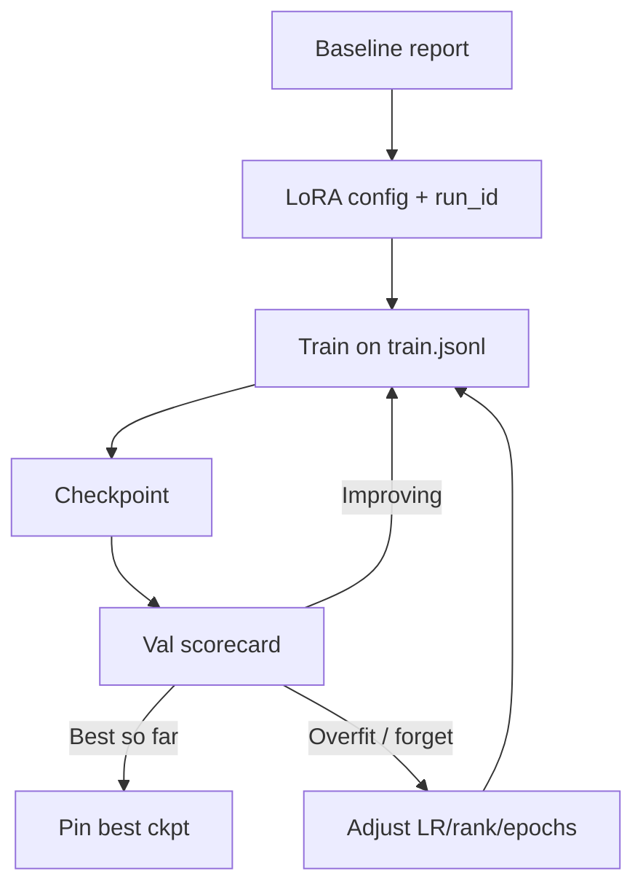

With baseline numbers in hand, run a short adaptation sprint. Default recommendation for this lab: **LoRA SFT** on your chat JSONL. Full fine-tuning is optional only if you already know PEFT underfits and you have the hardware. You can complete the learning goals with dry-run configs and toy loops if GPUs are unavailable.

## Intuition

Sprint means constrained ambition:

- One task, one schema, one adapter name.
- One recipe change at a time.
- Validation-guided early stop—not "train overnight and hope."

:::key
The sprint deliverable is a versioned artifact plus a scorecard delta vs baseline—not a vibes-based chat demo.
:::

## How it works

### Decision: LoRA vs full SFT

| Choose LoRA when | Consider fuller updates when |
| --- | --- |
| Weekend / single GPU | Proven PEFT ceiling with good data |
| Format/style/triage tasks | Huge domain shift + lots of data |
| Need modular rollback | Dedicated replica already planned |

For BackbenchLearner labs, pick LoRA unless your instructor says otherwise.

### Sprint checklist

1. Confirm train JSONL validates (lesson 3.1.2 checks).
2. Set `run_id` = `task_lora_r16_lr2e-4_e1`.
3. Config: `r=16`, `alpha=32`, targets `q_proj,v_proj` (expand if needed), LR `2e-4`, epochs `1`.
4. Save checkpoints each epoch (or every N steps).
5. Score **validation** after each checkpoint; keep the best.
6. Do **not** peek at holdout until the next lesson's writeup freeze.



### What "training" means in a no-GPU environment

Still do the sprint paperwork:

- Write the config YAML/JSON you *would* launch.
- Run dataset validation and a toy gradient loop on a tiny model.
- Produce a fake-but-structured training log with the fields you would monitor: loss, val schema rate, val intent acc, anchor pass.

The habit is the skill; GPUs only accelerate the same loop.

:::tip
Name adapters like `triage_lora_r16_2026-07-30`. Include rank and date. Future incidents love boring names.
:::

## In code

Dry-run config + a micro training loop that early-stops on val loss (CPU toy).

```python
from dataclasses import dataclass, asdict
import json


@dataclass
class LoraSprintConfig:
    run_id: str
    base_model: str
    r: int = 16
    alpha: int = 32
    lr: float = 2e-4
    epochs: int = 2
    targets: tuple[str, ...] = ("q_proj", "v_proj")


cfg = LoraSprintConfig(
    run_id="triage_lora_r16_lab",
    base_model="instruct-7b-base",
)
print(json.dumps(asdict(cfg), indent=2))


def toy_train(train_losses, val_losses, patience=1):
    """Emulate early stopping on val loss."""
    best_i, best_v = None, float("inf")
    bad = 0
    history = []
    for i, (tr, va) in enumerate(zip(train_losses, val_losses)):
        history.append({"epoch": i, "train": tr, "val": va})
        if va < best_v:
            best_v, best_i, bad = va, i, 0
        else:
            bad += 1
            if bad > patience:
                break
    return best_i, history


best, hist = toy_train([1.2, 0.9, 0.7, 0.5], [1.1, 0.95, 0.96, 1.05])
print("best_epoch", best, "history", hist)
```

HuggingFace-style launch sketch (illustrative):

```python
# peft_config = LoraConfig(r=cfg.r, lora_alpha=cfg.alpha, target_modules=list(cfg.targets))
# model = get_peft_model(base, peft_config)
# trainer = Trainer(model=model, args=args, train_dataset=train_ds, eval_dataset=val_ds)
# trainer.train()
# model.save_pretrained(f"artifacts/{cfg.run_id}")
```

Monitor mentally (or in logs):

```text
trainable% should be << 1% for LoRA
train loss falling
val schema_rate rising
anchor_pass not collapsing
```

## What goes wrong

- **Training on holdout** — Destroys the writeup's credibility.
- **Changing schema mid-sprint** — Relabel everything or stop; do not mix contracts.
- **Infinite epochs** — Classic overfit; use patience on val.
- **Ignoring trainable%** — If it prints 100%, you are not doing LoRA.
- **No artifact metadata** — Orphan weights without config or data hash.

:::warn
If val improves only on examples duplicated from train, fix the split before any more gradient steps.
:::

### Mid-sprint debugging tree

- **Loss not falling** — LR too low, labels masked wrong, template mismatch.
- **Loss falls, val schema flat** — Labels inconsistent; model learns something else.
- **Val up, anchors down** — Lower LR, fewer steps, mix replay data.
- **Trainable% ~100%** — PEFT wrapping failed; stop and fix.

Write the symptom -> check mapping in your notes; it will save the second experiment.

### Resource-honest scope

If you only have a laptop CPU, still produce: validated JSONL, config file, toy loop proving you understand gradients on adapters, and a filled scorecard with "simulated" or API-evaluated numbers if you call a hosted base model for baselines. The sprint grades process rigor.

### Optional stretch

Add a second run that changes exactly one knob (rank 16 -> 32). Compare val curves. That single ablation teaches more than five unrelated blog configs.

### Logging fields worth keeping

Even in a short sprint, log: timestamp, run_id, step, train_loss, val_schema_rate, val_intent_acc, anchor_pass, lr, epoch. A CSV with those columns is enough to reconstruct why you pinned a checkpoint. If you only save the final adapter, you cannot explain the curve later.

### Collaboration note

If two people tune prompts while one trains, stop. Parallel edits to `system_prompt.txt` invalidate the experiment. Appoint one owner for the frozen prompt during the sprint window.

## One-line summary

Run a **named LoRA SFT sprint** with a fixed recipe, validation-based early stopping, and checkpoints you can score—holdout stays sealed until the writeup.

## Key terms

- **Run id** — Unique name for a training experiment.
- **LoRA SFT** — Supervised fine-tuning via low-rank adapters.
- **Early stopping** — Halt when validation stops improving.
- **Checkpoint** — Saved weights at a point in training.
- **Dry-run config** — Complete training specification exercised without GPUs.
- **Trainable%** — Fraction of parameters being optimized.
- **Artifact** — Saved adapter or merged model plus metadata.
