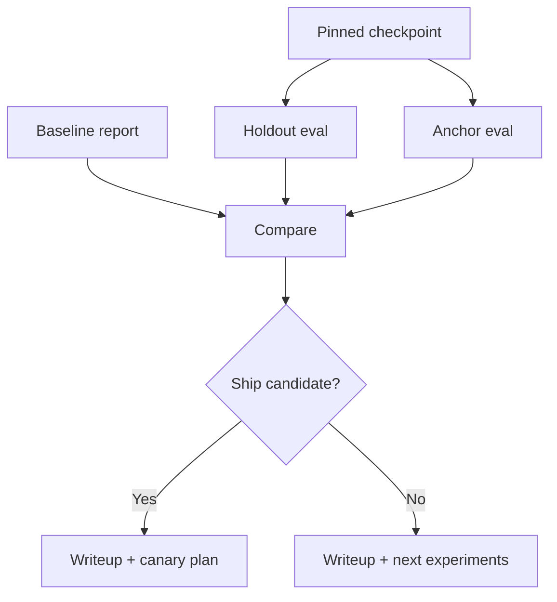

Training without a writeup is a demo. This lesson is the finish line of the sprint: evaluate the pinned checkpoint on **holdout + anchors**, compare to baseline, and document what you would ship—or why you would not.

## Intuition

A good lab writeup answers four questions in one page:

1. What problem and metric?
2. What changed (data + recipe + artifact)?
3. Did holdout improve vs baseline without wrecking anchors?
4. What would you do next?

:::key
Ship/no-ship is a scorecard decision. Chat anecdotes are optional color, not evidence.
:::

## How it works

### Unseal protocol

1. Freeze the checkpoint id (`best` from validation).
2. Load the **same** system prompt as baseline.
3. Run holdout and anchors through baseline path and fine-tune path.
4. Compute deltas.
5. Sample 10 failures for qualitative notes (no more silent cherry-picks).

### Scorecard template

| Metric | Baseline | Fine-tune | Delta |
| --- | --- | --- | --- |
| Schema valid | | | |
| Intent accuracy | | | |
| Priority tolerance | | | |
| Anchor pass rate | | | |
| Notes (overfit risk) | | | |

Decision rules (example):

- Require task metric lift >= 5 absolute points (or agreed threshold).
- Reject if anchor drop > 10 points.
- Flag for review if lift looks "too good" on tiny N—check contamination.



### Writeup outline

```text
# Experiment: <run_id>
## Task
## Data (counts, split rule, PII scrub)
## Method (base, LoRA r/alpha/targets, LR, epochs)
## Results (table)
## Error analysis (top clusters)
## Risks (forgetting, leakage, serving mode)
## Decision + next steps
```

:::tip
Paste the exact config and data hash into the writeup. Reproducibility is part of the grade in real teams—and in this lab.
:::

## In code

Generate a mini report from numeric results.

```python
from dataclasses import dataclass


@dataclass
class Card:
    schema: float
    intent: float
    anchors: float


def verdict(base: Card, ft: Card) -> str:
    if ft.intent - base.intent < 0.05 and ft.schema - base.schema < 0.05:
        return "NO_SHIP: insufficient holdout lift"
    if base.anchors - ft.anchors > 0.10:
        return "NO_SHIP: catastrophic forgetting on anchors"
    return "SHIP_CANDIDATE: canary next"


def render_md(run_id: str, base: Card, ft: Card) -> str:
    v = verdict(base, ft)
    return f"""# Experiment: {run_id}
| Metric | Baseline | Fine-tune | Delta |
| --- | --- | --- | --- |
| Schema | {base.schema:.2f} | {ft.schema:.2f} | {ft.schema-base.schema:+.2f} |
| Intent | {base.intent:.2f} | {ft.intent:.2f} | {ft.intent-base.intent:+.2f} |
| Anchors | {base.anchors:.2f} | {ft.anchors:.2f} | {ft.anchors-base.anchors:+.2f} |
**Decision:** {v}
"""


base = Card(0.62, 0.54, 0.93)
ft = Card(0.91, 0.80, 0.90)
print(render_md("triage_lora_r16_lab", base, ft))
```

Optional contamination sniff:

```python
def flag_overlap(holdout_texts, train_texts, thresh=0.8):
    # reuse a simple jaccard from fundamentals eval lesson
    from difflib import SequenceMatcher
    flags = []
    for h in holdout_texts:
        best = max(SequenceMatcher(None, h, t).ratio() for t in train_texts)
        if best >= thresh:
            flags.append((h[:40], best))
    return flags
```

## What goes wrong

- **Reporting val as holdout** — Optimistic bias; keep the names honest.
- **Only showing wins** — Include failure clusters; reviewers will find them anyway.
- **No serving note** — Say merged vs adapter and how to roll back.
- **Moving goalposts** — Changing metrics after seeing results.
- **Declaring victory on N=15** — State confidence limits; gather more labels.

:::warn
If anchors fall hard, the writeup's correct conclusion is "do not ship," even if the JSON accuracy chart looks pretty.
:::

### Qualitative review without cherry-picking

Sort holdout failures by error type. Pick the first two from each cluster, not your favorite dramatic examples. For each, note whether more data, cleaner labels, RAG, or prompt changes would help more than another training run.

### Stakeholder summary (five lines)

Busy readers need:

1. Metric lift vs baseline.
2. Anchor health.
3. Artifact id.
4. Ship/no-ship.
5. Next experiment if no-ship.

Put the essay below that block, not above it.

### After no-ship

Common productive next steps: relabel contradictions, add 50 hard cases, switch targets to include MLP projections, lower LR, or abandon FT for a tool call. Write the choice down so the next sprint does not repeat the same config hoping for magic.

### Numbers to always include

State N for holdout and anchors. A jump from 8/10 to 9/10 is not the same story as 40/50 to 45/50. When N is small, phrase results as "promising, needs more labels" rather than "solved."

### Serving paragraph (required)

End every writeup with how the artifact would be served (merged vs adapter), how to roll back, and which base revision it requires. Offline wins that cannot be deployed safely are incomplete wins.

## One-line summary

Close the lab by **scoring holdout and anchors against baseline**, then write a short reproducible report that ends in an explicit ship or no-ship decision.

## Key terms

- **Holdout unseal** — First evaluation of the final set after training.
- **Scorecard** — Table of metrics for baseline vs candidate.
- **Error analysis** — Structured review of remaining failure clusters.
- **Ship candidate** — Artifact that passed offline gates and awaits canary.
- **Canary** — Limited production exposure after offline success.
- **Reproducibility** — Ability to rerun from config + data hashes.
- **Contamination check** — Search for train/holdout overlap.
