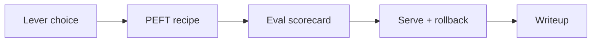

Use this lesson as a gate. If you can walk through every checkbox with a concrete example from your notes or lab, you are ready to move on. If not, jump back to the matching lesson instead of collecting more checkpoints.

## Intuition

Module 3 had three themes:

1. **Choose the right lever** — prompt vs RAG vs fine-tune; SFT vs preferences.
2. **Adapt efficiently** — freeze, LoRA/QLoRA, soft prompts, sane recipes.
3. **Prove it** — baselines, holdout, anchors, serving, writeups.

:::key
Competence here is judgment under constraints—not memorizing every hyperparameter default.
:::

## How it works

### 3.1 Fundamentals checklist

- [ ] I can explain a failure mode that needs RAG, not fine-tuning.
- [ ] I can describe chat JSONL and why train/serve templates must match.
- [ ] I know SFT optimizes next-token loss on assistant tokens.
- [ ] I can contrast full FT vs freeze vs adapters for cost and forgetting.
- [ ] I have a scorecard idea for overfit vs catastrophic forgetting.
- [ ] I can state when RLHF/DPO are considered after SFT.

### 3.2 PEFT checklist

- [ ] I can draw "frozen backbone + small trainable piece."
- [ ] I can write `W' = W + scale * B A` in plain terms.
- [ ] I know what QLoRA changes (memory via quantized backbone).
- [ ] I can contrast prompt/prefix tuning with LoRA.
- [ ] I can name a starting LoRA recipe (r, alpha, LR, epochs).
- [ ] I can argue merged vs adapter serving for a multi-tenant case.

### 3.3 Lab checklist

- [ ] Task card + frozen system prompt exist.
- [ ] Train/val/holdout/anchors defined with a split rule.
- [ ] Prompt-only baseline numbers saved before training.
- [ ] Run id + config + artifact metadata recorded.
- [ ] Holdout/anchor deltas drive a ship or no-ship call.
- [ ] Writeup includes error clusters and next steps.



### Oral exam prompts (self-test)

Try answering out loud in two minutes each:

1. Why might training loss fall while product quality falls?
2. When is DPO a better next step than more SFT rows?
3. What breaks if you serve an adapter on the wrong base revision?
4. How does `alpha/r` interact with a rank sweep?
5. What is the first file you look at in a fine-tune incident?

:::tip
If an answer needs a slide deck of caveats, you understand it. If it needs mystical vibes, revisit that lesson.
:::

## In code

A programmatic checklist you can tick in a notebook.

```python
CHECKS = [
    ("lever_choice", "Explained prompt vs RAG vs FT with one real failure"),
    ("sft_loss", "Stated what tokens receive SFT loss"),
    ("peft_formula", "Explained LoRA update W + scale*BA"),
    ("recipe", "Wrote a starting LoRA hyperparameter set"),
    ("baseline", "Saved prompt-only baseline metrics"),
    ("anchors", "Ran anchor regression on a checkpoint"),
    ("serving", "Chose merged vs adapter with a reason"),
    ("writeup", "Produced ship/no-ship with a scorecard"),
]


def review(done: dict[str, bool]) -> None:
    missing = [label for key, label in CHECKS if not done.get(key)]
    if not missing:
        print("Module 3 gate: PASS")
    else:
        print("Module 3 gate: incomplete")
        for m in missing:
            print(" -", m)


review({
    "lever_choice": True,
    "sft_loss": True,
    "peft_formula": True,
    "recipe": True,
    "baseline": True,
    "anchors": False,
    "serving": True,
    "writeup": False,
})
```

## What goes wrong

- **Skipping the lab writeup** — Knowledge stays abstract and evaporates.
- **Collecting adapters like stickers** — No eval owners, no rollback plan.
- **Treating Module 3 as only LoRA trivia** — Judgment about *when not to train* is the main skill.
- **Never rechecking anchors** — Silent forgetting in later modules' projects.
- **Confusing preference tuning with fact updating** — Still not a CMS.

:::warn
You are not done with Module 3 when training loss looks nice. You are done when the checklist—and a honest scorecard—say so.
:::

### Map lessons to skills

| Skill | Lessons |
| --- | --- |
| Lever choice | 3.1.1 |
| Data / templates | 3.1.2 |
| SFT mechanics | 3.1.3 |
| Freeze vs full | 3.1.4 |
| Eval / forgetting | 3.1.5 |
| RLHF / DPO map | 3.1.6 |
| PEFT intuition | 3.2.1 |
| LoRA / QLoRA | 3.2.2 |
| Soft prompts | 3.2.3 |
| Recipes | 3.2.4 |
| Serving | 3.2.5 |
| Lab loop | 3.3.1–3.3.3 |

### Capstone readiness

Module 4–5 projects will assume you can say "we tried prompt+RAG, measured X, then LoRA'd Y with scorecard Z." Practice that sentence with your lab numbers. If you cannot fill X/Y/Z, revisit the lab—not the architecture diagrams.

### Time-boxed review

Spend 45 minutes: 15 on fundamentals checkboxes, 15 on PEFT, 15 rewriting your lab decision in five lines. If any checkbox takes more than two minutes of hand-waving, open that lesson and add an example from your domain before moving to Module 4.

## One-line summary

Finish Module 3 by verifying you can **choose levers, run PEFT deliberately, and prove outcomes** with baselines, anchors, serving plans, and a clear writeup.

## Key terms

- **Review gate** — Explicit checklist before advancing modules.
- **Lever choice** — Prompt vs retrieval vs weight updates.
- **Scorecard discipline** — Metrics that include task lift and regressions.
- **Artifact hygiene** — Naming, metadata, and rollback for models/adapters.
- **Oral self-test** — Short spoken explanations that expose fuzzy understanding.
- **Ship/no-ship** — Binary offline decision before canary traffic.
- **Next-step backlog** — Documented follow-ups after a no-ship or partial win.
