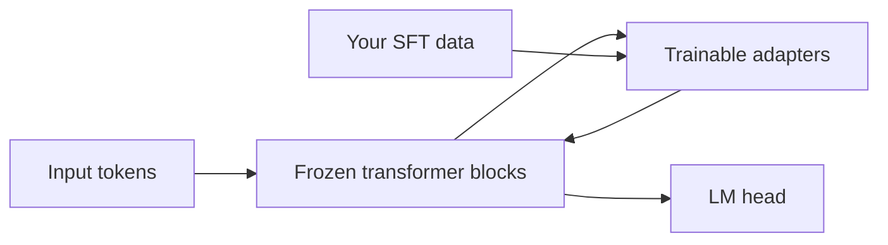

Full fine-tuning a multi-billion-parameter model for every product skill is rarely how teams ship. Parameter-efficient fine-tuning (PEFT) freezes the backbone and trains a thin layer of new weights—adapters—so you get task adaptation without copying the whole model for every experiment.

## Intuition

Imagine a large, expensive engine that already runs. Instead of rebuilding the engine for each car body, you bolt on a small custom gearbox. The engine stays put; the gearbox absorbs the specialization.

- **Backbone** — Pretrained LLM weights, frozen (or mostly frozen).
- **Adapter** — Small modules or low-rank updates trained on your data.
- **Compose** — At inference, backbone + adapter behave like a specialized model.

:::key
PEFT buys specialization with few trainable parameters: cheaper training, smaller artifacts, less forgetting, easier multi-skill serving.
:::

Why this works: pretrained transformers already contain rich features. Many tasks only need a light remap of those features—not a rewrite of every matrix.

## How it works

### Goals PEFT optimizes for

| Goal | How adapters help |
| --- | --- |
| **Memory** | Gradients/optimizer states only for tiny modules |
| **Storage** | Save megabytes of adapter weights, not full checkpoints |
| **Forgetting** | Frozen backbone keeps general skills |
| **Modularity** | Swap adapters per tenant, task, or locale |
| **Iteration speed** | More experiments per GPU-week |

### Adapter patterns (family view)

1. **Inserted modules** — Small MLPs added after attention/FFN blocks (classic adapters).
2. **Low-rank updates** — Approximate a weight change as a product of thin matrices (LoRA—next lesson).
3. **Prompt-side PEFT** — Train virtual tokens or prefixes (prompt/prefix tuning—later lesson).



### When PEFT is the default

- Product SFT for format, tone, triage, tool-call syntax.
- Multiple customers needing slight behavior variants.
- Single-GPU or modest multi-GPU budgets.
- You need fast rollback: unload adapter, restore base behavior.

### When full FT still wins

- Massive domain shift with huge data and budget.
- Research on new architectures or continued pretraining.
- You have proven PEFT capacity is the bottleneck after raising rank/coverage.

:::tip
Treat "full fine-tune" as an escalation after a PEFT recipe plateaus with healthy data—not as step one.
:::

## In code

Count parameters: adapters are a rounding error next to the backbone.

```python
def count_params(modules: dict[str, tuple[int, ...]]) -> int:
    total = 0
    for shape in modules.values():
        n = 1
        for d in shape:
            n *= d
        total += n
    return total


backbone = {
    "attn_w": (4096, 4096),
    "ffn_w": (4096, 11008),
}
# Per-layer toy adapter: down 4096->64, up 64->4096
adapter = {
    "down": (4096, 64),
    "up": (64, 4096),
}

b = count_params(backbone)
a = count_params(adapter)
print(f"backbone={b:,} adapter={a:,} ratio={a/b:.4%}")


def forward_block(x_dim: int, use_adapter: bool) -> str:
    path = "x -> frozen_attn_ffn"
    if use_adapter:
        path += " -> adapter_down -> nonlinearity -> adapter_up -> residual_add"
    return path + " -> out"


print(forward_block(4096, True))
```

Conceptual PEFT training switch:

```python
# for p in backbone.parameters():
#     p.requires_grad = False
# for p in adapters.parameters():
#     p.requires_grad = True
# optimizer = AdamW(adapters.parameters(), lr=1e-4)
# # loss same as SFT — only adapter weights move
```

## What goes wrong

- **Expecting miracles from bad data** — PEFT does not fix labeling chaos.
- **Under-allocating capacity** — Tiny adapters on a hard reasoning shift underfit; raise rank or unfreeze last layers.
- **Adapter sprawl** — Dozens of undocumented adapters with no eval owners.
- **Train/serve mismatch** — Training with adapters then forgetting to load them in prod (or double-applying).
- **Comparing unfairly to full FT** — Different LRs, epochs, and data make "PEFT is worse" a false conclusion.

:::warn
PEFT reduces how much can change—it does not remove the need for held-out eval and anchor regressions.
:::

### Multi-skill product reality

A support product might need triage, tone rewrite, and summarization. Full FT would mean three large checkpoints or one messy multi-task soup. PEFT lets you train three adapters from one base and route by endpoint. Storage stays manageable; rollback is "unpin adapter v3."

### What "capacity" means for adapters

Adapters have limited degrees of freedom. That is a feature for small datasets. If your task needs new factual associations for thousands of entities, you are probably asking PEFT to be a database—use RAG. If your task needs a stable syntactic habit, adapters usually have enough capacity.

### Team workflow

1. Freeze base revision in a registry.
2. Train adapter with a run id.
3. Evaluate scorecard vs baseline.
4. Register adapter metadata (data hash, metrics).
5. Canary, then promote.

Skipping (4) is how orphan adapters accumulate in object storage with no owner.

### Cost intuition

If a full FT stores tens of gigabytes per experiment and an adapter stores tens of megabytes, your experiment culture changes. Teams take more swings, keep more losers for analysis, and fear rollback less. That cultural shift is often the real ROI of PEFT—not only the GPU bill for a single run.

## One-line summary

**PEFT** freezes a strong backbone and trains small adapters so you adapt behavior affordably, with less forgetting and modular deployment.

## Key terms

- **PEFT** — Parameter-efficient fine-tuning methods that train few weights.
- **Backbone / base model** — Frozen pretrained network.
- **Adapter** — Small trainable module or update applied on top of the backbone.
- **Trainable parameter count** — Number of weights updated by the optimizer.
- **Modularity** — Ability to swap or combine task-specific adapters.
- **Continued pretraining** — Large-scale domain training that is not classic small-adapter SFT.
- **Escalation path** — PEFT first, then wider updates if capacity is proven insufficient.
