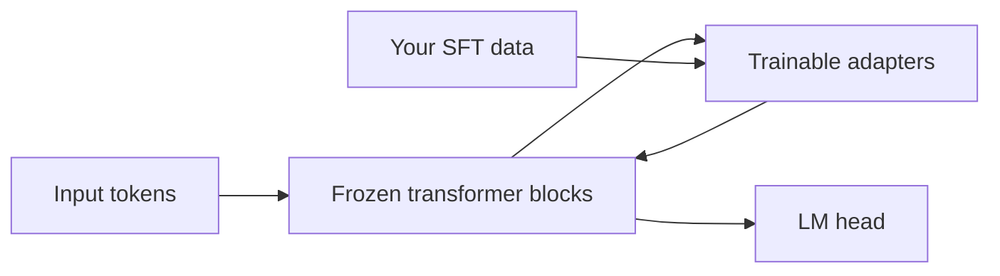

Training every weight in a large language model for each new task is slow, expensive, and risky. **Parameter-efficient fine-tuning (PEFT)** keeps the pretrained model mostly frozen and trains only a small add-on—so you get task-specific behavior without copying the whole model for every experiment.

## Intuition

Think of a large engine that already runs well. Instead of rebuilding the engine for each car body, you bolt on a small custom gearbox. The engine stays put; the gearbox handles the specialization.

- **Backbone** — The pretrained model weights, kept frozen (or mostly frozen).
- **Adapter** — A small trainable module that learns a task-specific tweak around the frozen features.
- **Compose** — At inference, backbone plus adapter behave like a specialized model.

:::key
PEFT buys specialization with very few trainable parameters: cheaper training, smaller saved files, less forgetting, and easier multi-skill serving.
:::

Why this works: pretrained transformers already hold rich language knowledge. Many tasks only need a light remap of those features—not a rewrite of every weight matrix.

## How it works

### What PEFT is trying to achieve

| Plain-English idea | When to use it |
| --- | --- |
| **Save GPU memory** | Gradients and optimizer states only touch tiny modules, not billions of weights. |
| **Save disk space** | Store megabytes of adapter weights instead of full checkpoints. |
| **Protect general skills** | A frozen backbone keeps what the model already knew before your task. |
| **Swap skills easily** | Change adapters per tenant, task, or locale without reloading the whole model. |
| **Run more experiments** | Cheaper runs mean more tries per GPU week. |

### Where PEFT sits in the fine-tuning family

| Plain-English idea | When to use it |
| --- | --- |
| **Selective tuning** (e.g. BitFit) | Train only a chosen subset of existing parameters. |
| **Additive adapters** | Insert small trainable blocks into the network. |
| **Low-rank updates** (LoRA, QLoRA — next lesson) | Express weight changes as two small matrices multiplied together. |
| **Soft prompting** (later lesson) | Learn virtual prompt tokens instead of changing backbone weights. |

### Adapter patterns

1. **Inserted modules** — Small MLP blocks added after attention or feed-forward layers. A common pattern: shrink the hidden state, apply a non-linearity, project back up, then add the result to the original stream.
2. **Low-rank updates** — Approximate a weight change as a product of thin matrices (LoRA — covered next).
3. **Prompt-side PEFT** — Train virtual tokens or prefixes (prompt/prefix tuning — covered later).

The adapter formula in plain terms:

```text
updated hidden state = original hidden state + up-project( nonlinearity( down-project(original) ) )
```

Sequential adapters sit in the main path. **Residual adapters** run in parallel and add their output back—often better for generation because the original stream stays intact.



### When PEFT is the default

- Product SFT for format, tone, triage, or tool-call syntax.
- Multiple customers needing slightly different behavior.
- Single-GPU or modest multi-GPU budgets.
- You need fast rollback: unload the adapter and restore base behavior.

### When full fine-tuning still wins

- Massive domain shift with huge data and budget.
- Research on new architectures or continued pretraining.
- You have proven PEFT capacity is the bottleneck after raising rank or coverage.

:::tip
Treat full fine-tuning as an escalation after a PEFT recipe plateaus with healthy data—not as step one.
:::

## In code

Adapters are a rounding error next to the backbone in parameter count.

```python
def count_params(modules: dict[str, tuple[int, ...]]) -> int:
    total = 0
    for shape in modules.values():
        n = 1
        for d in shape:
            n *= d
        total += n
    return total


backbone = {
    "attn_w": (4096, 4096),
    "ffn_w": (4096, 11008),
}
# Per-layer toy adapter: down 4096->64, up 64->4096
adapter = {
    "down": (4096, 64),
    "up": (64, 4096),
}

b = count_params(backbone)
a = count_params(adapter)
print(f"backbone={b:,} adapter={a:,} ratio={a/b:.4%}")


def forward_block(x_dim: int, use_adapter: bool) -> str:
    path = "x -> frozen_attn_ffn"
    if use_adapter:
        path += " -> adapter_down -> nonlinearity -> adapter_up -> residual_add"
    return path + " -> out"


print(forward_block(4096, True))
```

Conceptual adapter block and training switch:

```python
# class Adapter(nn.Module):
#     def forward(self, h):
#         return h + self.up(F.relu(self.down(h)))
#
# for p in backbone.parameters():
#     p.requires_grad = False
# for p in adapters.parameters():
#     p.requires_grad = True
# optimizer = AdamW(adapters.parameters(), lr=1e-4)
# # loss same as SFT — only adapter weights move
```

## What goes wrong

- **Expecting miracles from bad data** — PEFT does not fix labeling chaos.
- **Under-allocating capacity** — Tiny adapters on a hard reasoning shift underfit; raise rank or unfreeze last layers.
- **Adapter sprawl** — Dozens of undocumented adapters with no eval owners.
- **Train/serve mismatch** — Training with adapters then forgetting to load them in prod (or double-applying).
- **Comparing unfairly to full FT** — Different learning rates, epochs, and data make "PEFT is worse" a false conclusion.

:::warn
PEFT limits how much can change—it does not remove the need for held-out eval and anchor regressions.
:::

### Multi-skill product reality

A support product might need triage, tone rewrite, and summarization. Full fine-tuning would mean three large checkpoints or one messy multi-task soup. PEFT lets you train three adapters from one base and route by endpoint. Storage stays manageable; rollback is "unpin adapter v3."

### What "capacity" means for adapters

Adapters have limited degrees of freedom. That is a feature for small datasets. If your task needs new factual associations for thousands of entities, you are probably asking PEFT to be a database—use RAG. If your task needs a stable syntactic habit, adapters usually have enough capacity.

### Team workflow

1. Freeze base revision in a registry.
2. Train adapter with a run id.
3. Evaluate scorecard vs baseline.
4. Register adapter metadata (data hash, metrics).
5. Canary, then promote.

Skipping step 4 is how orphan adapters accumulate in object storage with no owner.

### Cost intuition

If full fine-tuning stores tens of gigabytes per experiment and an adapter stores tens of megabytes, your experiment culture changes. Teams take more swings, keep more losers for analysis, and fear rollback less. That cultural shift is often the real return on PEFT—not only the GPU bill for a single run.

## One-line summary

**PEFT** freezes a strong backbone and trains small adapters so you adapt behavior affordably, with less forgetting and modular deployment.

## Key terms

- **PEFT** — Parameter-efficient fine-tuning: update only a small part of the model instead of every weight.
- **Backbone / base model** — The frozen pretrained network.
- **Adapter** — A small trainable module inserted into the network to adjust hidden states.
- **Residual adapter** — An adapter that adds its output back to the original stream in parallel.
- **Trainable parameter count** — Number of weights the optimizer actually updates.
- **Modularity** — Ability to swap or combine task-specific adapters.
- **Continued pretraining** — Large-scale domain training that is not classic small-adapter SFT.
- **Escalation path** — PEFT first, then wider updates if capacity is proven insufficient.
