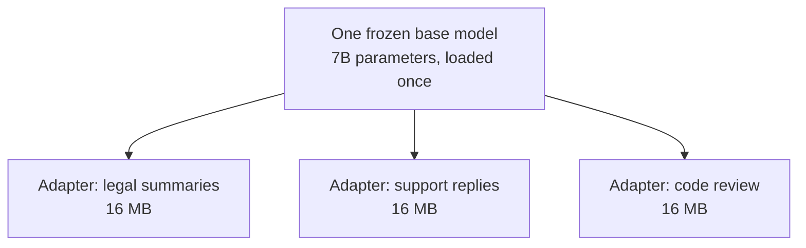

When a model already has billions of parameters, updating **every** weight for every new task is often wasteful. **PEFT** (parameter-efficient fine-tuning) keeps most of the pretrained model frozen and trains only a small add-on — or a small change — instead.

## Intuition

Full fine-tuning a large model can need huge GPU memory and many cards. PEFT asks a simpler question:

> Why update 7 billion parameters when a few million will do?

In practice, PEFT often trains **well under 1%** of the parameters, while still adapting the model to a new task.

It helps with:

- Lower GPU memory and compute cost
- Faster training and cheaper multi-task serving
- Keeping more of the general knowledge already in the base model
- Reducing **catastrophic forgetting** when tasks are narrow or many

:::note Analogy
A large hospital already employs excellent, fully trained doctors. When a new specialist procedure arrives, you do not send every doctor back to medical school. You run a short course for a handful of people and keep everything else exactly as it was.

PEFT is that short course. The expensive general training stays untouched; you add a small, specific capability on top — and if it turns out badly, you drop the course rather than rebuilding the hospital.
:::

The saving is not subtle. For a 7B model:

| Approach | Trainable parameters | Saved file per task |
| --- | --- | --- |
| Full fine-tuning | ~7,000,000,000 | ~14 GB |
| LoRA-style PEFT | ~4,000,000 | ~16 MB |

That is roughly 0.06% of the parameters. The practical consequence is what makes PEFT popular: storing 50 fine-tuned variants of a full model means 700 GB, while 50 PEFT adapters fit comfortably on a laptop.

:::key
PEFT = adapt a big pretrained model by changing only a small part of it.
:::

## How it works

### Where scale becomes a problem

Bigger models can be more capable — but full fine-tuning them gets “astronomically costly.” You may need many high-end GPUs just to update all weights. PEFT is the practical escape hatch: keep the big brain, train a small skill module.

### Multi-task fine-tuning pain

If you fully fine-tune one shared model for task after task, later tasks can wipe earlier skills (forgetting). PEFT lets many tasks **share one frozen backbone** and keep only tiny task-specific pieces.

Because the base model never changes, training the code-review adapter cannot damage the legal one. With full fine-tuning those three jobs would be three separate 14 GB models, each at risk of forgetting whatever it was not trained on most recently.

### PEFT taxonomy

| Family | Plain-English idea | Examples |
| --- | --- | --- |
| **Selective** | Train only some existing weights (or sparse differences) | BitFit, Diff Pruning |
| **Additive** | Add small new modules into the network | Adapters, AdapterFusion |
| **Re-parameterization** | Rewrite the weight update in a cheaper form | LoRA, QLoRA |
| **Soft prompting** | Learn virtual prompt tokens instead of editing the backbone | Prefix tuning, prompt tuning, SMoP, APT, IDPG |

The next lessons go deep on two tracks: **additive PEFT (adapters)** and **soft prompting**. **LoRA / QLoRA** (re-parameterization PEFT) get their own deep dive in lesson 3.4.

## What goes wrong

- Jumping straight to full fine-tuning “because we have a GPU,” then running out of memory or forgetting old skills.
- Treating PEFT as magic that always improves every metric — it is about **cheaper, safer adaptation**, not a free lunch.

## One-line summary

PEFT adapts huge language models by training a tiny fraction of parameters (or a tiny prompt), so you save cost and protect general skills.

## Key terms

- **PEFT** — Fine-tuning by changing only a small part of a pretrained model.
- **Full fine-tuning** — Updating (almost) all model weights for a task.
- **Catastrophic forgetting** — Losing older skills after narrow new training.
- **Post-training** — Training done after the base model was pretrained.
