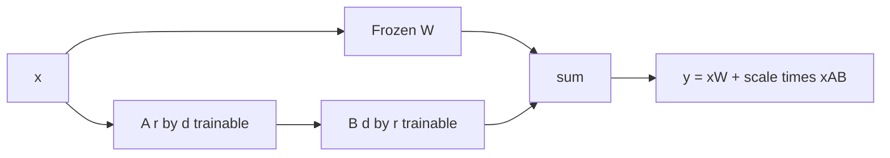

**LoRA (Low-Rank Adaptation)** is the PEFT method most teams meet first. Instead of updating a full weight matrix, you learn a small low-rank update and add it at runtime. **QLoRA (Quantized LoRA)** pairs that idea with a quantized frozen backbone so large models fit on smaller GPUs.

## Intuition

A dense weight update for a large matrix has millions of parameters. LoRA assumes the task-specific change is **approximately low rank**—it can be captured by two thin matrices multiplied together:

```text
new weight = frozen weight + weight update
weight update ~= B times A (low rank)

A shape: r rows by d columns
B shape: d rows by r columns
r is much smaller than d
```

You train A and B; the original weight stays frozen. After training you can keep them separate or **merge** the update into the weight for simpler serving.

:::key
LoRA stores the task as a skinny detour around each chosen weight—not a second full model.
:::

**QLoRA** loads the backbone in 4-bit (or similar) quantized form to save memory, keeps it frozen, and still trains LoRA adapters in higher precision. You get LoRA-quality adaptation with far less GPU RAM.

## How it works

### Where LoRA attaches

Common targets in transformers:

- Attention projections: `q_proj`, `k_proj`, `v_proj`, `o_proj`
- Sometimes MLP: `gate_proj`, `up_proj`, `down_proj`

More targets mean more capacity and memory. Start with attention; expand if the model underfits.

### Rank and scaling

- **`r` (rank)** — Capacity knob. Typical starting points: 8, 16, 32. Higher rank means more room to learn, but also more overfitting risk on small data.
- **`alpha` / scaling** — Many implementations scale the update by `alpha / r` so changing rank does not wildly change effective step size.
- **Dropout on LoRA layers** — Light regularization; optional.



### Merge vs keep separate

| Plain-English idea | When to use it |
| --- | --- |
| **Merged weights** | Bake the LoRA update into the base weight for a normal checkpoint. Simpler serving; harder to swap skills. |
| **Unmerged adapters** | Load base plus adapter at runtime. Hot-swap skills; slight runtime overhead. |

:::tip
For experiments, keep adapters separate. Merge when a skill is stable and you want the simplest deployment artifact.
:::

### QLoRA specifics (conceptual)

1. Quantize backbone weights to 4-bit storage.
2. Dequantize on the fly for matrix multiplies (implementation detail).
3. Train LoRA in 16-bit (e.g. bf16/fp16) adapters.
4. Optionally use paged optimizers or checkpointing for long contexts.

You still evaluate in a setup that matches production numerics as closely as you can.

## In code

Pure Python LoRA matmul to see shapes—no GPU.

```python
import random


def matmul(M, v):
    # M: list[list] shape (out, in); v: list length in
    return [sum(row[j] * v[j] for j in range(len(v))) for row in M]


def add(u, v):
    return [a + b for a, b in zip(u, v)]


def scale(v, s):
    return [s * x for x in v]


d, r = 8, 2
random.seed(0)
W = [[random.uniform(-0.2, 0.2) for _ in range(d)] for _ in range(d)]
A = [[random.uniform(-0.1, 0.1) for _ in range(d)] for _ in range(r)]  # r x d
B = [[random.uniform(-0.1, 0.1) for _ in range(r)] for _ in range(d)]  # d x r
alpha = 16
scale_factor = alpha / r

x = [random.uniform(-1, 1) for _ in range(d)]
y_base = matmul(W, x)
# x @ A^T then through B  (here: A is r x d so A @ x -> r, then B @ that -> d)
ax = matmul(A, x)
y_lora = matmul(B, ax)
y = add(y_base, scale(y_lora, scale_factor))
print("out_dim", len(y), "trainable", d * r + r * d)


def merge_W(W, A, B, scale_factor):
    # weight update[i,j] = scale * sum_k B[i,k] * A[k,j]
    d = len(W)
    r = len(A)
    merged = [row[:] for row in W]
    for i in range(d):
        for j in range(d):
            delta = sum(B[i][k] * A[k][j] for k in range(r))
            merged[i][j] += scale_factor * delta
    return merged


W_merged = merge_W(W, A, B, scale_factor)
y_merged = matmul(W_merged, x)
err = sum((a - b) ** 2 for a, b in zip(y, y_merged)) ** 0.5
print("merge_l2_err", round(err, 6))
```

HuggingFace / PEFT-style pseudocode:

```python
# from peft import LoraConfig, get_peft_model
# config = LoraConfig(r=16, lora_alpha=32, target_modules=["q_proj", "v_proj"])
# model = get_peft_model(base_model, config)
# # QLoRA: load base with load_in_4bit=True (bitsandbytes), then attach LoRA
# model.print_trainable_parameters()
# trainer.train()
```

## What goes wrong

- **Rank too low** — Underfit; loss plateaus; raise `r` or add MLP targets.
- **Rank too high on tiny data** — Overfit almost like fuller FT; watch holdout.
- **Wrong target modules** — Adapting unused projections wastes capacity.
- **QLoRA vs eval mismatch** — Train 4-bit, serve full precision (or vice versa) without checking quality deltas.
- **Forgetting to set `requires_grad` correctly** — Accidentally training the whole backbone undoes the point.

:::warn
QLoRA is a memory technique around LoRA—not a free accuracy upgrade. Always validate task and anchor metrics against your serving precision.
:::

## One-line summary

**LoRA** learns low-rank updates (B times A) on frozen weights; **QLoRA** does the same while storing the backbone in 4-bit to cut GPU memory.

## Key terms

- **LoRA** — Low-Rank Adaptation via trainable matrices A and B.
- **Rank (r)** — Inner dimension controlling adapter capacity.
- **lora_alpha** — Scaling hyperparameter paired with rank.
- **Target modules** — Which linear layers receive LoRA.
- **QLoRA** — LoRA training on a quantized frozen backbone.
- **Merge** — Folding the LoRA update into the base weight for a standalone checkpoint.
- **Adapter hotspot** — Serving many LoRA adapters on one base model.
