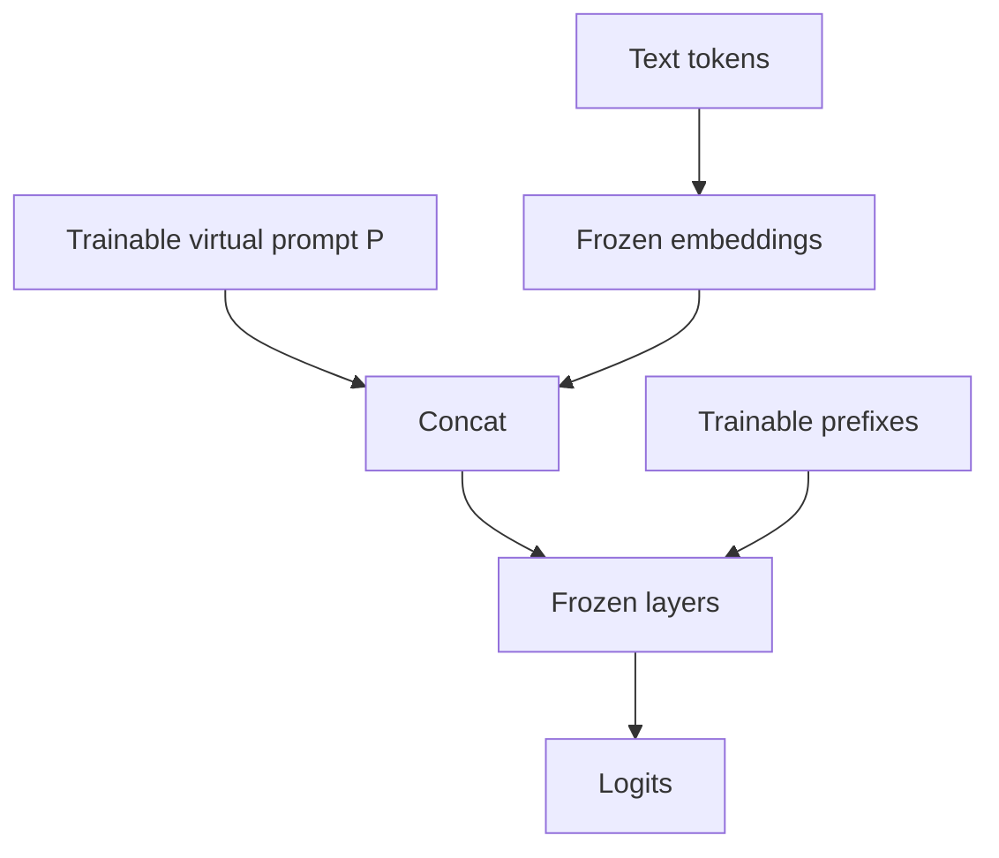

Not all PEFT methods change weight matrices. **Prompt tuning** and **prefix tuning** learn **soft prompts**—continuous vectors in embedding or hidden space—while the transformer stays frozen. They use even fewer trainable parameters than LoRA and shine when you want many task specialists on one backbone.

## Intuition

A **hard prompt** is text you type. A **soft prompt** is a set of learnable vectors the model treats like extra tokens—even though they are not real words.

- **Prompt tuning** — Train a small set of virtual token embeddings prepended to the input.
- **Prefix tuning** — Train prefix vectors injected into every layer's key/value streams—more expressive, more parameters than prompt tuning alone.

:::key
Soft prompts steer a frozen model by learning continuous "instructions" in activation space instead of rewriting weights.
:::

If LoRA is a custom gearbox bolted onto the engine, soft prompts are a custom key fob: tiny, swappable, limited force—but enough for many classification and formatting tasks.

## How it works

### Prompt tuning

The model's embedding matrix stays frozen. You learn a small matrix P of virtual prompt vectors and prepend them to the input embeddings:

```text
input to transformer = concat(learnable prompt P, embedded token ids)
```

Only P trains. Typical prompt length might be 8–100 virtual tokens depending on task difficulty.

### Prefix tuning

At each layer (or selected layers), learn prefixes for attention keys and values:

```text
K with prefix = concat(K_prefix, K)
V with prefix = concat(V_prefix, V)
```

Every block gets task-specific context that attention can read. Capacity is higher than embedding-only prompt tuning.



### Smarter soft-prompt variants

Plain soft prompts work, but one fixed prompt for every input and every layer can be too blunt. These variants add selectivity:

| Plain-English idea | When to use it |
| --- | --- |
| **SMoP (Sparse Mixture of Prompts)** | Pick from several prompt candidates instead of forcing one prompt to do all the work. Good when prompt budget is limited. |
| **APT (Adaptive Prefix Tuning)** | Use different prefix lengths per layer—lower layers often need more capacity for phrase-level features; higher layers for semantics. |
| **IDPG (Instance-Dependent Prompt Generation)** | Generate the prompt from the input itself, not just from a task label. Useful when one task has many subcases. |
| **SPT (Selective Prompt Tuning)** | Insert soft prompts only in layers where they actually help—not everywhere by default. |

### Compared to LoRA

| Plain-English idea | When to use it |
| --- | --- |
| **Soft prompts** | Smallest trainable footprint; extreme multi-task swapping; classification or light rewriting. |
| **LoRA** | Stronger capacity for generation style and hard output contracts; slightly larger artifacts. |

### When to reach for soft prompts

- Many tasks or tenants, one frozen 7B–70B server.
- Classification, routing, or light rewriting.
- Extremely tight storage budgets per skill.
- Research on multi-task composition of soft prompts.

When generation quality lags, escalate to LoRA or unfreeze last layers.

:::tip
Initialize soft prompts from embeddings of real instruction text ("You are a triage bot...") so early training starts near a meaningful region.
:::

## In code

Show prompt concatenation and a tiny SGD update on virtual tokens.

```python
import math
import random


random.seed(1)
d_model = 4
n_virtual = 2
# Frozen token embeddings for a 3-token sentence
token_emb = [
    [0.1, 0.0, 0.0, 0.2],
    [0.0, 0.1, 0.2, 0.0],
    [0.2, 0.2, 0.0, 0.1],
]
# Trainable soft prompt
P = [[random.uniform(-0.1, 0.1) for _ in range(d_model)] for _ in range(n_virtual)]


def concat_prompt(P, token_emb):
    return [row[:] for row in P] + [row[:] for row in token_emb]


def mean_pool(H):
    cols = len(H[0])
    return [sum(H[i][j] for i in range(len(H))) / len(H) for j in range(cols)]


def score(h, w):
    return sum(a * b for a, b in zip(h, w))


# Toy linear classifier on pooled states; only P will be updated
w_frozen = [0.5, -0.2, 0.3, 0.1]
target = 1.0
lr = 0.2

for step in range(6):
    H = concat_prompt(P, token_emb)
    pooled = mean_pool(H)
    s = score(pooled, w_frozen)
    # Simple squared error toward target
    err = s - target
    # d(loss)/d(pooled) = 2*err*w; virtual tokens get equal share via mean pool
    grad_pool = [2 * err * wi for wi in w_frozen]
    grad_p = [g / len(H) for g in grad_pool]
    for i in range(n_virtual):
        P[i] = [P[i][j] - lr * grad_p[j] for j in range(d_model)]
    print(f"step {step} score={s:.3f} loss={err*err:.3f}")

print("seq_len_with_prompt", len(concat_prompt(P, token_emb)))
```

Prefix tuning sketch (shapes only):

```python
# n_layers, n_heads, r_prefix, d_head = 32, 32, 8, 128
# prefix_keys[layer].shape == (r_prefix, n_heads * d_head)
# At attention: K = concat(prefix_keys[layer], K_tokens)
```

## What goes wrong

- **Too few virtual tokens** — Cannot encode the task; lengthen or switch to LoRA.
- **Too many on tiny data** — Soft prompts overfit as easily as any other parameters.
- **Ignoring max length** — Virtual tokens consume context budget.
- **Assuming soft prompts beat LoRA always** — Hard generative domains often need weight-space adapters.
- **Task interference** — Loading the wrong soft prompt for a request silently mis-routes behavior.

:::warn
Soft prompts are invisible in the text logs. Persist and version them like any other model artifact, and log which prompt id served each request.
:::

### Composition and routing

Soft prompts compose naturally with routing layers: map `task_id -> prompt vectors`, concatenate, generate. For prefix tuning, store per-layer tensors keyed by task id. Keep a default "neutral" prompt for unknown tasks that falls back to base behavior.

### Initialization and length

Random virtual tokens work but train slower. Initializing from the embeddings of a short hard prompt often helps. Lengthen virtual prompts when the task needs more steering; watch the context budget—every virtual token is one less token for user content and RAG passages.

### Failure case study

A team tried 4 virtual tokens to force complex tool-call JSON. The model kept drifting. Bumping to 32 tokens helped slightly; switching to LoRA on attention projections fixed the schema. Moral: soft prompts are not a universal LoRA replacement for heavy output contracts.

## One-line summary

**Prompt tuning** learns virtual input embeddings and **prefix tuning** learns per-layer prefixes so a frozen LLM can specialize with extremely small, swappable parameter sets.

## Key terms

- **Hard prompt** — Natural language instructions in the input.
- **Soft prompt** — Trainable continuous vectors used as prompt tokens.
- **Prompt tuning** — PEFT that trains only virtual embeddings (typically).
- **Prefix tuning** — PEFT that trains prefixes into layer attention states.
- **Virtual tokens** — Non-text tokens existing only as learned vectors.
- **Multi-task PEFT** — Many small task modules sharing one backbone.
- **Context budget** — Maximum sequence length; soft tokens consume part of it.
