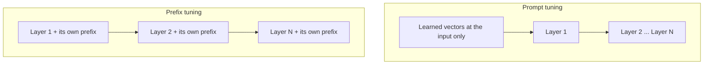

**Prefix tuning** and **prompt tuning** are both soft-prompt methods. The shared idea: we are **not** editing the main model weights; we are learning a prompt representation. They differ mainly in **how** that learned context is attached and used.

## Intuition

Both methods add **virtual tokens** (learned embeddings). Think of them as a small learned “header” that conditions the model for a task.

| Method | Plain-English idea | Often useful for |
| --- | --- | --- |
| **Prefix tuning** | Attach learnable prefix context (often influencing attention keys/values as extra context) | Generation tasks; compact adaptation |
| **Prompt tuning** | Learn only the prompt embeddings; keep the whole model frozen | Simple PEFT baseline |

:::key
Same family: soft prompts. Prefix tuning emphasizes learned prefix context; prompt tuning emphasizes optimizing prompt embeddings with a frozen backbone.
:::

## How it works

### Prefix tuning

- Adds virtual tokens that act like **learnable context** at the front (a prefix).
- Especially useful when the model must **generate** text for a task.
- It is especially aimed at continuous prefix optimization for generation.

### Prompt tuning

- Optimizes prompt embeddings while the backbone stays frozen.
- Attractive because it is simple and tiny.
- A warning: quality can vary sharply with small prompt changes, and cost grows if you make the soft prompt very long.

:::note Analogy
Both methods brief the same expert, but at different moments.

**Prompt tuning** is handing over a briefing note at the door. The expert reads it, then gets on with the work — and as the job goes on, that first note matters less and less.

**Prefix tuning** is having the briefing available in every room, at every stage of the work. The guidance is present when the expert makes the opening decision and when they make the final one.

That is why prefix tuning tends to hold up better on long generated answers: the influence does not fade as the output grows.
:::

Where each one lands in the model:

Prefix tuning therefore trains more parameters than prompt tuning — a prefix for every layer instead of one set at the front — but both remain far smaller than an adapter or a full fine-tune.

### The cost of longer prompts

If you keep adding soft tokens:

- Sequence length grows → more compute
- Not every soft token helps every example

Practical habits:

- Prefer a **short** prompt when you can
- Use **multiple** prompts if different parts of the data need different context
- Later methods add **gating / selection** so the model uses only the useful prompts (next lesson)

## What goes wrong

- Growing the soft prompt to hundreds of tokens “just in case.”
- Expecting prompt tuning to behave like full fine-tuning on hard generative tasks.
- Mixing up names: both are soft prompts; the difference is mechanism/emphasis, not a totally different universe.

## One-line summary

Prefix tuning and prompt tuning learn virtual prompt context instead of updating the backbone — prefix tuning leans on learned prefix context; prompt tuning learns prompt embeddings with a frozen model.

## Key terms

- **Prefix tuning** — Soft-prompt method that prepends learned context.
- **Prompt tuning** — Learning prompt embeddings while freezing the backbone.
- **Virtual tokens** — Trainable embeddings that act like extra prompt context.
