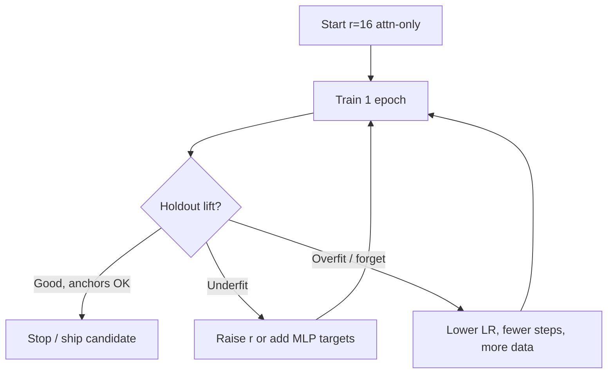

PEFT fails more often from bad recipes than from bad theory. Learning rate, rank, epochs, and quantization all interact. This lesson is a field guide for defaults that work for SFT-style LoRA—and how to tune when metrics stall.

## Intuition

Think in three knobs:

1. **How hard you push** — learning rate, schedule, grad clipping.
2. **How much room to learn** — rank, target modules, epochs.
3. **How you pack the model in memory** — precision and quantization.

:::key
Change one major knob at a time, and always re-check task lift vs anchor regressions.
:::

A common successful pattern: modest rank, slightly higher learning rate than full fine-tuning, one to two epochs on clean data, early stop on holdout.

## How it works

### Learning rate

LoRA often tolerates **higher learning rates** than full fine-tuning because only a few parameters move.

| Plain-English idea | When to use it |
| --- | --- |
| **Full FT ~1e-5 to 2e-5** | Updating every weight in a 7B model—small steps to avoid breaking the backbone. |
| **LoRA SFT ~1e-4 to 3e-4** | Only adapter weights move—can push harder without destabilizing the base. |
| **Soft prompts ~1e-3 to 5e-3** | Very tiny parameter set—often needs a higher learning rate to move at all. |

Use cosine or linear decay with a short warmup. If loss spikes or anchors crash, cut learning rate by 2–5x.

### Rank and alpha

```text
effective scale ~= alpha / r
```

Recipes:

- Start `r=16`, `alpha=32` (scale 2) on attention projections.
- If underfit: `r=32` or add MLP targets before jumping to full FT.
- If overfit: lower `r`, fewer epochs, more diverse data.

Keep `alpha/r` stable when sweeping `r`, or you accidentally sweep learning rate too.

### Steps, epochs, batch

- Prefer **more unique data** over a fifth epoch on 200 rows.
- Use gradient accumulation for effective batch size if VRAM is tight.
- Sequence length dominates memory; truncate thoughtfully (do not silently chop labels).

### Quantization choices

| Plain-English idea | When to use it |
| --- | --- |
| **bf16/fp16 LoRA** | Clean baseline when you have enough GPU memory. |
| **8-bit backbone + LoRA** | Lower memory; usually a mild quality hit. |
| **4-bit QLoRA** | Smallest memory footprint; check eval carefully. |
| **Serve merged bf16 after 4-bit train** | Common in practice; validate—do not assume identical quality. |

Quantization is a systems trade. Measure schema accuracy and anchors; do not assume blog defaults match your domain.



:::tip
Log: learning rate, rank, alpha, targets, precision, epoch, trainable%, task scores, anchor scores. Without that table, PEFT tuning becomes folklore.
:::

## In code

A tiny hyperparameter search ledger—no training required.

```python
from dataclasses import dataclass


@dataclass
class Recipe:
    name: str
    lr: float
    r: int
    alpha: int
    epochs: int
    targets: tuple[str, ...]

    @property
    def scale(self) -> float:
        return self.alpha / self.r


def sanity(recipe: Recipe) -> list[str]:
    warns = []
    if recipe.lr > 5e-4:
        warns.append("LR very high for LoRA — watch instability")
    if recipe.r >= 64 and recipe.epochs >= 3:
        warns.append("High capacity + many epochs — overfit risk on small data")
    if recipe.scale > 4:
        warns.append("alpha/r large — effective updates may be aggressive")
    if recipe.targets == ("q_proj",) and "format_heavy" in recipe.name:
        warns.append("Consider v_proj/o_proj or MLP for format-heavy tasks")
    return warns or ["ok"]


recipes = [
    Recipe("baseline", 2e-4, 16, 32, 1, ("q_proj", "v_proj")),
    Recipe("format_heavy_wide", 2e-4, 16, 32, 1, ("q_proj",)),
    Recipe("aggressive", 1e-3, 64, 256, 4, ("q_proj", "v_proj", "down_proj")),
]

for rec in recipes:
    print(rec.name, "scale", rec.scale, "->", "; ".join(sanity(rec)))
```

Illustrative trainer config (pseudocode):

```python
# training_args = dict(
#     learning_rate=2e-4,
#     num_train_epochs=1,
#     per_device_train_batch_size=1,
#     gradient_accumulation_steps=8,
#     lr_scheduler_type="cosine",
#     warmup_ratio=0.03,
#     bf16=True,
# )
# lora = dict(r=16, lora_alpha=32, target_modules=["q_proj", "k_proj", "v_proj", "o_proj"])
```

## What goes wrong

- **Copying full-FT learning rates into LoRA** — Training crawls; people "fix" it by over-epoching into overfit.
- **Sweeping rank while changing alpha/r** — Confounded experiments.
- **4-bit everything including eval blindness** — Ship decisions on numbers that do not match prod precision.
- **One giant batch of unrelated tasks** — Need task balance or separate adapters.
- **No warmup on fragile stacks** — Early spikes damage adapters.

:::warn
If holdout jumps 40 points after one epoch on 80 near-duplicate rows, assume leakage or memorization until proven otherwise.
:::

### Sequence length and packing

Long tickets blow up memory. Truncate inputs carefully: keep the end of the user message if that is where the error appears, and never truncate away the assistant label during training. Packing multiple short examples into one sequence can raise throughput—only if your stack masks loss correctly across boundaries.

### Seed and small-data variance

On fewer than a few hundred rows, seed changes can move metrics several points. Report at least two seeds for ship decisions, or widen the holdout. Do not treat a single lucky run as gospel.

### Recipe anti-patterns

- Copying a 70B blog config onto a 3B model unchanged.
- Raising epochs to 10 because loss "still going down" on 120 rows.
- Enabling 4-bit, 8-bit, gradient checkpointing, and flash attention all at once while debugging quality—isolate variables.

## One-line summary

A solid PEFT recipe pairs a **LoRA-scale learning rate** with a **modest rank**, few epochs on clean data, and **quantization choices validated** against the same metrics you serve.

## Key terms

- **Learning rate (LR)** — Step size for optimizer updates.
- **Warmup** — Gradual LR ramp at the start of training.
- **Rank / alpha** — LoRA capacity and scaling pair.
- **Gradient accumulation** — Simulate larger batches with multiple forward passes.
- **bf16 / fp16** — Mixed-precision training formats.
- **4-bit quantization** — Compress weight storage (QLoRA-style) for memory.
- **Hyperparameter ledger** — Recorded configs tied to eval outcomes.
