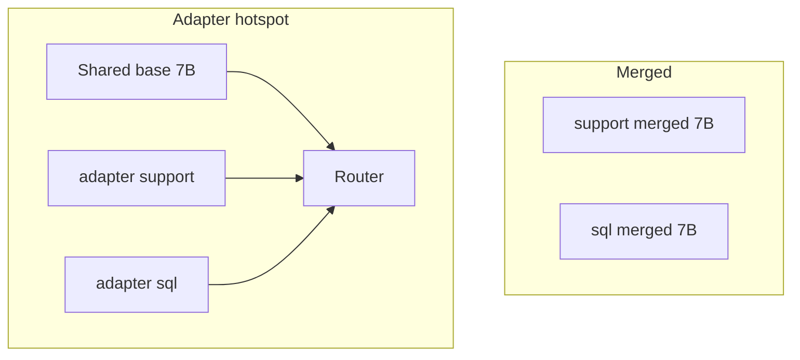

Training ends when something serves. With LoRA you choose: **merge** adapters into the base for a single checkpoint, or **load adapters dynamically** on a shared backbone. The right answer depends on how many skills you run, how often they change, and your latency budget.

## Intuition

- **Merged weights** — One artifact that looks like a normal model. Simple ops story; specialization is baked in.
- **Adapter weights** — Base stays generic; each request (or session) can attach a skill pack.

:::key
Merge for simplicity and peak serving speed of one skill. Keep adapters separate when you need many skills, fast rollback, or per-tenant behavior on one GPU fleet.
:::

Neither choice fixes a bad eval. Both require versioning: which base SHA + which adapter SHA produced an answer.

## How it works

### Merged serving

1. Start from base `W`.
2. Compute `W_merged = W + scale * B A` for each LoRA layer.
3. Export a standard HuggingFace / GGUF / vLLM-compatible checkpoint.
4. Serve like any fine-tuned model.

Pros: max simplicity, often best throughput, no adapter routing bugs.  
Cons: storage multiplies per skill; switching skill means loading another full model (or another replica).

### Adapter serving

1. Load base once.
2. Register adapters (`support_v3`, `sql_v2`, ...).
3. Router picks adapter id from tenant, path, or header.
4. Forward with base + active adapter (or merge in memory temporarily).

Pros: small artifacts, hot-swap, A/B skills, shared memory for the backbone.  
Cons: routing complexity, possible slight overhead, must prevent "wrong adapter" incidents.



### Operational checklist

| Concern | Merged | Adapters |
| --- | --- | --- |
| Disk per skill | Full model | Megabytes |
| Rollback | Redeploy previous full ckpt | Unload / pin previous adapter id |
| Multi-tenant | Separate replicas or models | Router + isolation tests |
| Latency | Usually simplest path | Watch framework overhead |
| Quantized serve | Re-quantize after merge | Framework must support LoRA+quant |

### Safety and isolation

- Never let user text select arbitrary adapter paths on disk.
- Default adapter for unknown tenants should be safe/base.
- Canary: shadow traffic on new adapter before 100% flip.

:::tip
Store a `model_card.json` with base revision, adapter id, train data hash, and eval scorecard. Future you will need it during an incident.
:::

## In code

Simulate routing and merge bookkeeping.

```python
from dataclasses import dataclass


@dataclass
class Adapter:
    adapter_id: str
    version: str
    scale: float
    # toy: single layer update strength
    delta: float


BASE = 1.0  # stand-in for frozen W


def apply_adapter(base: float, ad: Adapter) -> float:
    return base + ad.scale * ad.delta


def merge(base: float, ad: Adapter) -> float:
    return apply_adapter(base, ad)


adapters = {
    "support": Adapter("support", "v3", scale=2.0, delta=0.05),
    "sql": Adapter("sql", "v2", scale=2.0, delta=-0.02),
}


def serve(skill: str, mode: str = "adapter") -> dict:
    if skill not in adapters:
        skill = "support"  # safe default
    ad = adapters[skill]
    if mode == "merged":
        # In production you'd load a premerged checkpoint keyed by skill
        weight = merge(BASE, ad)
        artifact = f"merged::{ad.adapter_id}:{ad.version}"
    else:
        weight = apply_adapter(BASE, ad)
        artifact = f"base@1.0+{ad.adapter_id}:{ad.version}"
    return {"skill": skill, "effective_w": weight, "artifact": artifact}


print(serve("sql", "adapter"))
print(serve("sql", "merged"))
print(serve("unknown", "adapter"))
```

Deployment pseudocode:

```python
# # Adapter hotspot
# model = load_base("base-7b")
# model.load_adapter("artifacts/support_v3")
# model.set_active_adapter("support_v3")
#
# # Merge once for a dedicated replica
# merged = merge_and_unload(model)
# save_pretrained(merged, "artifacts/support_v3_merged")
```

## What goes wrong

- **Silent wrong adapter** — Tenant A gets Tenant B's tone/policy; treat as a sev-level bug.
- **Double application** — Merged checkpoint plus loading the same LoRA again.
- **Base drift** — Adapter trained on base SHA X served on base SHA Y.
- **Unbounded adapter registry** — Orphan adapters without owners or evals.
- **Merge then forget recipe** — Cannot reproduce the training run that created prod.

:::warn
Your serving path is part of the model. An adapter router without tests is an untested model.
:::

### Latency and batching notes

Merged models fit ordinary batched serving. Adapter hotspots need frameworks that can apply LoRA efficiently per request or per batch segment. If your stack cannot batch mixed adapters well, pin heavy tenants to dedicated merged replicas and keep long-tail tenants on the hotspot.

### CI for adapters

Add a minimal CI job: load base+adapter, run 20 golden prompts, assert schema and anchor strings. Fail the deploy if golden checks fail. This catches "wrong file uploaded" faster than users do.

### Rollout story

1. Offline scorecard pass.
2. Staging with production-like precision.
3. Canary 5% traffic with side-by-side logging of artifact id.
4. Promote or auto-rollback on schema/error budget.

Document who owns the adapter after promotion—on-call needs a name, not a mystery path in S3.

## One-line summary

**Merge** LoRA into the base for simple single-skill serving; keep **separate adapters** when you need modular skills, smaller artifacts, and fast rollback on a shared backbone.

## Key terms

- **Merged checkpoint** — Base weights with LoRA updates baked in.
- **Adapter hotspot** — One backbone serving many LoRA modules.
- **Hot-swap** — Changing active adapters without reloading the full base.
- **Model card / artifact metadata** — Provenance for base+adapter+data+eval.
- **Canary** — Limited rollout before full traffic.
- **Rollback** — Restoring a previous artifact quickly after a regression.
- **Isolation** — Preventing cross-tenant adapter misuse.
